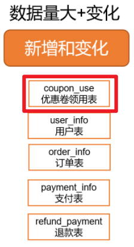

---

Created at: 2021-10-26
Last updated at: 2021-12-09


---

# 7-DWD层


DWD层需要建立事实表，数据来源于有两类：用户行为数据 和 业务表中业务流程有关的表。

1 对用户行为日志建表：
ODS层只需要保存数据的原貌，所以用户行为日志表只有一列，并且将两种日志都保存在一张表里了。但是在DWD层需要将用户行为日志拆开，分别建立可以统计不同指标的表：启动日志表，页面日志表、动作日志表、曝光日志表、错误日志表。
从ODS层到DWD层，日志表的首日和每日均是每日增量同步


DWD层需要根据 选择业务过程→声明粒度→确认维度→确认事实 这4个步骤对业务数据建立事实表，**每个事实表有两类字段：维度外键 和 度量值**，如果本应该为该事实表建立的维度表的列太少，可以直接维度退化将维度表的列放在事实表中。
本项目所建立的事实表有：评价事实表、订单明细事实表、退单事实表、加购事实表、收藏事实表、优惠券领用事实表、支付事实表、退款事实表、订单事实表。
事实表根据表中数据的更新特点分为3种：事务型事实表、周期型快照事实表 和 累积型快照事实表。

* 事务型事实表的特点是数据只会新增，原有的数据不会改变，所以事务型事实表的同步是增量同步，只需要将增量数据写到最新的分区即可。
* 周期型快照事实表的特点是表中所有数据变化频繁，但我们并不关心表中数据变化的中间状态，只在每天或者每月的某个时间点对该表的数据进行一次全量同步，就像是在这个时间点为数据拍了一张快照，所以称为周期型快照事实表。
* 累积型快照事实表的特点是有一个或几个不同含义的时间字段，时间字段是否有值表示着数据处于不同状态，我们需要根据每一条数据的状态变化将它写到不同的分区之中，也就把状态没有终止的数据保存在最新的分区之中，把状态已经终止的数据保存在其终止日期的分区之中。

需要注意的是，DWD层事实表的数据是来自于MySQL的多张业务表，所以　从MySQL到ODS 和 ODS到DWD 的同步策略也是基本相同，但是要强调我们现在谈论的是DWD层的事实表，这与ODS层的表是不同的，也就是虽然同步策略相同，但具体的更新行为完全不同。

2 评价事实表
评价事实表的数据只来自ODS层的评价表，该表的同步策略是增量同步，所以评价事实表是一张**事务型事实表**。

```
CREATE EXTERNAL TABLE dwd_comment_info(
    `id` STRING COMMENT '编号',
    `user_id` STRING COMMENT '用户ID',
    `sku_id` STRING COMMENT '商品sku',
    `spu_id` STRING COMMENT '商品spu',
    `order_id` STRING COMMENT '订单ID',
    `appraise` STRING COMMENT '评价(好评、中评、差评、默认评价)',
    `create_time` STRING COMMENT '评价时间'
) COMMENT '评价事实表'
PARTITIONED BY (`dt` STRING)
STORED AS PARQUET
LOCATION '/warehouse/gmall/dwd/dwd_comment_info/'
TBLPROPERTIES ("parquet.compression"="lzo");
```
该表中user\_id、sku\_id、create\_time分别属于用户维度表、商品维度表 和 时间维度表 的维度外键，appraise是维度退化的列。
对于增量同步表，还是那句话，ODS不需要对数据做任何处理，所以无论是那种同步策略，ODS层的首日都是全量同步，但DWD层不能这样，对于增量同步策略的数据，DWD层必须将ODS首日同步的全量数据展开，每个分区保存都是当日的记录。然后每日同步时，只需要直接将ODS层的数据同步到DWD层即可。所有事务型事实表的同步策略都是这样的。


3 订单明细事实表
订单明细事实表主要的数据来自于ODS层的ods\_order\_detail订单明细表，需要关联用户和地区维度表，可以从ODS层的订单表ods\_order\_info中拿到这两个外键，需要关联活动维度表，可以从ODS层的订单明细活动关联表ods\_order\_detail\_activity拿到活动id和活动规则id的外键，需要关联优惠券维度表，可以从订单明细优惠券关联表ods\_order\_detail\_coupon中拿到这个优惠券id这个外键。
从MySQL到ODS层的ods\_order\_detail订单明细表是增量同步，所以订单明细事实表是一张事务型事实表。

于是从ODS层到DWD层的首日同步应该将全量数据散开，每日同步直接同步当天的增量即可：


4 退单事实表
退单事实表的数据主要来自于ODS的ods\_order\_refund\_info退单表，需要关联地区维度表，可以从从ODS层的订单表中拿到这个维度外键。
从MySQL到ODS层的ods\_order\_refund\_info退单表是增量同步，所以退单事实表是一张事务型事实表。


5 加购事实表
加购事实表的数据主要来自于ODS层的ods\_cart\_info加购表，这是一张全量同步表，所以加购事实表是一张**周期型快照事实表**。

周期型快照事实表首日和每日都直接采用全量同步：


6 收藏事实表
收藏事实表的数据主要来自于ODS层的ods\_favor\_info收藏表，所以收藏事实表也是一张周期性快照事实表，直接全量同步。

7 优惠券领用事实表
优惠券领用事实表主要来自于ODS层的ods\_coupon\_use表，这张表从MySQL到ODS层的同步策略是新增及变化，所以从ODS层到DWD层的策略也应该是新增及变化，所以这是一张**累积型快照事实表**。

还是那句话，对于新增及变化同步策略的表，ODS层可以不做处理，只负责将每天的新增及变化的数据存到当天分区即可，但是DIM层和DWD层就不能这么简单粗暴了，这两层的表是维度建模的结果，是为后续对数据进行分析做准备的，所以需要经过处理后将数据放到相应的分区之中，处理的策略就是把状态没有终止的数据保存在最新的分区之中，把状态已经终止的数据保存在其终止日期的分区之中，这样后续查询就方便了。如果不经过这一层的处理，直接从ODS查某条数据需要遍历所有分区的数据才能查到。
优惠券领用事实表的同步逻辑如下，这也是所有累积型快照事实表的装载逻辑。

累积型快照事实表之所以称为累积，是因为表中有许多于时间相关的字段，每个时间字段都有其特定的含义，能反映出该记录所处的状态。比如优惠券领用事实表有get\_time、used\_time、expire\_time，其中如果used\_time 或者 expire\_time不为null，则表示该优惠券已经使用了，所以该数据为终止状态，应该写到终止日期对应的分区中，如果这两个字段不为null，则表示该优惠券的状态还没有终止，应该把这条数据写到最新的9999-99-99分区中。也就是，**累积型快照表9999-99-99分区存的是未完成的记录，其它的每日分区存的是已经完成的记录**。
首日同步时，根据数据的used\_time 和 expire\_time是否为null，可以确定数据是否为终止状态，从而将数据写入到相应的分区之中。
每日同步时，在新增及变化的数据中，新增的数据有状态未终止的数据，也有状态已经终止的数据，需要将这两部分的数据分别写到最新的9999-99-99分区和当日的分区中（当日分区为状态已经终止的分区），比如2020-06-16应该执行脚本同步前一日2020-06-15的数据，2020-06-15的数据有新增的已经终止的数据，这部分数据就应该写到2020-06-15分区中。还有就是变化的数据，变化的数据一定要么是优惠券被使用了，要么是过期了，这部分数据也都应该写到当日的分区中。
以上首日同步的sql使用动态分区即可完成，每日同步到的sql需要将新增及变化的数据与9999-99-99分区full outer join，然后使用动态分区写入即可。每日装载sql的逻辑：

**累积型快照事实表 与 DIM层拉链表** 的相同点都是新增及变化的同步策略，区别就在于，累积型快照事实表中存的是业务流程，也就是一条数据完整的业务流程都在一条数据中，靠几个时间字段来区分，所以所有数据都会只存在一条记录，要么在最新的 9999-99-99分区中，要么在前面某天的分区中。而DIM层拉链表中的每个数据都存在着最新的记录在 9999-99-99分区中，还存在着很多历史记录在之前的分区中，这种同一条数据多条历史记录的情况应该不会出现业务流程里，所以这种表应该只会出现在DIM层。
DIM层拉链表的分区字段dt的值与该分区中数据的end-time相同，累积型快照事实表由于有多个时间字段与终止状态有关，所以其分区字段dt的值只可能等于该分区中数据某个时间字段的值（如果累积型快照事实表一条数据的终止状态只与一个时间字段的值有关，那么分区字段dt的值就等于该字段的值）。
区别总结就是，累积型快照事实表的9999-99-99分区只会保留状态还未终止的记录，状态已经终止的记录保存在之前的分区之中；而DIM层拉链表的9999-99-99分区会保存所有数据最新状态的记录，如果数据有历史状态的记录，那么会保存在之前的分区的中，一条数据所有状态的记录的start-time和end-time是首位相连的，所以称为拉链表。

8 支付事实表
支付事实表的数据主要来自与ODS层ods\_payment\_info表，需要通过order\_info表拿到地区维度表的外键。

因为ods\_payment\_info表是一张新增及变化的表，所以支付事实表的也是一张累积型快照事实表。其与状态有关的时间字段是create\_time、callback\_time，callback\_time不为null，表示支付完成，为null则表示支付未完成。
其首日与每日同步逻辑如下，和其它累积型快照事实表一样，靠callback\_time是否为null将数据写到相应的分区中。


9 退款事实表
退款事实表的数据主要来自与ODS层ods\_refund\_payment表。

因为ods\_refund\_payment表是一张新增及变化的表，所以退款事实表的也是一张累积型快照事实表。其与状态有关的时间字段是create\_time、callback\_time，callback\_time不为null，表示退款完成，为null则表示退款未完成。和其它累积型事实表一样，靠callback\_time是否为null将数据写到相应的分区中。

10 订单事实表
订单事实表的数据主要来自于ODS层的ods\_order\_info表 和 ods\_order\_status\_log表，主要还是ods\_order\_info表，只是需要从ods\_order\_status\_log表获取订单与状态有关的时间。所以订单事实表也是一张累积型快照事实表。

订单事实表与状态有关的时间如下：

* create\_time    创建时间(未支付状态)
* payment\_time    支付时间(已支付状态)
* cancel\_time    取消时间(已取消状态)
* finish\_time    完成时间(已完成状态)
* refund\_time    退款时间(退款中状态)
* refund\_finish\_time    退款完成时间(退款完成状态)
* expire\_time    过期时间

其中表示订单完成的状态有：
1.cancel\_time不为null，终止时间为cancel\_time
2.finish\_time不为null，并且同步的时间大于finish\_time 7天，并且refund\_time为null，终止时间为finish\_time+7天
3.refund\_finish\_time不为null，终止时间为refund\_finish\_time
4.expire\_time不为null， 终止时间为expire\_time
和其它累积型事实表一样，根据终止时间将数据写到对应的分区中，没有终止的数据写到9999-99-99分区中。

