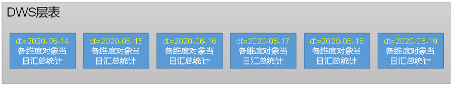
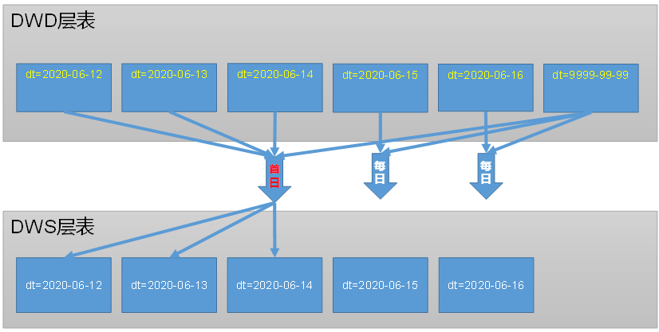

---

Created at: 2021-10-27
Last updated at: 2022-07-04


---

# 8-DWS层


DWS层表记录的是与维度表相关联的事实表的度量值的聚合值（按天聚合），所以DWS层的建表思路是以维度模型中维度表为基准，通常是DIM层有几张维度表，DWS层就相应有几张主题表，因为与维度表相关联的事实表通常会有很多，并且每张事实表也会有不止一个度量值，所以DWS层的主题表需要统计的聚合值也会有很多，也就是DWS层的表通常比较宽。
DWS层的主题宽表并不需要保留维度表中的字段，因为DIM层的维度表本身保存的就是完整的维度信息，所以DWS层的主题宽表只需要一个与维度表关联的维度外键即可，其余字段全是与该维度表关联的事实表的度量值的聚合值。又因为事实表与维度表关联，所以事实表中也有维度外键，于是那个维度外键也可以从事实表中拿到（对事实表聚合时的group by字段就是这个维度外键，事实表有多个维度外键，对每个维度外键进行分组聚合的结果会被分别写到DWS层不同的主题表中），也就是说DWS层一张主题表的数据全部来自于DWD层多张事实表的数据。

对于维度表中的每行数据，并不是DWS层对应的主题表的每个分区中都有其统计值，而是只统计当天的活跃数据。比如用户维度表中有一亿条用户数据，在DWS层用户主题表的每个分区中，并不是每一个用户都有一条统计数据，而是当天分区只统计当天活跃用户所产生的数据的聚合值。
因为ODS层的数据经过DWD层的装载逻辑之后，数据在DWD层按天分区的组织逻辑就十分清晰了，即：

1. 事务型事实表的每个分区存的是当日新增的数据
2. 周期型快照事实表的每个分区存的是当日零点的全量数据
3. 累积型快照表9999-99-99分区存的是未完成的记录，其它的每日分区存的是已经完成的记录

所以很容易实现DWS层每个分区只统计当天活跃用户，即DWS层每天只从DWD层当日的分区中取数即可（如果是累积型快照事实表还可能需要从9999-99-99分区中取数；~~一般很少会从周期型快照事实表取数，一是因为周期型快照事实表保存的是全量数据，即使没有活跃的用户也会在当日保存一份记录，二是因为周期型快照事实表保存的某个时间的切面，并不是一个过程量，所以很少会有统计指标需要统计这样的数据~~）。


DWS层所有表的装载思路都相同：

首日装载的数据来自DWD层事实表的所有分区，所以首日装载对事实表的度量值进行聚合的sql的group by 字段不仅有维度外键，还有时间字段，因为要统计的是每日的汇总。汇总之后再根据这个时间字段写到DWS层对应的分区之中。
每日装载时，如果是是对事务型事实表的度量值进行聚合，那么只需要从DWD层事务型事实表的当日分区中总取数，如果是累积型快照事实表，可能不仅需要从当日分区中取数，还可能需要从9999-99-99分区中取数。不过每日装载的sql的group by字段不需要有时间字段，只需要有维度外键即可，因为进行汇总的所有数据都来自于当日（在sql的where中会先根据分区字段将数据过滤出来了，如果数据还来自于9999-99-99分区，那么除了用分区字段过滤数据外，肯定还有另外一个时间字段用于过滤数据）。汇总之后只需要写到DWS层当日的分区中即可。

下面以DWS层用户主题宽表为例说明DWS层的表到底保存了哪些数据，以及其具体是如何从DWD层表的分区中取数的。

用户主题宽表的表结构如下，可以看到只有user\_id是DIM层用户维度表的维度外键，其余字段全是与用户维度表有关联的事实表的度量值的聚合值：
```
DROP TABLE IF EXISTS dws_user_action_daycount;
CREATE EXTERNAL TABLE dws_user_action_daycount
(
    `user_id` STRING COMMENT '用户id',
    `login_count` BIGINT COMMENT '登录次数',
    `cart_count` BIGINT COMMENT '加入购物车次数',
    `favor_count` BIGINT COMMENT '收藏次数',
    `order_count` BIGINT COMMENT '下单次数',
    `order_activity_count` BIGINT COMMENT '订单参与活动次数',
    `order_activity_reduce_amount` DECIMAL(16,2) COMMENT '订单减免金额(活动)',
    `order_coupon_count` BIGINT COMMENT '订单用券次数',
    `order_coupon_reduce_amount` DECIMAL(16,2) COMMENT '订单减免金额(优惠券)',
    `order_original_amount` DECIMAL(16,2)  COMMENT '订单单原始金额',
    `order_final_amount` DECIMAL(16,2) COMMENT '订单总金额',
    `payment_count` BIGINT COMMENT '支付次数',
    `payment_amount` DECIMAL(16,2) COMMENT '支付金额',
    `refund_order_count` BIGINT COMMENT '退单次数',
    `refund_order_num` BIGINT COMMENT '退单件数',
    `refund_order_amount` DECIMAL(16,2) COMMENT '退单金额',
    `refund_payment_count` BIGINT COMMENT '退款次数',
    `refund_payment_num` BIGINT COMMENT '退款件数',
    `refund_payment_amount` DECIMAL(16,2) COMMENT '退款金额',
    `coupon_get_count` BIGINT COMMENT '优惠券领取次数',
    `coupon_using_count` BIGINT COMMENT '优惠券使用(下单)次数',
    `coupon_used_count` BIGINT COMMENT '优惠券使用(支付)次数',
    `appraise_good_count` BIGINT COMMENT '好评数',
    `appraise_mid_count` BIGINT COMMENT '中评数',
    `appraise_bad_count` BIGINT COMMENT '差评数',
    `appraise_default_count` BIGINT COMMENT '默认评价数',
    `order_detail_stats` array<struct<sku_id:string,sku_num:bigint,order_count:bigint,activity_reduce_amount:decimal(16,2),coupon_reduce_amount:decimal(16,2),original_amount:decimal(16,2),final_amount:decimal(16,2)>> COMMENT '下单明细统计'
) COMMENT '每日用户行为'
PARTITIONED BY (`dt` STRING)
STORED AS PARQUET
LOCATION '/warehouse/gmall/dws/dws_user_action_daycount/'
TBLPROPERTIES ("parquet.compression"="lzo");
```

首日装载：

* * *

```
`login_count` BIGINT COMMENT '登录次数',
`cart_count` BIGINT COMMENT '加入购物车次数',
`favor_count` BIGINT COMMENT '收藏次数',
```
cart\_count字段 和 favor\_count字段 看似可以从加购事实表 和 收藏事实表 中取数，但是这两张表是周期型快照事实表，不保存中间过程，只保存零点的全量数据，所以不能从中取数。其实以上3个字段全都是对日志表按用户维度聚合的每日统计值，**DWD层的日志表可以看作是维度全部退化了的事务型事实表**，即维度信息全部存在日志表里了。
统计login\_count，按用户和分区字段分组，因为每个分区保存的就是当日的日志（当然也可以按用户和日志的时间戳字段分组，但是因为分区是按时间戳字段动态分区生成的，所以日志的分区字段与时间戳字段相等，这里可以使用分区字段dt分组，这样效率更高）：
```
select dt,
       user_id,
       count(*) login_count
from dwd_page_log
where user_id is not null
  and last_page_id is null
group by dt, user_id;
```
统计cart\_count 和  favor\_count：
```
select dt,
       user_id,
       sum(`if`(action_id = 'cart_add', 1, 0))  cart_count,
       sum(`if`(action_id = 'favor_add', 1, 0)) favor_count
from dwd_action_log
-- 能加购和下单的一定是登录用户，所以user_id一定不为null，可以不加user_id is not null
where user_id is not null
  and action_id in ('favor_add', 'cart_add')
group by dt, user_id;
```
可以看到，**首日****装载****时，对于数据来自于事务型事实表的****聚合值****，只需要对事务型事实表按 维度外键 和 分区字段 进行分组聚合，因为每个分区保存的就是当日的数据。**

* * *

```
`order_count` BIGINT COMMENT '下单次数',
`order_activity_count` BIGINT COMMENT '订单参与活动次数',
`order_activity_reduce_amount` DECIMAL(16,2) COMMENT '订单减免金额(活动)',
`order_coupon_count` BIGINT COMMENT '订单用券次数',
`order_coupon_reduce_amount` DECIMAL(16,2) COMMENT '订单减免金额(优惠券)',
`order_original_amount` DECIMAL(16,2)  COMMENT '订单单原始金额',
`order_final_amount` DECIMAL(16,2) COMMENT '订单总金额',
```
以上字段是对订单事实表按用户维度进行聚合的每日统计值（订单事实表还可以按其它维度进行聚合然后写到其它DWS层的主题表中），所以group by字段有 user\_id 和 create\_time。因为订单事实表是一张累积型快照事实表，其分区字段并不是下单日期(create\_time)，而是订单完成的日期（有可能是cancel\_time，或者finish\_time等），所以group by 的时间字段不能用分区字段dt代替create\_time，而只能使用create\_time，虽然这会造成全表扫描。
```
select date_format(create_time, 'yyyy-MM-dd')      dt,
       user_id,
       count(*)                                    order_count,
       sum(`if`(activity_reduce_amount > 0, 1, 0)) order_activity_count,
       sum(activity_reduce_amount)                 order_activity_reduce_amount,
       sum(`if`(coupon_reduce_amount > 0, 1, 0))   order_coupon_count,
       sum(coupon_reduce_amount)                   order_coupon_reduce_amount,
       sum(original_amount)                        order_original_amount,
       sum(final_amount)                           order_final_amount
from dwd_order_info
group by date_format(create_time, 'yyyy-MM-dd'), user_id;
```

* * *

```
`payment_count`                BIGINT COMMENT '支付次数',
`payment_amount`               DECIMAL(16, 2) COMMENT '支付金额',
```
这两个字段是对支付事实表按用户维度进行聚合的每日统计值，因为支付事实表是一张累积型快照事实表，并且统计的是支付完成记录的次数和金额，所以首先可以用where过滤掉支付未完成的9999-99-99分区，然后可以使用分区字段dt分组，因为dt是按支付完成的时间callback\_time动态分区生成的，所以callback\_time与dt相等，使用dt分组效率更高。
```
select dt,
       user_id,
       count(*) payment_count,
       sum(payment_amount) payment_amount
from dwd_payment_info
where dt != '9999-99-99'
group by user_id, dt;
```
总结，**首日****装载****时，对于数据来自于累积型快照事实表的****聚合值****，如果是按照完成时间分组，那么可以使用分区字段dt分区（不过前提是完成的标志只能取决于一个时间字段的取值），如果不是按完成时间分区，那么就需要按业务逻辑使用相应的时间分组，不过这会造成对所有分区的数据进行扫描。**

* * *

```
`refund_order_count`           BIGINT COMMENT '退单次数',
`refund_order_num`             BIGINT COMMENT '退单件数',
`refund_order_amount`          DECIMAL(16, 2) COMMENT '退单金额',
```
这3两个字段是对退单事实表按用户维度进行聚合的每日统计值，退单事实表是一张事务型事实表，每个分区保存的是当日产生的退单，所以可以直接按用户和分区字段分组聚合。（下单和支付 与 退单和退款 都是分开的两张表，注意理清关系。退单是没有状态的表，所以是一张事务型事实表，退款记录是有状态，所以是一张累积型快照事实表。）
```
select dt,
       user_id,
       count(*) refund_order_count,
       sum(refund_num) refund_order_num,
       sum(refund_amount) refund_order_amount
from dwd_order_refund_info
group by user_id, dt;
```

* * *

```
`coupon_get_count`             BIGINT COMMENT '优惠券领取次数',
`coupon_using_count`           BIGINT COMMENT '优惠券使用(下单)次数',
`coupon_used_count`            BIGINT COMMENT '优惠券使用(支付)次数',
```
这3两个字段是对优惠券领用事实表按用户维度进行聚合的每日统计值，优惠券领用事实表是一张累积型快照事实表，其分区字段由used\_time 和expire\_time 确定，如果used\_time 或者 expire\_time不为null，则表示该优惠券已经使用了，应该将记录写到used\_time 或者 expire\_time对应时间的分区中，否则应该把数据写到9999-99-99分区中。
coupon\_get\_count优惠券领取次数的分组字段应该是get\_time，所以无法利用到分区字段dt，于是会全表扫描：
```
select get_time,
       user_id,
       count(*) coupon_get_count
from dwd_coupon_use
where get_time is not null
group by user_id, get_time;
```
coupon\_using\_count优惠券使用(下单)次数的分组字段是using\_time，所以无法利用到分区字段dt，于是会全表扫描：
```
select using_time,
       user_id,
       count(*) coupon_using_count
from dwd_coupon_use
where using_time is not null
group by user_id, using_time;
```
coupon\_used\_count优惠券使用(支付)次数的分组字段是used\_time，可以利用到分区字段dt，因为需要统计的是优惠券使用(支付)次数，所以记录的used\_time不能为null，又因为used\_time不能为null的记录一定不在9999-99-99分区中，所以可以使用dt != '9999-99-99'先过滤一部分数据，然后再利用used\_time 和 用户 分组统计，这样效率更高。
```
select used_time,
       user_id,
       count(*) coupon_used_count
from dwd_coupon_use
where used_time is not null
  and dt != '9999-99-99'
group by user_id, date_format(used_time, 'yyyy-MM-dd');
```

把以上3个查询结果连接在一起，注意需要使用全外连full outer join，因为一个用户可能只领券了却没有用券下单或支付，以及类似的情况。
```
select coalesce(t1.get_time, t2.using_time, t3.used_time) dt,
       coalesce(t1.user_id, t2.user_id, t3.user_id)       user_id,
       nvl(coupon_get_count, 0)                           coupon_get_count,
       nvl(coupon_using_count, 0)                         coupon_using_count,
       nvl(coupon_used_count, 0)                          coupon_used_count
from (
         select get_time,
                user_id,
                count(*) coupon_get_count
         from dwd_coupon_use
         where get_time is not null
         group by user_id, get_time
     ) t1
         full join
     (
         select using_time,
                user_id,
                count(*) coupon_using_count
         from dwd_coupon_use
         where using_time is not null
         group by user_id, using_time
     ) t2
     on t1.user_id = t2.user_id and t1.get_time = t2.using_time
         full join
     (
         select used_time,
                user_id,
                count(*) coupon_used_count
         from dwd_coupon_use
         where used_time is not null
           and dt != '9999-99-99'
         group by user_id, date_format(used_time, 'yyyy-MM-dd')
     ) t3
     on nvl(t1.user_id, t2.user_id) = t3.user_id
         and nvl(t1.get_time, t2.using_time) = t3.used_time;
```
**注意，2个以上表做全外连的时候，****必须使用nvl或者coalesce****函数处理前面多张表****连接结果的连接字段后，再****与后面的表做连接。**

* * *

每日装载：
每日装载的sql与首日装载的sql只有一点不同，那就是每日装载sql的group by不在需要使用时间字段了，因为会使用where过滤出DWD层当日的数据，所以可以直接按维度外键分组聚合然后写到DWS层当日分区即可。
对于DWD层事务型事实表，因为增量数据只会写到当日的分区之中，所以每日装载的sql只需要先使用where dt='当日日期' 过滤出当日数据，然后再使用其它过滤条件过滤出符合条件的数据，比如使用日志表统计login\_count
```
`login_count` BIGINT COMMENT '登录次数',
```
```
select user_id,
       count(*) login_count
from dwd_page_log
`where dt = '2020-06-15'`
  and user_id is not null
  and last_page_id is null
group by user_id;
```

对于DWD层累积型快照事实表，因为增量数据只可能会写到两个分区中，即当日新增完成的记录写到当日分区，当日新增未完成的记录写到9999-99-99分区，所以需要结合具体业务场景来选择过滤条件，即从这3个条件中选出一个：where dt='当日日期' 或者 where dt='9999-99-99' 或者 where dt='当日日期' or where dt='9999-99-99'，作为过滤出当日数据的条件，然后再使用其它过滤条件过滤出符合条件的数据。
比如对订单事实表按用户维度进行聚合，因为订单事实表这里需要通过的下单次数等与订单状态无关，只与下单日期有关的聚合值，所以这里必须使用create\_time过滤出当日数据，又因为当日新增订单要么是已完成的，要么未完成的，反正一定是在当日分区和9999-99-99分区中，所以可以先使用where dt='当日日期' or where dt='9999-99-99' 按分区过滤一下，然后再使用create\_time过滤出当日数据，这样效率更高。
```
select user_id,
       count(*)                                    order_count,
       sum(`if`(activity_reduce_amount > 0, 1, 0)) order_activity_count,
       sum(activity_reduce_amount)                 order_activity_reduce_amount,
       sum(`if`(coupon_reduce_amount > 0, 1, 0))   order_coupon_count,
       sum(coupon_reduce_amount)                   order_coupon_reduce_amount,
       sum(original_amount)                        order_original_amount,
       sum(final_amount)                           order_final_amount
from dwd_order_info
`where (dt = '9999-99-99' or dt = '2020-06-15')`
  and date_format(create_time, 'yyyy-MM-dd') = '2020-06-15'
group by user_id;
```

再比如对支付事实表按用户维度进行聚合，因为是对当日已完成的订单进行统计，所以可以使用where dt='当日日期'过滤出数据：
```
select user_id,
       count(*)            payment_count,
       sum(payment_amount) payment_amount
from dwd_payment_info
`where dt = '2020-06-15'`
group by user_id;
```

再比如对优惠券领用事实表按用户维度进行聚合，因为去掉首日装载3条sql的group by后面的时间字段后，3个子查询的每日装载的sql的group by字段相同，只剩下一个user\_id，所以可以将3个聚合值的计算放在一条sql语句中，又因为当日的数据可能来自当日分区和9999-99-99分区，所以可以使用where dt='当日日期' or where dt='9999-99-99' 按分区过滤一下：
```
select user_id,
       sum(`if`(get_time = '2020-06-15', 1, 0)),
       sum(`if`(using_time = '2020-06-15', 1, 0)),
       sum(`if`(used_time = '2020-06-15', 1, 0))
from dwd_coupon_use
`where (dt = "2020-06-15" or dt = '9999-99-99')`
  and (get_time = '2020-06-15'
    or using_time = '2020-06-15'
    or used_time = '2020-06-15')
group by user_id;
```

* * *

最后是将上面首日装载和每日装载的sql分别拼装在一起组成首日和每日完整的用于装载DWS层用户主题宽表的sql，需要注意3点：
1.需要使用全外连将上述sql查询的结果关联在一起，因为今日活跃用户有极大可能是只某几项聚合值有值。
2.2张以上全外连时需要使用nvl函数 或者 coalesce函数处理前面连接结果与后面表做连接时的连接条件
3.select中需要使用coalesce函数处理最后连接结果的连接字段，使用nvl函数处理其它字段。

还有一种不使用全外连，但可以实现全外连效果的方法来拼接这些子查询，即使用union。具体过程是，先将所有子查询的结果补零对齐，然后uion在一起之后，按group by 时的字段分组聚合。虽然使用union实现全外连要比直接使用全外连的效率高，但是并不是所有条件都可使用uion来代替full join，union实现全外连只适用于用聚合值全是数字类型的情况，因为补零之后分组再可以用sum求和，比如用户主题表因为包含array类型的聚合值，所以不能使用union实现全外连。

* * *

**总结：**
**~~1.对于周期型快照事实表的统计，数据一般不来自周期型快照事实表，而是来自日志表，DWD层的日志表可以看作是维度全部退化了的事务型事实表。~~**
**2.一张事实表有多个维度外键，对每个维度外键分组聚合的统计值会写到不同的DWS层的主题表中，也就是DWS层的每张主题表可以看作是对DWD层事实表不同角度的聚合。**

**3.****首日装载****分组聚合****的****sql的group by****需要使用 维度外键 和 时间字段，****因为每个分区保存的就是当日的数据。**
**4.如果****首日装载时的****数据来自于事务型事实表，该时间字段可以是 分区字段。**
**5.如果首日装载时的数据来自于累积型快照事实表，如果是按照完成时间分组，那么时间字段可以使用分区字段dt（不过前提是完成的标志只是一个时间字段的取值），如果不是按完成时间分组，那么就需要按业务逻辑使用相应的时间字段分组，不过这会造成对所有分区的数据进行扫描。**

**6.****每日装载sql的group by不在需要使用时间字段了，只需要按维度字段分组即可。因为会****使用where过滤出DWD层当日的数据，****然后再使用其它过滤条件过滤出符合条件的数据，最后使用维度外键分组聚合。**
**7.****如果每日装载时的数据来自于****事务型事实表，那么需要先使用where dt='当日日期' 过滤出当日数据。**
**8.****如果每日装载时的数据来自于****累积型快照事实表****，那么需要先使用where dt='当日日期' 过滤出当日数据，那么需要****从这3个条件中选出一个：where dt='当日日期' 或者 where dt='9999-99-99' 或者 where dt='当日日期' or where dt='9999-99-99'，作为过滤出当日数据的条件。**

* * *

