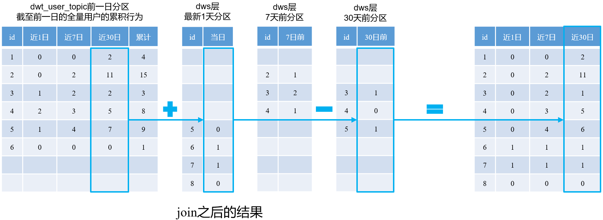

---

Created at: 2021-10-30
Last updated at: 2021-10-31
Source URL: about:blank


---

# 9-DWT层


DWS层是对DWD层事实表每日数据的汇总，而DWT层是对DWD层最近n天数据的累积汇总，即可以是最近1天、最近7天、最近30天 和 从开始至今的累积汇总。因为DWS层已经统计了DWD层每一天的数据，所以DWT层直接对DWS层数据进行汇总即可，也就是说DWT层的表与DWS层表具有对应关系，DWS层有几张表DWT层就有几张表，每张DWT层表的数据是对DWS层对应表的数据的累积汇总，比如DWT层用户主题的数据来自于DWS层用户主题表的数据，所以DWT层表的字段数量一般是DWS层对应表字段数量的若干倍。
比如DWT层的用户主题表：
```
CREATE EXTERNAL TABLE dwt_user_topic
(
    `user_id`                               STRING COMMENT '用户id',
    `login_date_first`                      STRING COMMENT '首次活跃日期',
    `login_date_last`                       STRING COMMENT '末次活跃日期',
    `login_date_1d_count`                   STRING COMMENT '最近1日登录次数',
    `login_last_1d_day_count`               BIGINT COMMENT '最近1日登录天数',
    `login_last_7d_count`                   BIGINT COMMENT '最近7日登录次数',
    `login_last_7d_day_count`               BIGINT COMMENT '最近7日登录天数',
    `login_last_30d_count`                  BIGINT COMMENT '最近30日登录次数',
    `login_last_30d_day_count`              BIGINT COMMENT '最近30日登录天数',
    `login_count`                           BIGINT COMMENT '累积登录次数',
    `login_day_count`                       BIGINT COMMENT '累积登录天数',
    `order_date_first`                      STRING COMMENT '首次下单时间',
    `order_date_last`                       STRING COMMENT '末次下单时间',
    `order_last_1d_count`                   BIGINT COMMENT '最近1日下单次数',
    `order_activity_last_1d_count`          BIGINT COMMENT '最近1日订单参与活动次数',
    `order_activity_reduce_last_1d_amount`  DECIMAL(16, 2) COMMENT '最近1日订单减免金额(活动)',
    `order_coupon_last_1d_count`            BIGINT COMMENT '最近1日下单用券次数',
    `order_coupon_reduce_last_1d_amount`    DECIMAL(16, 2) COMMENT '最近1日订单减免金额(优惠券)',
    `order_last_1d_original_amount`         DECIMAL(16, 2) COMMENT '最近1日原始下单金额',
    `order_last_1d_final_amount`            DECIMAL(16, 2) COMMENT '最近1日最终下单金额',
    `order_last_7d_count`                   BIGINT COMMENT '最近7日下单次数',
    `order_activity_last_7d_count`          BIGINT COMMENT '最近7日订单参与活动次数',
    `order_activity_reduce_last_7d_amount`  DECIMAL(16, 2) COMMENT '最近7日订单减免金额(活动)',
    `order_coupon_last_7d_count`            BIGINT COMMENT '最近7日下单用券次数',
    `order_coupon_reduce_last_7d_amount`    DECIMAL(16, 2) COMMENT '最近7日订单减免金额(优惠券)',
    `order_last_7d_original_amount`         DECIMAL(16, 2) COMMENT '最近7日原始下单金额',
    `order_last_7d_final_amount`            DECIMAL(16, 2) COMMENT '最近7日最终下单金额',
    `order_last_30d_count`                  BIGINT COMMENT '最近30日下单次数',
    `order_activity_last_30d_count`         BIGINT COMMENT '最近30日订单参与活动次数',
    `order_activity_reduce_last_30d_amount` DECIMAL(16, 2) COMMENT '最近30日订单减免金额(活动)',
    `order_coupon_last_30d_count`           BIGINT COMMENT '最近30日下单用券次数',
    `order_coupon_reduce_last_30d_amount`   DECIMAL(16, 2) COMMENT '最近30日订单减免金额(优惠券)',
    `order_last_30d_original_amount`        DECIMAL(16, 2) COMMENT '最近30日原始下单金额',
    `order_last_30d_final_amount`           DECIMAL(16, 2) COMMENT '最近30日最终下单金额',
    `order_count`                           BIGINT COMMENT '累积下单次数',
    `order_activity_count`                  BIGINT COMMENT '累积订单参与活动次数',
    `order_activity_reduce_amount`          DECIMAL(16, 2) COMMENT '累积订单减免金额(活动)',
    `order_coupon_count`                    BIGINT COMMENT '累积下单用券次数',
    `order_coupon_reduce_amount`            DECIMAL(16, 2) COMMENT '累积订单减免金额(优惠券)',
    `order_original_amount`                 DECIMAL(16, 2) COMMENT '累积原始下单金额',
    `order_final_amount`                    DECIMAL(16, 2) COMMENT '累积最终下单金额',
    `payment_date_first`                    STRING COMMENT '首次支付时间',
    `payment_date_last`                     STRING COMMENT '末次支付时间',
    `payment_last_1d_count`                 BIGINT COMMENT '最近1日支付次数',
    `payment_last_1d_amount`                DECIMAL(16, 2) COMMENT '最近1日支付金额',
    `payment_last_7d_count`                 BIGINT COMMENT '最近7日支付次数',
    `payment_last_7d_amount`                DECIMAL(16, 2) COMMENT '最近7日支付金额',
    `payment_last_30d_count`                BIGINT COMMENT '最近30日支付次数',
    `payment_last_30d_amount`               DECIMAL(16, 2) COMMENT '最近30日支付金额',
    `payment_count`                         BIGINT COMMENT '累积支付次数',
    `payment_amount`                        DECIMAL(16, 2) COMMENT '累积支付金额',
    `refund_order_last_1d_count`            BIGINT COMMENT '最近1日退单次数',
    `refund_order_last_1d_num`              BIGINT COMMENT '最近1日退单件数',
    `refund_order_last_1d_amount`           DECIMAL(16, 2) COMMENT '最近1日退单金额',
    `refund_order_last_7d_count`            BIGINT COMMENT '最近7日退单次数',
    `refund_order_last_7d_num`              BIGINT COMMENT '最近7日退单件数',
    `refund_order_last_7d_amount`           DECIMAL(16, 2) COMMENT '最近7日退单金额',
    `refund_order_last_30d_count`           BIGINT COMMENT '最近30日退单次数',
    `refund_order_last_30d_num`             BIGINT COMMENT '最近30日退单件数',
    `refund_order_last_30d_amount`          DECIMAL(16, 2) COMMENT '最近30日退单金额',
    `refund_order_count`                    BIGINT COMMENT '累积退单次数',
    `refund_order_num`                      BIGINT COMMENT '累积退单件数',
    `refund_order_amount`                   DECIMAL(16, 2) COMMENT '累积退单金额',
    `refund_payment_last_1d_count`          BIGINT COMMENT '最近1日退款次数',
    `refund_payment_last_1d_num`            BIGINT COMMENT '最近1日退款件数',
    `refund_payment_last_1d_amount`         DECIMAL(16, 2) COMMENT '最近1日退款金额',
    `refund_payment_last_7d_count`          BIGINT COMMENT '最近7日退款次数',
    `refund_payment_last_7d_num`            BIGINT COMMENT '最近7日退款件数',
    `refund_payment_last_7d_amount`         DECIMAL(16, 2) COMMENT '最近7日退款金额',
    `refund_payment_last_30d_count`         BIGINT COMMENT '最近30日退款次数',
    `refund_payment_last_30d_num`           BIGINT COMMENT '最近30日退款件数',
    `refund_payment_last_30d_amount`        DECIMAL(16, 2) COMMENT '最近30日退款金额',
    `refund_payment_count`                  BIGINT COMMENT '累积退款次数',
    `refund_payment_num`                    BIGINT COMMENT '累积退款件数',
    `refund_payment_amount`                 DECIMAL(16, 2) COMMENT '累积退款金额',
    `cart_last_1d_count`                    BIGINT COMMENT '最近1日加入购物车次数',
    `cart_last_7d_count`                    BIGINT COMMENT '最近7日加入购物车次数',
    `cart_last_30d_count`                   BIGINT COMMENT '最近30日加入购物车次数',
    `cart_count`                            BIGINT COMMENT '累积加入购物车次数',
    `favor_last_1d_count`                   BIGINT COMMENT '最近1日收藏次数',
    `favor_last_7d_count`                   BIGINT COMMENT '最近7日收藏次数',
    `favor_last_30d_count`                  BIGINT COMMENT '最近30日收藏次数',
    `favor_count`                           BIGINT COMMENT '累积收藏次数',
    `coupon_last_1d_get_count`              BIGINT COMMENT '最近1日领券次数',
    `coupon_last_1d_using_count`            BIGINT COMMENT '最近1日用券(下单)次数',
    `coupon_last_1d_used_count`             BIGINT COMMENT '最近1日用券(支付)次数',
    `coupon_last_7d_get_count`              BIGINT COMMENT '最近7日领券次数',
    `coupon_last_7d_using_count`            BIGINT COMMENT '最近7日用券(下单)次数',
    `coupon_last_7d_used_count`             BIGINT COMMENT '最近7日用券(支付)次数',
    `coupon_last_30d_get_count`             BIGINT COMMENT '最近30日领券次数',
    `coupon_last_30d_using_count`           BIGINT COMMENT '最近30日用券(下单)次数',
    `coupon_last_30d_used_count`            BIGINT COMMENT '最近30日用券(支付)次数',
    `coupon_get_count`                      BIGINT COMMENT '累积领券次数',
    `coupon_using_count`                    BIGINT COMMENT '累积用券(下单)次数',
    `coupon_used_count`                     BIGINT COMMENT '累积用券(支付)次数',
    `appraise_last_1d_good_count`           BIGINT COMMENT '最近1日好评次数',
    `appraise_last_1d_mid_count`            BIGINT COMMENT '最近1日中评次数',
    `appraise_last_1d_bad_count`            BIGINT COMMENT '最近1日差评次数',
    `appraise_last_1d_default_count`        BIGINT COMMENT '最近1日默认评价次数',
    `appraise_last_7d_good_count`           BIGINT COMMENT '最近7日好评次数',
    `appraise_last_7d_mid_count`            BIGINT COMMENT '最近7日中评次数',
    `appraise_last_7d_bad_count`            BIGINT COMMENT '最近7日差评次数',
    `appraise_last_7d_default_count`        BIGINT COMMENT '最近7日默认评价次数',
    `appraise_last_30d_good_count`          BIGINT COMMENT '最近30日好评次数',
    `appraise_last_30d_mid_count`           BIGINT COMMENT '最近30日中评次数',
    `appraise_last_30d_bad_count`           BIGINT COMMENT '最近30日差评次数',
    `appraise_last_30d_default_count`       BIGINT COMMENT '最近30日默认评价次数',
    `appraise_good_count`                   BIGINT COMMENT '累积好评次数',
    `appraise_mid_count`                    BIGINT COMMENT '累积中评次数',
    `appraise_bad_count`                    BIGINT COMMENT '累积差评次数',
    `appraise_default_count`                BIGINT COMMENT '累积默认评价次数'
) COMMENT '会员主题宽表'
    PARTITIONED BY (`dt` STRING)
    STORED AS PARQUET
    LOCATION '/warehouse/gmall/dwt/dwt_user_topic/'
    TBLPROPERTIES ("parquet.compression" = "lzo");
```

DWT层数据的装载逻辑：

首日装载时直接对DWS层对应表的所有分区的数据进行汇总，然后写到DWT层表的当日分区中（因为是累积汇总行为，所以只需要写到DWT当日的分区中）。
每日装载时，可以像首日装载那样同样直接对DWS层对应表的所有分区的数据进行汇总，但是这样效率太低，而是采用将DWS层当日新增的数据与DWT层前一日汇总的数据进行汇总的方式得到DWT层今日的汇总是数据，这样效率更高。
因为DWT层数据的最近n天的统计值的时效性很高，所以一般只会保留两天数据，于是在每日装载时会删除DWT层两天前的分区。

从DWT层首日装载和每日装载的逻辑可以看出，DWT层每个分区是对截止到当日DWS层所有分区数据的汇总，所以DWT层的每日分区保存的是对应维度表所有记录的统计值，即DWT层的数据是全量的，比如DWT层用户主题表保存的是所有的用户的最近1天、最近7天、最近30天、从开始至今的统计值，这是与DWS层不同的地方，DWS层每日分区只保存当日活跃记录的当日统计值。

**首日装载：**
比如统计DWT层用户主题表的这几个字段
```
`login_date_1d_count`                   STRING COMMENT '最近1日登录次数',
`login_last_1d_day_count`               BIGINT COMMENT '最近1日登录天数',
`login_last_7d_count`                   BIGINT COMMENT '最近7日登录次数',
`login_last_7d_day_count`               BIGINT COMMENT '最近7日登录天数',
`login_last_30d_count`                  BIGINT COMMENT '最近30日登录次数',
`login_last_30d_day_count`              BIGINT COMMENT '最近30日登录天数',
`login_count`                           BIGINT COMMENT '累积登录次数',
`login_day_count`                       BIGINT COMMENT '累积登录天数',
```
需要从DWS层用户主题表的所有分区中取数，然后按用户分组，接着按时间聚合：
```
select sum(if(dt = '2020-06-14'), login_count, 0)                login_date_1d_count,
       sum(if(dt = '2020-06-14'), 1, 0)                          login_last_1d_day_count,
       sum(if(date_add(dt, 6) >= '2020-06-14'), login_count, 0)  login_last_7d_count,
       sum(if(date_add(dt, 6) >= '2020-06-14'), 1, 0)            login_last_7d_day_count,
       sum(if(date_add(dt, 29) >= '2020-06-14'), login_count, 0) login_last_30d_count,
       sum(if(date_add(dt, 29) >= '2020-06-14'), 1, 0)           login_last_30d_day_count,
       sum(login_count)                                          login_count,
       count(*)                                                  login_day_count
from dws_user_action_daycount
group by user_id;
```
注意：sum(if())、max(if())、min(if())在根据不同条件算聚合值时非常有用

**每日装载：**
每日装载的思路是将DWS层当日新增的数据与DWT层前一日汇总的数据进行汇总，再写到DWT层当日的分区中。具体的sql实现过程如下：
1.查出DWT层前一日分区中数据、DWS层最新1天分区的数据、DWS层7天前的分区 和 DWS层30天前的分区，然后把这4张表连接在一起。因为DWS层最新1天分区会有新用户， 所以DWT层前一日分区中数据 与 DWS层最新1天分区的数据 做full join，因为DWS层7天前的分区 和 DWS层30天前的分区的所有用户数据已经汇总在DWT层前一日分区中了，所以这两个分区的数据只需要与DWT层前一日分区做left join即可。

2.用户id即维度外键取值的思路如下，因为DWS层最新1天分区会有新用户，所以应该nvl(dws\_1d\_ago.user\_id, dwt\_user\_topic.user\_id)

3.近1日汇总结果的计算思路如下，因为统计的最新一天的数据，所以应该把dws层最新1天分区写到DWT层

4.近7日汇总结果的计算思路如下，DWS层最新1天的数据加上DWT层前1日的汇总结果，然后减去DWS层7天前的数据

5.近30日汇总结果的计算思路如下，与近7日的计算思路相同

6.累积汇总结果计算思路如下，将DWT层前一日的汇总结果 与 DWS层最新一天的汇总结果加起来即可。

比如每日装载DWT层用户主题表的这几个字段
```
`login_date_1d_count`                   STRING COMMENT '最近1日登录次数',
`login_last_1d_day_count`               BIGINT COMMENT '最近1日登录天数',
`login_last_7d_count`                   BIGINT COMMENT '最近7日登录次数',
`login_last_7d_day_count`               BIGINT COMMENT '最近7日登录天数',
`login_last_30d_count`                  BIGINT COMMENT '最近30日登录次数',
`login_last_30d_day_count`              BIGINT COMMENT '最近30日登录天数',
`login_count`                           BIGINT COMMENT '累积登录次数',
`login_day_count`                       BIGINT COMMENT '累积登录天数',
```

```
select nvl(dws_new_1d.user_id, dwt_1d_ago.user_id),
       nvl(dws_new_1d.login_count, 0) login_date_1d_count,
       if(dws_new_1d.user_id is not null, 1, 0) login_last_1d_day_count,

       nvl(dwt_1d_ago.login_last_7d_count, 0) + nvl(dws_new_1d.login_count, 0) - nvl(dws_7d_ago.login_count, 0) login_date_7d_count,
       nvl(dwt_1d_ago.login_last_7d_day_count, 0) + if(dws_new_1d.user_id is not null, 1, 0) - if(dws_7d_ago.user_id is not null, 1, 0) login_date_7d_day_count,

       nvl(dwt_1d_ago.login_last_30d_count, 0) + nvl(dws_30d_ago.login_count, 0) - nvl(dws_30d_ago.login_count, 0) login_last_30d_count,
       nvl(dwt_1d_ago.login_last_30d_day_count, 0) + if(dws_30d_ago.user_id is not null, 1, 0) - if(dws_30d_ago.user_id is not null, 1, 0) login_last_30d_day_count,

       nvl(dws_new_1d.login_count) + nvl(dws_new_1d.login_count, 0) login_count,
       nvl(dwt_1d_ago.login_day_count, 0) + if(dws_new_1d.user_id is not null, 1, 0) login_day_count
from (
         -- DWT层前一日分区中数据
         select *
         from dwt_user_topic
         where dt = date_add('2020-06-15', -1)
     ) dwt_1d_ago
         full join
     (
         -- DWS层最新1天分区的数据
         select *
         from dws_user_action_daycount
         where dt = '2020-06-15'
     ) dws_new_1d
     on dws_new_1d.user_id = dws_new_1d.user_id
         left join
     (
         -- DWS层7天前的分区
         select *
         from dws_user_action_daycount
         where dt = date_add('2020-06-15', -7)
     ) dws_7d_ago
     on dws_new_1d.user_id = dws_7d_ago.user_id
         left join
     (
         -- DWS层30天前的分区
         select *
         from dws_user_action_daycount
         where dt = date_add('2020-06-15', -30)
     ) dws_30d_ago
     on dws_new_1d.user_id = dws_30d_ago.user_id
;
```

