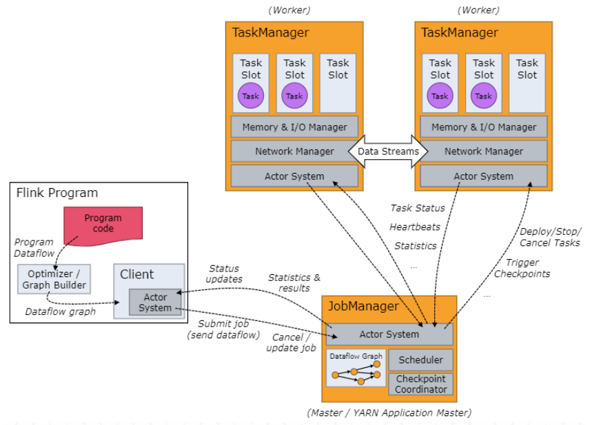
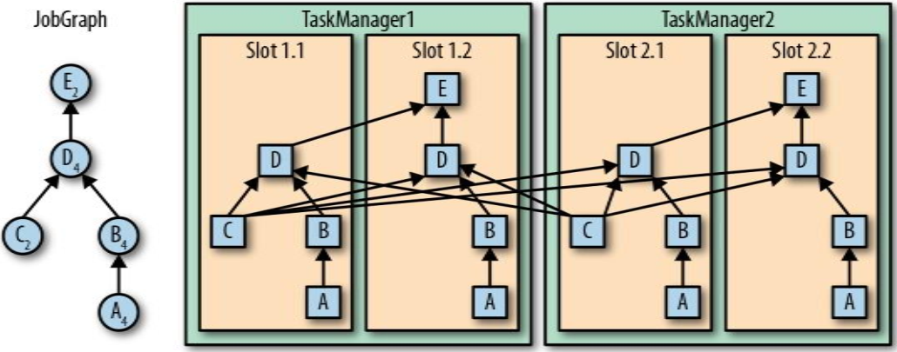
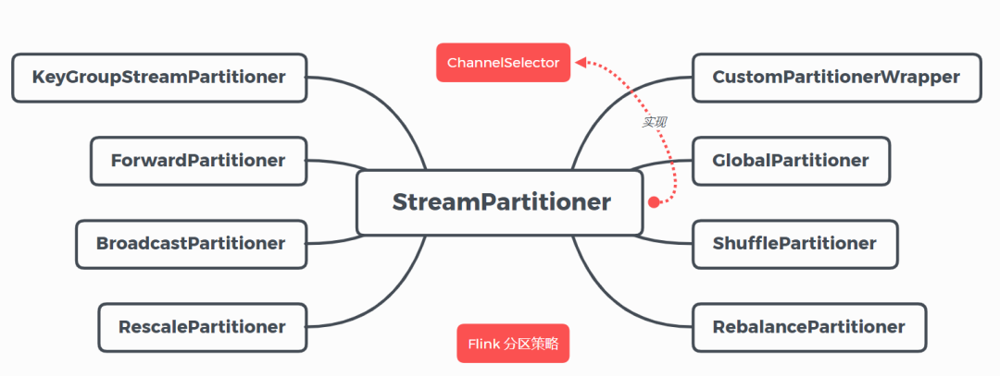
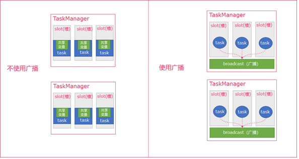
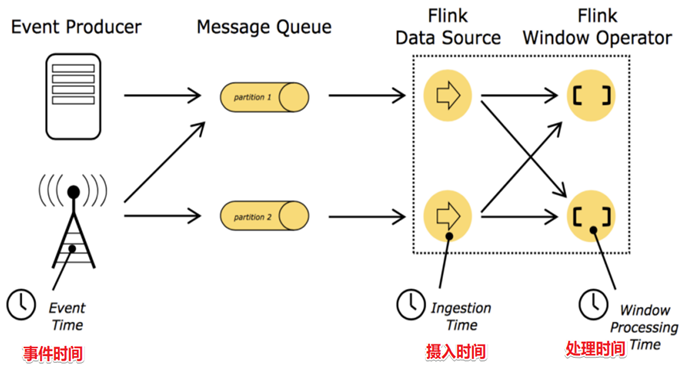
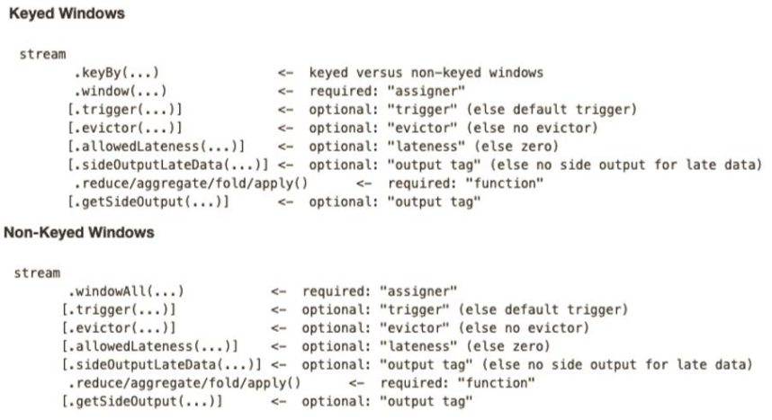

### Filnk的部署模式？

- Standalone模式：使用Flink自带的资源管理器部署Flink集群，StandaloneSessionClusterEntrypoint类似于yarn的ResourceManager，TaskManagerRunner类似于yarn的NodeManager

- Yarn模式（Session-Cluster模式、Per-Job-Cluster模式）
  
  - Session-Cluster模式：Session-Cluster模式是先在 yarn 中初始化一个 flink 集群（yarn的一个application），开辟指定的资源，以后提交任务都向这里提交，这个 flink 集群会常驻在 yarn 集群中， 除非手工停止（与standalone模式很类似）。Session-Cluster模式需要先初始化 flink 集群并指定资源的数量，如果不能满足下一个作业所需要的资源，那么该作业就无法提交，只能等到前面的作业执行完成后， 释放了资源， 该作业才会能提交成功。
  
  - Per-Job-Cluster模式：每次提交都会创建一个新的 flink 集群，任务之间互相独立，互不影响，任务执行完成之后创建的集群也会消失。 Per-Job-Cluster模式下，一个 Job 会对应一个集群，每提交一个作业会根据自身的情况，都会单独向 yarn 申请资源，直到作业执行完成，一个作业的失败与否并不会影响下一个作业的正常提交和运行，适合规模大长时间运行的作业。

### 详细介绍一下Flink的运行架构？



由 Client 提交任务给 JobManager，JobManager 再调度任务到各个TaskManager 去执行。

- **Client**
  
  Client是用来提交 job 到 Flink 集群的，Client 负责 StreamGraph (流图)和 JobGraph (作业图)的构建。

- **JobManager**
  
  JobManager 根据并行度将 Flink 客户端提交的Flink 应用分解为子任务（将JobGraph转换成ExecutionGraph），从资源管理器 **ResourceManager** 申请所需的计算资源，资源具备之后，开始分发任务到 TaskManager 执行 Task，并负责应用容错，跟踪作业的执行状态，发现异常则恢复作业等。

- **TaskManager**
  
  TaskManager 接收 JobManage 分发的子任务后，负责任务的启动、 停止、销毁、异常恢复等生命周期阶段。

### slot 和 并行度 的关系？

TaskManager 在启动前就设置好了槽位数（slot），slot数就是每个TaskManager能启动的最大线程数。

一个作业由许多算子构成一个数据流图，一个算子会被包装成许多相同的任务task，在相同或者不同的TaskManager的不同的线程上执行，处理不同的数据，这些任务称为这个算子的子任务，子任务数量也就是这个算子的并行度。不同算子的子任务会共享slot。

TaskManager 从 JobManager 处接收子任务后，就会启动线程来执行子任务。因为同一算子的子任务必须在不同的slot上执行，所以一个算子的并行度不能超过所有TaskManager总的slot数，不然就无法满足作业执行的最少资源。



### 算子的并行度如何设置？

从四个不同层面设置并行度：

- 操作算子层面(Operator Level)，算子的`setParallelism(2)`方法

- 执行环境层面(Execution Environment Level)，执行环境中设置所有算子的默认并行度：`env.setParallelism(4);`

- 客户端层面(Client Level)，提交作业时在命令行参数中指定并行度：-p参数

- 系统层面(System Level)，配置文件flink-conf.yaml中的设置的所有算子的默认并行度：parallelism.default: 1

优先级：算子层面>环境层面>客户端层面>系统层面。

### Flink编程模型？

Flink 作业由三部分组成，**源** Source、**转换** transformation、**输出** sink。Source 负责读取数据源， Transformation 利用各种算子进行处理加工， Sink负责输出。 每一个dataflow以一个或多个sources开始以一个或多个sinks结束， dataflow是一个有向无环图（ DAG）。

**常用Source算子：**  

- 从内存读：fromElements

- 从文件读：readTextFile

- Socket 接入 ：socketTextStream

- 自定义读取：createInput

**常用transformation算子：** Map（单输入单输出）、FlatMap（单输入、多输出）、Filter（过滤）、KeyBy（分组）、Reduce（聚合）、Window（窗口）、Connect（连接）、Split（分割）等。

**常用sink算子：** print、writeToSocket、自定义Sink

#### 简单说一下flink计算wordcount的步骤？

主要包含以下几步：

1. 获取运行环境  `StreamExecutionEnvironment.getExecutionEnvironment();`

2. 接入source源

3. 执行转换操作，如map()、flatmap()、keyby（）、sum()

4. 输出sink源，如print()

5. 执行 `env.execute();`

### Flink的分区策略（数据传输方式）？

目前 Flink 支持**8种分区策略**的实现：



1. **ForwardPartitioner**
   
   在API层面上**ForwardPartitioner**应用在DataStream上，生成一个新的 DataStream。如果前后两个算子的并行度相同，并且没有调用下面的算子将数据打乱，那么默认就是forward，所以一般不会调用这个算子。如果调用这个算子，那么要求前后两个算子的并行度必须相同。

2. **RebalancePartitioner**
   
   以**Round-robin**（轮询）的方式为每个元素分配分区，确保下游的 Task 可以均匀地获得数据，避免数据倾斜。

3. **KeyGroupStreamPartitioner**
   
   在API层面上，**KeyGroupStreamPartitioner**应用在 **DataStream**上，生成一个新的 **KeyedStream**。会将数据按 Key 的 Hash 值输出到下游算子实例中。**该分区器不是提供给用户来用的**。

4. **ShufflePartitioner**
   
   随机的将元素进行分区，可以确保下游的Task能够均匀地获得数据。

5. **BroadcastPartitioner**
   
   将该记录广播给所有分区，即有N个分区，就把数据复制N份，每个分区1份。

6. **GlobalPartitioner**
   
   数据会被分发到下游算子的第一个实例中进行处理。

7. **RescalePartitioner**
   
   将上游算子的部分子任务的数据轮询地发送给下游算子的部分子任务，比如上游算子有2个子任务，下游算子有4个子任务，那么就会1对2的轮询发送数据。

8. **CustomPartitionerWrapper**
   
   用户自定义分区器，需要用户自己实现Partitioner接口，来定义自己的分区逻辑。

### Flink的广播机制了解？广播流？



广播变量是发给TaskManager的内存中，将一个数据广播后，不同的TaskManager都可以在节点上获取到，每个节点只存一份， 如果不使用广播，每一个slot都会拷贝一份数据集，造成内存资源浪费。

### 说一下富函数？

Transform算子需要传递一个以Function结尾接口或者抽象类的实现类的对象，其目的就是作为参数传递方法，其中有一类函数是以Rich开头以Function结尾的抽象子类，于是称为富函数，它提供了比原有接口和抽象类更丰富的功能，比如可以**获取运行环境的上下文**（可以从运行时上下文中获取状态），拥有一些**生命周期方法**，可以实现更复杂的功能。

RichFunction 有两个生命周期方法：

`open()`方法是 RichFunction 子类对象反序列化时会调用的方法。

`close()`方法是RichFunction 子类对象销毁时调用的方法，做一些清理工作。

RichMapFunction的匿名子类实例只在主线程（JobManager）上实例化一次，然后被序列化传送到每一个map算子子任务所在的slot中，所以每个线程都会有一份RichMapFunction匿名子类对象。并且当taskManager的slot反序列化RichMapFunction匿名子类对象时会调用open()方法。当任务结束时，会调用close()方法。

### Flink的四大基石？

1. **Time（时间）**

2. **Window（窗口）**

3. **State（状态）**

4. **Checkpoint（检查点）**

### Flink的时间语义？



Flink有3种时间语义：Event Time、Ingestion Time、Processing Time

- Event Time指的是数据产生的时间，需要外部数据源在产生数据时带上时间戳。

- Ingestion Time指的是数据到达Flink的Source时的时间，以systemTime为准。

- Processing Time是指到达算子的时间，以systemTime为准。

### WaterMark原理？

watermark实际上也是一条数据，与普通的业务数据StreamRecord都继承自StreamElement抽象类，从调用assignTimestampsAndWatermarks()指定如何生成watermark开始，watermark会与业务数据一起从上游向下游传递。

当数据发生Redistributing 时，watermark会以广播的方式向下游分区传递，这样才能保证所有Redistributing后的下游分区接收到相同的watermark，然后下游算子会选出最小的那个watermark再向下游传递。

事实上，当发生第一次Redistributing后，后面不管是one-to-one还是再发生Redistributing，所有并行流中watermark都会是相同的，因为第一次Redistributing后的第一个算子的所有子任务向下游发送的是相同的watermark。

### WaterMark生成的策略？

首先要设置为事件时间语义EventTime`env.setStreamTimeCharacteristic(TimeCharacteristic.EventTime);`。

通过DataStream的`assignTimestampsAndWatermarks()`方法设置将时间戳赋值给watermark的策略，assignTimestampsAndWatermarks()方法需要传入`AssignerWithPeriodicWatermarks`接口 或者 `AssignerWithPunctuatedWatermarks `接口的子类实现，这两个接口均是继承自TimestampAssigner接口。

如果是AssignerWithPeriodicWatermarks接口，Flink会周期性地生成watermark，这个周期的默认值是200ms，也可以自己设置`env.getConfig().setAutoWatermarkInterval(200);`。如果是AssignerWithPunctuatedWatermarks 接口，Flink每接收一条数据都会生成watermark。

AssignerWithPeriodicWatermarks接口的两个子抽象类实现，即AscendingTimestampExtractor 和 BoundedOutOfOrdernessTimestampExtractor。首先在两个类中都有一个当前时间戳字段，这个字段的值是当前assignTimestampsAndWatermarks算子收到数据中的最大时间戳。AscendingTimestampExtractor 直接将最大时间戳-1赋值给了watermark，也就是watermark是当前Flink接收到的数据的最大时间戳-1ms。BoundedOutOfOrdernessTimestampExtractor 会将最大时间戳减去 `maxOutOfOrderness`最大乱序时间后赋给 watermark，相当于把整个flink的EventTime调慢了一个maxOutOfOrderness。

### filnk有哪几种窗口？

1. 时间窗口（ Time Window）：
   
   - 滚动时间窗口
   
   - 滑动时间窗口

2. 计数窗口（ Count Window）：
   
   + 滚动计数窗口
   - 滑动计数窗口

3. 会话窗口

### WindowedStream的聚合算子传入的函数有哪两类？

增量聚合函数（ incremental aggregation functions）和 全窗口函数（ full window functions）。

- 增量聚合函数包括：ReduceFunction 和 AggregateFunction。增量聚合的意思是，窗口中每来一条数据，算子就会调用增量聚合函数对数据进行一次计算，每次计算都会保存中间结果，这个中间结果称为状态，也就是每次计算其实是对该状态的更新。

- 全窗口函数包括：ProcessWindowFunction 和 WindowFunction。全窗口聚合的意思是，窗口中每来一条数据，算子并不会立即进行计算，而是先把窗口内的所有数据收集起来，等到窗口关闭时再调用全窗口函数遍历所有数据一次性地计算，类似于批处理。

### Window API调用顺序？



- **WindowAssigner**：创建WindowedStream的window()方法需要传入抽象类WindowAssigner（窗口分配器）的一个子类对象来指定创建窗口的类型以及一些属性。

- **Trigger**：trigger()方法可选，在开窗之后，使用窗口聚合算子之前调用，传入Trigger接口的实现类对象。每当有元素加入到该窗口，或者之前注册的定时器超时了，那么Trigger都会被调用。
  
  Trigger的返回结果可以是 ：
  
  1. `CONTINUE`（继续、不做任何操作）
  
  2. `FIRE`（触发计算，处理窗口数据）
  
  3. `PURGE`（触发清理，移除窗口和窗口中的数据）
  
  4. `FIRE_AND_PURGE`（触发计算+清理，处理数据并移除窗口和窗口中的数据）

- **Evictor**：evictor()方法可选，在trigger()之后，使用窗口聚合算子之前调用，传入Evictor接口的实现类对象。**Evictor 主要用来遍历窗口中的元素列表，并决定最先进入窗口的多少个元素需要被移除**。剩余的元素会交给用户指定的函数进行窗口的计算。如果没有 Evictor 的话，窗口中的所有元素会一起交给函数进行计算。

- **allowedLateness()**：使用WindowedStream的allowedLateness()方法设置一个允许迟到的时间，比如allowedLateness(Time.seconds(2))表示允许数据迟到2s。设置允许迟到时间之后的计算过程是，在窗口关闭时，会对窗口中的数据进行一次计算然后输出结果，在允许迟到时间内来的迟到数据，每来一条都会与已关闭窗口中的数据重新做一次计算得到结果，然后输出这个结果。

- **sideOutputLateData()**：使用WindowedStream的sideOutputLateData()方法设置侧输出流，对于在允许时间之后迟到的数据直接扔进侧输出流中，再在侧输出流中做处理。

- **getSideOutput()**：使用getSideOutput()方法拿到侧输出流。

### Flink有哪几种状态及其特点？

流式计算分为无状态和有状态两种情况。状态是指中间计算结果。无状态不会保存中间计算结果，数据来一条处理一条，比如map算子；有状态会保存中间计算结果，数据来一条就会基于之前保存的状态计算一个结果，并把这个结果更新到状态中，比如聚合算子就是有状态的计算。

**状态有两个作用：** 一是对于有状态算子，状态作为中间计算结果；二是状态是checkpoint的基础，对于flink的高可用容灾意义重大。

状态又分为类型：

- 算子状态（ Operator State）

- 键控状态（ Keyed State）

**Operator State特点：**

1. 可以用于所有算子，但整个算子只对应一个state。

2. 实现 `CheckpointedFunction `或者 `ListCheckpointed `接口。

3. 目前只支持 `ListState `数据结构。

**keyed State特点：**

1. 只能用在keyedStream上的算子中，状态跟特定的key绑定

2. 通过RuntimeContext访问，实现RichFunction接口。

每个分组一个状态需要使用键控状态接口，以下键控状态接口均继承自State接口：

- 值状态（ `ValueState<T>`）：将状态表示为单个的值

- 列表状态（`ListState<T>`）：将状态表示为一组数据的列表

- 映射状态（ `MapState<K, V>`）：将状态表示为一组 Key-Value 对

- 聚合状态（`ReducingState<T>` & `AggregatingState<I, O>`）：将状态表示为一个用于聚合操作的列表

使用键控状态必须实现富函数，因为键控状态需要从运行时上下文中获取，而且键控状态的初始化只能在open()方法中进行，因为每个子任务的运行时上下文是不同的。

### 状态如何存储？

状态由状态后端**StateBackend**负责存储 , 它具备两种能力：

（1）维护本地状态。在计算过程中提供访问State能力，开发者在编写业务逻辑中能够使用StateBackend的接口读写数据。

（2）生成checkpoint。将State持久化到外部存储就叫checkpoint检查点，提供容错能力。

Flink提供了三种状态后端：  

1. MemoryStateBackend：内存级的状态后端，会将状态放在 TaskManager 的 JVM 堆内存中作为对象进行管理，State 存储在 TaskManager的内存中，受限于 TaskManager的内存大小；而将 checkpoint 存储在 JobManager 的内存中。适用于验证、测试、不推荐生产使用。

2. FsStateBackend：对于本地状态， 跟 MemoryStateBackend 一样，放在 TaskManager 的 JVM 堆上，State 存储在 TaskManager的内存中，受限于 TaskManager的内存大小；而将 checkpoint 存到远程的持久化文件系统（ FileSystem） 上， 比如HDFS，此种方式同时拥有内存级的本地访问速度，对于checkpoint也有容错保证，生产环境首选。

3. RocksDBStateBackend：对于本地状态，RocksDBStateBackend 使用嵌入式的本地数据库 RocksDB 将流计算数据状态存储在本地磁盘中，不会受限于TaskManager 的内存大小，在执行checkpoint的时候，再将整个 RocksDB 中保存的State数据全量或者增量持久化到配置的文件系统中，比如HDFS。RocksDBStateBackend 相比基于内存的StateBackend，访问State的成本高很多，可能导致数据流的吞吐量剧烈下降，甚至可能降低为原来的 1/10。
   

### 状态持久化到文件系统的策略？

持久化策略有两种：

- **全量持久化策略** ：每次将全量的State写入到状态存储中（HDFS），内存型、文件型、RocksDB类型的StataBackend 都支持全量持久化策略。

- **增量持久化策略** ：增量持久化就是每次持久化增量的State，**只有RocksDBStateBackend 支持增量持久化。**

### Filnk的容错机制？checkpoint？

Flink 使用轻量级分布式快照，生成检查点（**checkpoint**）实现可靠容错。将State持久化到外部存储后就叫checkpoint检查点。

Flink 使用的分布式快照算法也叫Chandy-Lamport 算法，大致原理是，当要生成checkpoint的时候，JobManager会向所有source发送一条带有检查点ID的消息，这时每个source会生成一条与watermark类似的特殊数据——**检查点分界线（ Checkpoint Barrier）**，所有有状态子任务收到Barrier之后都会保存checkpoint，这条数据的传递和watermark一样，当发生数据的Redistributing，就会以广播的方式传递到下游，从而保证下游的所有子任务都会收到这条数据。

### 什么是Barrier对齐？

当一个下游子任务会收到多个上游子任务的数据时，也就会收到多个barrier，与watermark取最小值不同的是，此时下游子任务会等所有source的barrier到齐之后才开始保存状态到checkpoint（称为barrier对齐），这是因为barrier含义是所有barrier之前的数据都应该是已经处理完保存在状态中了，而barrier之后的数据应该保存在下一个状态中，所以在barrier尚未到齐之前，对于barrier已经到达的分区，继续到达的数据会被缓存， 而barrier尚未到达的分区，数据会被正常处理。

### 什么是Savepoint保存点？

保存点与检查点原理一样，也可用于恢复程序。保存点与检查点不同之处就在于：

1.保存点需要人为手动地触发，而检查点是由Flink周期性地生成。

2.从保存点中恢复程序需要在提交应用时指定保存点的位置，适用于应用升级、集群迁移、 Flink 集群版本更新、A/B测试以及假定场景、暂停和重启、归档等场景。而检查点是用于故障恢复的，其恢复过程由Flink自动进行。

### Checkpoint中保存的是什么信息？

对于Source，checkpoint总保存的是读取数据源的偏移offset；对于transform算子，checkpoint保存的是State；sink算子虽然没有checkpoint需要保存，但是sink任务收到barrier之后需要向JobManager发送确认消息，当所有sink任务都发送完消息后，检查点才算真正保存完成了。

### 当作业失败后，检查点如何恢复作业？

Flink提供了两种恢复机制： **应用自动恢复机制** 和 **手动作业恢复机制**。

**应用自动恢复机制：**

1. 定期恢复策略：fixed-delay
   
   固定延迟重启策略会尝试一个给定的次数来重启Job，如果超过最大的重启次数，Job最终将失败，在连续两次重启尝试之间，重启策略会等待一个固定时间，默认Integer.MAX_VALUE次

2. 失败比率策略：failure-rate

3. 直接失败策略：None ，失败不重启

**手动作业恢复机制**：提交应用时指定checkpoint的位置。

### 什么是状态一致性，Flink提供了哪一个级别的状态一致性？

对于分布式应用而言，任何一个环节出现异常都可能会导致数据的丢失或者重复计算，于是状态一致性可分为3个等级：

- at-most-once：数据最多被消费一次

- at-least-once：数据最少消费一次

- exactly-once：数据恰好被消费一次

Flink的checkpoint机制可以保证Flink内部状态exactly-once，但整个数据处理流程的状态一致性级不仅取决于Flink内部，还取决于Flink的source与sink连接的外部系统，换句话说，整个系统的状态一致性级别取决于所有组件中一致性最弱的那一个，这也被称为端到端（end-to-end）状态一致性。

Flink source端一致性级别取决于外部系统**可不可以重置数据的读取位置**，比如socket不可以重设读取位置，那么source端一致性级别就是at-most-once，Kafka可以设置offset，那么source端就是exactly-once，此时offset保存在Flink的状态中，不是保存在Kafka的默认topic里，不需要提交offset。

要保证sink端exactly-once，就需要保证从故障恢复时，数据不会重复写入外部系统，具体有两种实现方式：**幂等（Idempotent）写入** 和 **事务性（Transactional）写入**。

- 幂等写入是指外部系统对于重复的写入操作只会保留一次结果。比如数据库的唯一主键可以阻止重复的插入操作；Redis的setnx命令的语义本事就具有幂等性，但是对于map这种数据结构，在Flink故障恢复之后的重新计算可能会引起短暂地结果回退，但是最终还是可以达到状态一致性；Kafka可以开启`acks=all`和幂等。

- 事务性写入是指分布式事务的实现方式——两阶段提交协议（2PC）。Flink的 TwoPhaseCommitSinkFunction 函数提取并封装了两阶段提交协议中的公共逻辑，保证Flink 发送Sink端时实现严格一次处理语义。事务性写入还需要外部系统支持事务，通过构建事务来写入外部系统，具有事务的特点，即要么全部写入成功，要么全部失败，从而保证了不会重复数据。**事务的开始对应着保存checkpoint的开始，checkpoint真正完成时事务结束，这时才把所有结果提交到sink所连接的外部系统中。**

### Flink反压？

#### 什么是反压？

当下游任务处理数据的速度 远低于 上游任务发送数据的速度 时，如果不限制上游任务的发送速度，就可能会造成OOM，导致系统崩溃，反压正是用来当发生这种情况时限制上游发送速度的一种机制，能防止系统崩溃。引入反压机制之后，当发生下游处理速度跟不上上游处理速度时，下游会及时向上游反馈，从而抑制上游的发送速度，然后如果直接上游没有缓存数据的能力，会接着继续向上游反压，直到source放慢读数据。所以反压沿着相反的方向传播，沿着数据流向上游传播。出现反压之后，虽然系统不至于立即崩溃，但这表示系统性能已经严重降低，所以我们我们必须及时排查导致反压的问题并加以解决（就像人感觉到寒冷会打寒颤一样，如果人没有打寒颤机制，那么人会因为体温流失而死亡，人引入打寒颤机制之后有两个作用，一是产生少量热量，不至于立刻嗝屁，二是给大脑报警，但是寒冷的问题必须要尽快解决）。

#### 出现反压会造成哪些影响？

首先说明反压是系统的一个正向调节机制，不是导致问题出现的负向原因，他们之间是有因果关系的，为什么会这样提问？因为他们总是同时出现，所以这些概念经常会混在一起提及。比如数据倾斜是造成反压的原因，下游任务处理数据的速度 远低于 上游任务发送数据的速度是数据倾斜导致的问题，反压是缓解这个问题的手段。下游处理速度跟不上上游处理速度会**导致checkpoint时间过长**，因为 checkpoint barrier 是不会越过普通数据的，数据处理被阻塞也会导致 checkpoint barrier 流经整个数据管道的时长变长，因而 checkpoint 总体时间（End to End Duration）变长。

#### Flink是如何实现反压的？

flink的反压经历了两个发展阶段,分别是基于TCP的反压(<1.5)和基于credit的反压(>1.5)

- 基于 TCP的滑动窗口机制的反压，基于TCP的反压最大的问题是会造成整个TaskManager端的反压，所有的task都会受到影响

- 基于 Credit 的反压，RS与IC之间通过backlog和credit来确定双方可以发送和接受的数据量的大小以提前感知，而不是通过TCP滑动窗口的形式来确定buffer的大小之后再进行反压

#### 怎么样才能知道系统出现了反压？

webUI页面[监控反压](https://nightlies.apache.org/flink/flink-docs-master/zh/docs/ops/monitoring/back_pressure/#%e7%9b%91%e6%8e%a7%e5%8f%8d%e5%8e%8b)

#### 有哪些问题会导致反压？换句话说，出现反压我们应该从哪些方面去排查？

1. 系统资源不足，主要是cpu和内存资源，解决办法就是增加服务器的数量；还有个办法可以缓解一下内存资源不足问题，那就是`算子链`机制，算子链就是把并行度相同的两个算子的子任务合并成一个子任务。

2. 数据倾斜

3. 外部IO依赖，IO属于很耗时的操作，如果算子的子任务在进行IO操作就会造成处理速度很重降低，解决办法就是使用Flink提供的异步IO操作，或者还可以加入缓存。

### Flink为什么使用自主内存管理而不用JVM内存管理？

### Flink内存模型？

### 简单介绍一下CEP？

### 双流join?

### 异步IO?

```java
public static <IN, OUT> SingleOutputStreamOperator<OUT> orderedWait(DataStream<IN> in, AsyncFunction<IN, OUT> func, long timeout, TimeUnit timeUnit, int capacity) {
        return addOperator(in, func, timeUnit.toMillis(timeout), capacity, AsyncDataStream.OutputMode.ORDERED);
    }
```

```
AsyncDataStream.unorderedWait()
```

主线程调用`AsyncDataStream.unorderedWait()`就启动了另外一个线程处理后面来的流数据，每来一条数据都会在这个线程上调用`AsyncFunction.asyncInvoke()`方法处理数据，在这asyncInvoke()方法如果不另外为每次到来的数据开辟一个线程处理的话，那么数据就是依次排好序等待去HBase查到维度数据关联好之后再处理下一条数据，所以一般又会在asyncInvoke()方法里把查询HBase的过程提交给线程池。

~~在主线程里多次调用AsyncDataStream.unorderedWait()效果的是这些线程在同时处理数据，比如如果不是异步，那么效果是先查A维表处理好这一条数据，然后这条数据流到下游再查B维表关联维度；如果使用了AsyncDataStream.unorderedWait()，那么这条数据会同时出现在多个线程中查对应的维表关联维度。~~


> 参考：[史上最全干货！Flink面试大全总结（全文6万字、110个知识点、160张图）](https://mp.weixin.qq.com/s?__biz=Mzg5NDY3NzIwMA==&mid=2247497240&idx=1&sn=954c0702a2d842f9facb4e36c8c44563&source=41#wechat_redirect)
