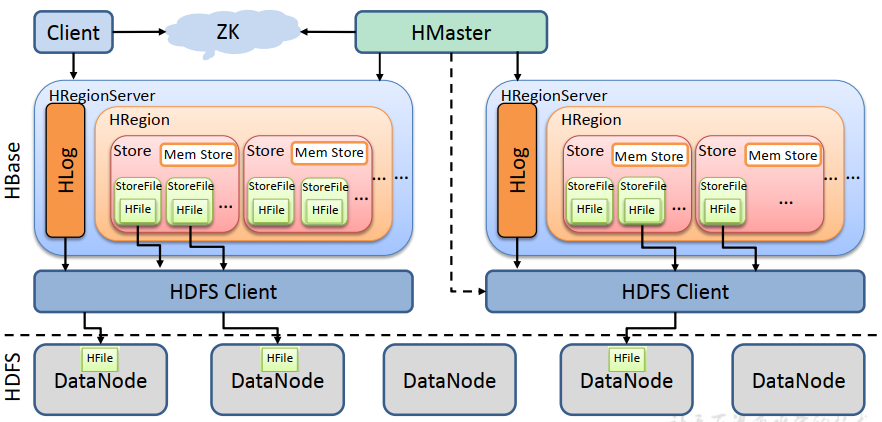
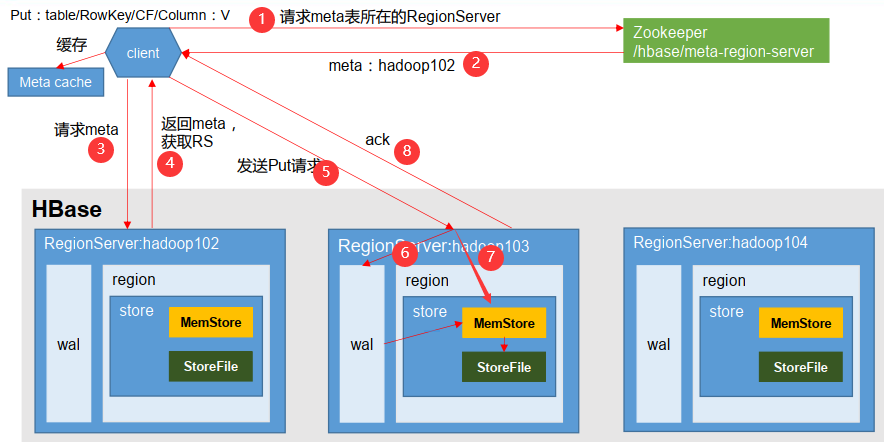
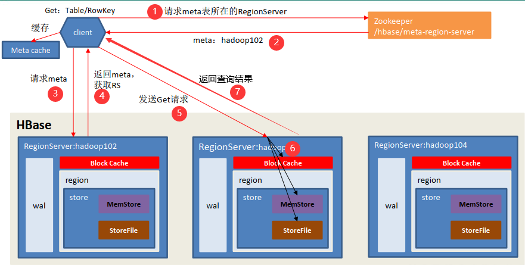
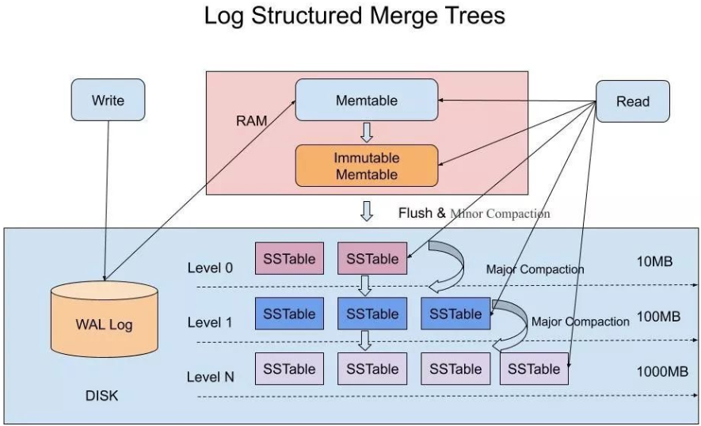

### HBase表的逻辑结构？

HBase表的逻辑结构只涉及这个概念：**RowKey、列族、列、timestamp**。通过 RowKey + 列族 + 列 确定一个单元格，一个单元格有多个版本的历史数据，靠timestamp标识。

- RowKey：每一行数据都有一个唯一的RowKey，在建表时不需要指定，但是在插入数据时必须给出，可以是任意字符串(最大长度是 64KB)，**数据是按照 RowKey的字典顺序存储的**，在查询数据时也必须给出RowKey。

- 时间戳（timestamp）：一个单元格会保存多个版本的数据，每个版本都有自己的时间戳，时间戳最大的数据为最新版本，时间戳的类型是 64 位整型，精确到毫秒，可以在数据写入时自动赋值，也可以由客户显式赋值。
  - 单元格需要保留多少个版本的数据，可以在建表时通过指定该单元格所在列族的VERSIONS属性的值来确定，默认只保留一个版本，也可以在建表以后修改列族的VERSIONS属性的值，每个列族的VERSIONS属性的值可以不同。

### HBase表的物理结构？

物理结构涉及的概念：**Region、store、HFile**。

- Region：表的数据量大了之后，HBase会将表进行横向切分，每一部分被称为Region，也可以在建表的时候进行预分区，即提前设置好Region的个数以及每个Region的rowkey范围。一张HBase表的数据以Region为单位交给不同的RegionServer进行维护。

- Store：一个Region的一个列族的数据就是Store。一个Region以Store为单位进行维护

- HFile：每次将Store刷写到HDFS生成的文件称为HFile，或者称为StoreFile。

### HBase架构？

HBase的主要组成是：Master、RegionServer、Client

涉及的外部组件：Zookeeper、HDFS

----

**Master**：

- 处理客户端对**命名空间**和**表**的ddl操作：Master会把命名空间的元数据写到hbase:namespace表；把表的元数据写到hbase:meta表中。

- 管理RegionServer集群：

  - Master会把所有表的Region分摊到每个RegionServer中进行维护，实现RegionServer集群的负载均衡，接着Master还会把表的Region正在被哪些RegionServer所维护的信息写到hbase:meta表中，然后把hbase:meta表正在被哪个RegionServer所维护的信息写到zookeeper中。
  - 当有RegionServer挂掉了，Master会把挂掉的RegionServer所维护的Region的任务分给其它的存活的RegionServer，接着Master会修改hbase:meta表中关于Region正在被哪些RegionServer所维护的信息。

  **hbase:meta表存了哪些数据：**表的元数据，以及表的Region正在被哪些RegionServer所维护

----

**RegionServer**：RegionServer负责维护表的Region，处理来自客户端对Region的读写请求。一个RegionServer可以维护许多来自不同表的Region，当然也可以是同一张表的不同Region。

- **MemStore**：表的Store的数据在内存中就是MemStore，一个Region有多个列族，从而有一个Region有多个MemStore。**数据在MemStore中按rowkey组织成跳表，所以数据在MemStore是有序的**。

----

**zookeeper：**

- zookeeper的数据存储服务：zookeeper保存了hbase:meta表正在被哪个HRegionServer所维护的信息，以及其它很多信息，比如master和/backup-masters所在的主机；
- zookeeper的监听通知服务：master集群的高可用也依赖于zookeeper，所有Master会在zookeeper上创建临时节点，当主Master挂掉之后，其它备份Master就会收到通知，之后争抢创建新的临时节点，创建成功的会成为新的主Master。

----

**Client**：HBase的客户端并不需要与HMaster连接，因为HMaster已经将Client所需要的集群的信息存到zookeeper了，所以HBase的客户端只需要与zookeeper建立连接即可，Client会从zookeeper中获取到相关的信息，然后再与具体的主机连接完成请求。

### HBase写数据流程？

在HBase中，任何形式的写数据，比如插入、删除、修改，都是新增一条带有时间戳的新数据。

1. Client 先访问 zookeeper，获取 hbase:meta 表位于哪个 RegionServer，并将 meta 表的位置信息缓存在客户端的 meta cache。
2. 访问hbase:meta 表位于的 RegionServer，查询要插入的rowkey（`namespace:table/rowkey`）位于哪个 RegionServer 中的哪个 Region 中，并将region 信息缓存在客户端的 meta cache。
3. 将写请求发送到目标RegionServer。
4. RegionServer 先将写请求顺序写入 WAL。
5. 然后RegionServer 根据列族将数据写入对应的MemStore。在MemStore中，数据以跳表的形式维持有序性。
6. 向客户端返回ack消息，此时客户端的写请求已经完成，但修改的数据没有保存到HDFS中，因为要等到 MemStore 的刷写，才会将数据写到 HFile。

### MemStore的刷写？

每个MemStore会经历多次刷写，每次刷写都会将MemStore中的数据只保留表列族设置的VERSIONS个版本，然后将数据写到HDFS上生成HFile，最后清空MemStore。

MemStore Flush 的时机：

- RegionServer 中 MemStore 的总大小达到低水位阈值，会对所有MemStore 进行刷写，此时RegionServer 仍会处理客户端的写请求，当MemStore 的总大小达到高水位阈值，RegionServer将会阻塞用户的写请求，直到MemStore 的总大小达到低水位阈值。
- 某个MemStore的大小达到了一定的阈值。
- 距离MemStore最后一次写入的时间间隔到达设置的自动刷写的时间间隔。

### HFile的合并？

memstore每次刷写都会生成一个新的HFile，从而一个单元格的不同版本（timestamp）的数据会分布在不同的 HFile 中，因此查询可能需要遍历多个的 HFile。 为了减少 HFile 的个数，以及清除过期（超过表列族设置的VERSIONS）和 删除（type=Delete）的数据，HBase会对HFile进行合并。

Compaction 分为两种，分别是 Minor Compaction 和 Major Compaction。

- Minor Compaction只是单纯地将临近的若干个较小的 HFile 合并成一个较大的 HFile，不会清理过期和删除的数据。
- Major Compaction 会将一个 Store 下的所有的 HFile 合并成一个大 HFile，并且会清理掉过期和删除的数据。

### HBase读数据流程？

1. Client 先访问 zookeeper，获取 hbase:meta 表位于哪个 HRegionServer，并将 meta 表的位置信息缓存在客户端的 meta cache。
2. 访问hbase:meta 表位于的 RegionServer，查询rowkey（`namespace:table/rowkey`）位于哪个 RegionServer 中的哪个 Region 中，并将region 信息缓存在客户端的 meta cache。
3. 将读数据请求发送到目标 HRegionServer。
4. HRegionServer 先从 MemStore 找数据，如果没有，再到 BlockCache 里面读，BlockCache 还没有，再到 HFile 上读。如果是从 HFile 里面读取到数据，则将查询到的数据缓存到 Block Cache。
5. 将查询到的数据返回给客户端。

Block缓存与Memstore的区别：Block中缓存的是已经刷写到HFile中又被读出来的块，而Memstore是新写入还没有刷写到HFile中的块。

### HFile的结构？

HFile文件的特点：

1. HFile由DataBlock（datablock大小默认为64KB）、Meta信息（Index、BloomFilter）、Info等信息组成。
2. 整个DataBlock由一个或者多个KeyValue组成。
3. 数据在文件内按Key排序。

根据HFile文件的特点，RegionServer根据rowkey读取HFile文件的流程是这样的：

1. 先把 索引 和 布隆过滤器 读到内存中
2. 然后先根据布隆过滤器查这个rowkey在不在这个HFile中，布隆过滤器返回false，那就表示不在，于是接下来应该读下一个HFile，如果返回true，表示可能在
3. 可能在的话，接下来应该根据rowkey查索引，看数据在HFile的哪个块中
4. 再然后读这个块的数据
5. 如果在这个块中，那么就返回，不在的话，还是要接着读下一个HFile

### 简单介绍一下WAL？

WAL是数据库保证数据写入的**低延时**和**持久性**常用的技术。不只是HBase。

如果数据库在内存对数据修改过后就直接向用户返回修改成功，然后再等到合适的时机再刷写到磁盘，这样快是快了，但是没有保证持久性，如果等到每次将修改过后的数据落盘之后再返回修改成功呢，这样虽然保证了持久性，但是又增加延时。WAL（Write Ahead Log，预写日志）解决了这一问题，同时保证数据写入的低延时和持久性。

低延时：WAL并不需要真正等到内存中已修改的数据刷写到磁盘后才向用户返回修改成功，而是先将增删改操作追加写到磁盘上的日志文件中，然后再更新内存中的数据，这两个操作完成即可向用户返回成功，因为将增删改操作追加到日志文件是顺序写磁盘，效率很高，所以对于用户来说可以做到快速更新。

持久性：如果数据库宕机，那么下次重启的时候，可以根据WAL恢复数据，保证了数据的持久性。

### 简单介绍一下LSM-Tree（ Log Structured Merge Tree）？

LSM-Tree是用于构建能存储海量数据的高性能KV数据库的一种思想。LSM-Tree的核心就是**顺序写磁盘**效率高。以上HBase的数据组织方式及其读写流程就是LSM-Tree的思想。LSM-Tree的特点总结如下：

1. 数据顺序磁盘到WAL中，接着更新内存（Memtable）中数据，内存中的数据按key进行排序。
2. Memtable会被刷写到磁盘，每次刷写都会生成一个新的文件，系统需要定期合并这些文件，删除过期的数据

> [深入理解什么是LSM-Tree](https://cloud.tencent.com/developer/article/1441835)

### 简单介绍一下HBase？

HBase是一个支持对海量数据随机实时读写的NoSQL数据库。三个关键字：海量数据、随机读写、实时读写。

**海量数据存储**：把数据存储在HDFS上，HDFS能实现海量数据的存储，但不能实现随机读写，HDFS只能追加写，读的话只能先下载下来。

#### HBase是如何做到随机实时读写的？

- **随机写**是因为任何形式的写数据，比如插入、删除、修改，都是新增一条带有时间戳的新数据。

- **实时写**是因为HBase把数据写到MemStore，把操作写到WAL就返回了。
- **随机读**是HBase把表分成很多Region，然后Region又分成了很多HFile，可以通过RowKey定位到数据在哪个Region上，然后通过列族找到对应的HFile，最后遍历StoreFile就能找到数据了。

- **实时读**是因为HBase对读做了很多性能优化，比如MemStore、Block缓存、索引、布隆过滤器。

### HBase的缺点？

HBase支持海量数据的随机实时读写是HBase的优点，HBase的缺点如下：

- 不支持事务
- 不能支持条件查询，只支持按照Row key来查询。
- 暂时不能支持Master server的故障切换，当Master宕机后,整个存储系统就会挂掉。

### RowKey如何设计？

- **散列原则**：尽量将不同类的数据均匀的分散在不同的Region中，将同一类数据放在同一个Region中。通常的做法是，对原 RowKey 或原RowKey 的一部分计算 Hash 值，同将hash值最为作为原 RowKey 的前缀。
- **长度原则**：HBase中RowKey的最大长度是64kb，实际应用中一般为 10-100bytes，建议越短越好，不要超过 16 个字节，因为越长，RowKey占用的空间也就越多，对于 MemStore 和 BlockCache，如果 RowKey 字段过长，内存的有效利用率就会降低，系统不能缓存更多的数据，这样会降低检索效率。
- **唯一原则**：由于 RowKey 用来唯一标识一行记录，所以必须在设计上保证 RowKey 的唯一性。如果向 HBase 中同一张表插入相同 RowKey 的数据，则原先存在的数据会被新的数据给覆盖掉（和 HashMap 效果相同）。
- **排序原则**：无论是在 MemStore 还是 HFile 中，数据都是按 RowKey 的字典顺序排序存储的，因此，设计 RowKey 的时候，要充分利用这个排序的特点，将经常读取的数据存储到一块，将最近可能会被访问的数据放到一块。
