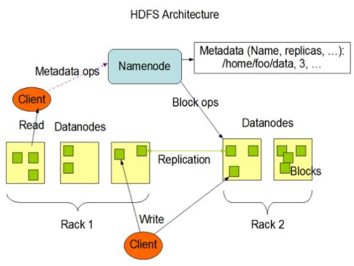
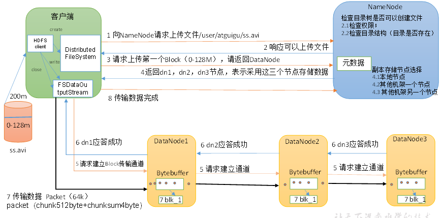
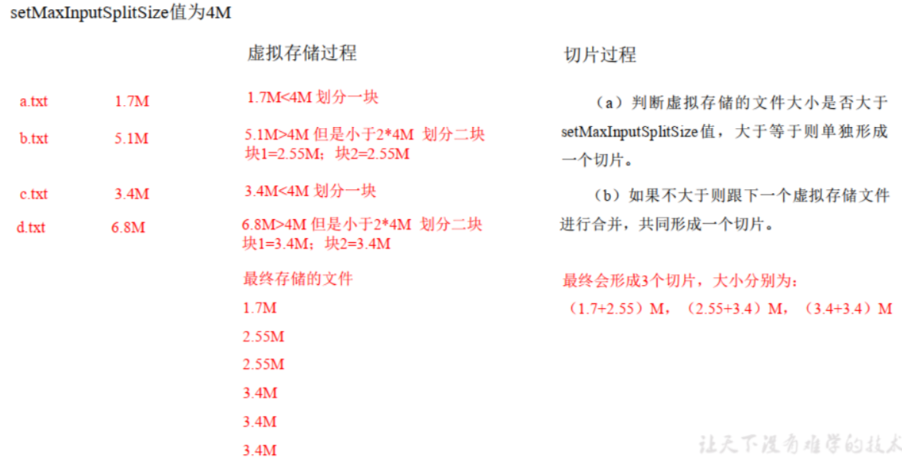
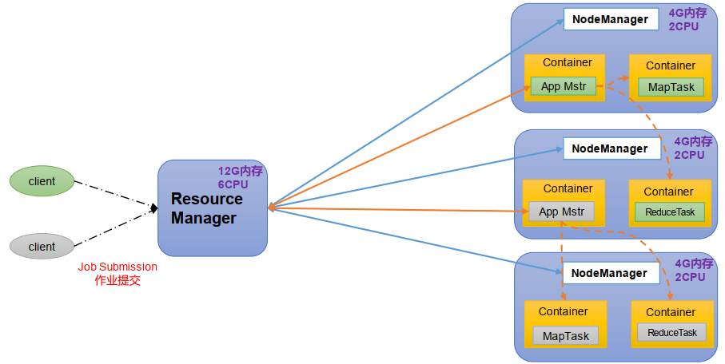
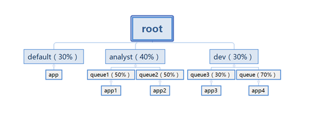

#### HDFS架构？

HDFS采用主从（Master/Slave）架构，由HDFSClient、NameNode、DataNode和SecondaryNameNode四部分组成。

**HDFSClient**：

- 与NameNode交互， 获取文件的元数据信息。

- 与DataNode交互， 读取或者写入数据。

**NameNode**：

- 在内存中维护着整个文件系统的元数据信息（比如文件系统树型结构的目录、每个文件各个块所在节点的信息）。对于文件系统的树型结构目录，NameNode会将来自客户端的修改以追加写的方式持久化到磁盘上；对于每个文件各个块所在节点的信息，NameNode并不会在持久化这些信息，而是由DataNode进行持久化，在HDFS启动时，DataNode会向NameNode汇报这些信息。

- 处理来自客户端的请求。

**DataNode**：文件系统的工作节点， 执行数据块的读/写操作。DataNode每3s会向NameNode发送心跳，如果超过10分钟没有收到某个DataNode的心跳，则认为该节点不可用；每6小时会向NameNode上报所有的块信息。

**SecondaryNameNode（2NN）**：辅助NameNode，负责合并Fsimage和Edits， 并推送给NameNode。NN追加写时将修改操作保存到edits_inprogress文件中，当edits_inprogress达到1kb停止往这个文件上写，把这个edits_inprogress更名为edits，然后再新建另外一个edits_inprogress继续追加写，2NN负责拉取NN上的edits与自己之前的fsimage合并，合并完之后再把fsimage传送给NN。

#### HDFS写数据流程？

1. 客户端通过Distributed FileSystem模块向NameNode请求上传文件。
2. NameNode检查目标文件是否已存在，父目录是否存在，NameNode返回是否可以上传。
3. 客户端请求第一个 Block上传到哪几个DataNode服务器上。
4. NameNode返回3个DataNode节点，分别为dn1、dn2、dn3。
5. 客户端通过FSDataOutputStream模块请求dn1上传数据，dn1收到请求会继续调用dn2，然后dn2调用dn3，将这个通信管道建立完成。
6. 客户端开始往dn1上传第一个Block（先从磁盘读取数据放到一个本地内存缓存），以Packet为单位，dn1收到一个Packet就会传给dn2，dn2传给dn3；dn1每传一个packet会放入一个应答队列等待应答。
7. 当一个Block传输完成之后，客户端再次请求NameNode上传第二个Block的服务器。（重复执行3-7步）。

#### HDFS读数据流程？

1. 客户端通过DistributedFileSystem向NameNode请求下载文件，NameNode通过查询元数据，找到文件块所在的DataNode地址。
2. 挑选一台DataNode（就近原则，然后随机）服务器，请求读取数据。
3. DataNode开始传输数据给客户端（从磁盘里面读取数据输入流，以Packet为单位来做校验）。
4. 客户端以Packet为单位接收，先在本地缓存，然后写入目标文件。

#### 小文件有哪些危害？

- NameNode在内存维护文件系统的元数据信息，每一个小文件都需要各自维护一份，会占用大量内存，严重影响NameNode的性能。

- 并且小文件的寻址时间超过读取时间，这个成本不划算。

#### 小文件解决方法？

#### MapTask的个数?

MapTask 并行度完全由切片个数决定，一个切片会对应启动一个 MapTask来处理，而切片个数由输入文件大小、数量以及切片规则决定。

InputFormat抽象类是最顶级的抽象类，它一共也就只定义了两个抽象方法getSplits()和createRecordReader()，这两个方法需要由其子类都实现。getSplits()在任务提交前计算分片以便决定MapTask的并行度；createRecordReader()创建RecordReader，用于读取文件内容。

InputFormat有众多的子类，比较重要的子类是抽象类FileInputFormat，FileInputFormat实现了getSplits()方法，该方法的切片计算逻辑主要是对每个文件进行切片，FileInputFormat比较重要的子类有**TextInputFormat**和抽象类CombineFileInputFormat，CombineFileInputFormat重写了FileInputFormat的getSplits()方法，该方法的切片计算逻辑主要是将小文件合并之后一起切，CombineFileInputFormat比较重要的子类是**CombineTextInputFormat**。

切片只是逻辑上的，并没有真正将文件拆分，意思是getSplits()方法只是计算得到了MaskTask运行时的读取数据的计划，MaskTask在运行时会按照切片计算的结果读取数据。

##### TextInputFormat的切片逻辑？

TextInputFormat的getSplits()方法继承自FileInputFormat，它的计算过程是：

（1）程序先找到数据存储的目录。

（2）开始遍历处理（规划切片）目录下的每一个文件

（3）遍历第一个文件ss.txt

 a. 获取文件大小fs.sizeOf(ss.txt)  

b. 计算切片大小，默认情况下切片大小=blocksize=128M ，计算过程是 ：         `computeSplitSize(Math.max(minSize,Math.min(maxSize,blocksize)))=blocksize=128M（424行）`

c. 开始切，形成第1个切片： ss.txt—0:128M 第2个切片ss.txt—128:256M 第3个切片ss.txt—256M:300M（ 每次切片时，都要判断要切的部分是否大于块的1.1倍，不大于1.1倍的话就不切，形成一整块切片，大于的话就切片，第一片128M，剩余作为一个切片再次判断是否要切片）

d. 将切片信息写到一个切片规划文件中，只记录了切片的元数据信息，比如起始位置、长度以及所在的节点列表等。

##### CombineTextInputFormat的切片逻辑？

TextInputFormat 切片机制是对任务按文件规划切片，不管文件多小，都会是一个单独的切片， 都会交给一个 MapTask， 这样如果有大量小文件， 就会产生大量的MapTask， 处理效率低。而CombineTextInputFormat 用于小文件过多的场景， 它可以将多个小文件从逻辑上规划到一个切片中， 这样多个小文件就可以交给一个 MapTask 处理。

CombineTextInputFormat的切片包括两个过程： 虚拟存储过程、切片过程

1.虚拟存储过程：  将输入目录下所有文件的大小 依次和设置的 setMaxInputSplitSize 值比较， 如果不大于设置的最大值， 逻辑上划分一个块。如果输入文件大于设置的最大值且大于两倍，那么以最大值切割一块； 当剩余数据大小超过设置的最大值且不大于最大值2 倍，此时将文件均分成 2 个虚拟存储块（防止出现太小切片） 。例如 setMaxInputSplitSize 值为 4M， 输入文件大小为 8.02M，则先逻辑上分成一个4M。 剩余的大小为 4.02M，如果按照 4M 逻辑划分，就会出现 0.02M 的小的虚拟存储文件， 所以将剩余的 4.02M 文件切分成（2.01M 和 2.01M）两个文件。
2.切片过程： 

（a） 判断虚拟存储的文件大小是否大于 setMaxInputSplitSize 值，大于等于则单独形成一个切片。

（b） 如果不大于则跟下一个虚拟存储文件进行合并，共同形成一个切片。

#### ReduceTask的个数？

ReduceTask 数量是在Driver类中手动设置决定的，ReduceTask数量一般要与分区数量设置相同，所以可以说ReduceTask的并行度是由分区数量决定的（当然可以把ReduceTask 数量设置成与分区数量不一致，但这样会出现问题）。

#### ReduceTask个数与分区数的关系？

如果不设置ReduceTask的数量，默认为1，此时分区也就只有一个，map端所有数据都会进入到一个reduce中，自定义的分区方法会失效。

当设置的ReduceTask的数量大于1时，如果没有自定义分区方法，那么默认按照key的hash值取余分区，如果有自定义分区方法，那就按照自定义的分区方法分区，但要注意一个问题，自定义分区方法的分区数一定要小于等于设置的RreduceTask数，不然会抛异常。

MapReduce中分区与key的关系是，一个reduce只会处理一个分区中的数据，一个分区中可以有多个不同的key。

#### MapReduce的过程？

##### map端：

（1）Read阶段：MapTask通过InputFormat获得的RecordReader，然后由RecordReader按行读取文件的内容解析出一个个`<key, value>`，如果使用的是默认的TextInputFormat，那么key是行起始位置的偏移量，value是该行的内容。

（2）Map阶段：将解析出的`<key, value>`交给用户编写map()函数处理，并产生一系列新的`<key, value>`。

（3）Collect收集阶段：该阶段就是将数据map()处理后的数据写到环形缓冲区中，此时会调用分区器Partitioner对数据进行分区。

（4）Spill阶段：即溢写阶段，当环形缓冲区满后（当输入数据量本身就比较小，Collect阶段结束后环形缓冲区没满也会溢写），数据会被溢写到本地磁盘生成一个临时文件。需要注意的是，将数据写入本地磁盘之前，先要对数据进行一次快排，排序的过程是先按分区排，再按key排，如果有设置combiner，还会对数据进行combine，溢写后的文件会有一个索引文件来记录每个分区的信息，比如每个分区再在临时文件中的偏移量等。

（5）Merge阶段：当所有数据处理完成后，MapTask会对所有临时文件进行一次归并排序，如果有设置combiner，还会对数据进行combine，以确保最终只会生成一个数据文件和索引文件。

##### 为什么要排序？

知乎搜索MapReduce排序。用的是什么排序算法，为什么不用并行排序算法？

思考这样一个问题：内存装不下，如何借助外存合并两个Map（把相同key的value合并）？

答：只能先排序，步骤是，先分块读文件对key进行快排序，然后把排好序的文件写到外存，再借助外存对文件进行归并排序，最后顺序读文件对value进行聚合。

所以，聚合时如果内存装得下所有数据是可以不排序的，但是如果内存装不下则必须先排序。Shuffle过程直接采取了排序的方式，不管内存是否装得下。

##### 为什么要合并多个文件？

1. 避免产生过多小文件：让每个MapTask最终只生成一个数据文件，可避免同时读取大量小文件产生的随机读取带来的开销
2. 并且在map端对同一分区数据排序后，可以减少reduce端排序的工作量。

##### reduce端：

（6）Copy阶段：ReduceTask从各个MapTask上远程拷贝属于同一个分区的数据，如果其大小超过一定阈值，则写到磁盘上，否则直接放到内存中。

（7）Sort阶段：在远程拷贝数据的同时，ReduceTask启动了两个后台线程对内存和磁盘上的文件进行合并，以防止内存使用过多或磁盘上文件过多。由于各个MapTask已经实现对自己的处理结果进行了局部排序，因此，ReduceTask只需对所有数据进行一次归并排序即可。

（8）Reduce阶段：reduce()函数将计算结果写到HDFS上。

#### shuffle的过程？

首先map的输出会写到环形缓冲区，这个缓冲区的大小默认为100MB，可以通过`io.sort.mb`属性调整。一旦缓冲的内容达到预设的阀值(通过`io.sort.spill.percent`，默认是0.8或80%)，一个后台进程便把内容溢出(spill)到磁盘。在溢出过程中，map会继续往环形缓冲区中反向写，如果在此期间环形缓冲区被被填满了，就会阻塞主线程，直到写磁盘过程完成。溢出时会将数据写到`mapreduce.cluster.local.dir`指定的目录内，在写硬盘之前会对数据进行分区并排序，如果有combiner函数，则在排序之后执行combiner。每次溢写都会生产一个溢写文件(spill file)，map最终会将所有溢出文件会被合并成一个已分区且已排序的输出文件。ReduceTask的Shuffle阶段首先会从各台Map主机上拉取同一分区的文件，然后归并排序（如果内存不能存得下归并后的文件，那么还需借助磁盘存储），排完序后再进行Reduce。

#### 自定义bean对象需要注意的事项？

key必须实现WritableCompare接口，value可以只实现Writable接口。因为key和value需要从map端传送reduce端，所以必须要能被序列化，也就是必须要实现Writable接口，又因为MapReduce的shuffle是强制要求排序的，所以key必须还要能比较大小，也就是key必须实现WritableCompare接口。

##### shuffle序列化需要注意的事项？

自定义序列化类需要以下7个步骤：

1. 必须实现 Writable 接口
2. 必须有空参构造，因为反序列化时需要反射调用空参构造函数
3. 必须重写序列化方法 public void write(DataOutput out) throws IOException
4. 必须重写反序列化方法 public void readFields(DataInput in) throws IOException
5. **反序列化的顺序和序列化的顺序需要完全一致**
6. 输出到文件中需要toString()方法，所以需要重写toString()方法， 可用"\t"分隔每个字段
7. **如该序列化对象是map输出结果的key，那么 还需要实现 Comparable 接口，因为MapReduce 框架中的 Shuffle 过程要求对 key 必须能排序**

#### Yarn架构和工作流程？

主要记住这个东西：

- ResoureManager

- NodeManager

- ApplicationMaster

- Container

yarn由ResoureManager和NodeManager组成，这两个进程是分布式集群里的常驻进程。ResoureManager负责等待处理来自客户端的请求，和监控NodeManager，掌管着yarn集群的运行；NodeManager在分布式集群的每一个节点上都有一个，负责监控和分配本机资源（监控肯定就是NodeManager定时向ResoureManager发送心跳，分配本机资源就是处理来自ResoureManager的资源分配请求）。

当客户端向ResoureManager请求执行任务的时候，ResoureManager首先会把任务加入到队列中等待被调度运行，当轮到这个任务的时候，NodeManager领取任务启动一个Container，Container就是 YARN中的资源抽象，是资源分配的单位，然后在这个Container上启动ApplicationMaster，之后就交由ApplicationMaster来调度MapReduce任务的运行，过程就是先调度Map任务，根据MapTask的数量将MapTask任务加入到队列中，之后NodeManager领取任务启动MapTask，MapTask全部结束之后，ApplicationMaster再把Reduce任务加入到队列中，然后NodeManager领取任务启动ReduceTask，reduce任务完成之后，ApplicationMaster向ResoureManager申请注销，至此这个MapReduce任务就完成了。

#### Yarn有哪些调度器？

三种： FIFO调度器、 容量调度器（Capacity Scheduler） 和 公平调度器（Fair Scheduler）。

**FIFO调度器**：把应用按提交的顺序排成一个队列，这是一个先进先出队列，在进行资源分配的时候，先给队列中最头上的应用进行分配资源，待最头上的应用需求满足后再给下一个分配，以此类推。

**容量调度器**：Capacity 调度器允许多个组织共享整个集群，每个组织可以获得集群的一部分计算能力。通过为每个组织分配专门的队列，然后再为每个队列分配一定的集群资源，这样整个集群就可以通过设置多个队列的方式给多个组织提供服务了。除此之外，队列内部又可以垂直划分，这样一个组织内部的多个成员就可以共享这个队列资源了，在一个队列内部，资源的调度是采用的是先进先出(FIFO)策略。

**公平调度器**：公平调度器的设计目标是为所有的应用分配公平的资源（对公平的定义可以通过参数来设置），公平调度在也可以在多个队列间工作。

例子：假设有两个用户A和B，他们分别拥有一个队列。当A启动一个job而B没有任务时，A会获得全部集群资源；当B启动一个job后，A的job会继续运行，不过一会儿之后两个任务会各自获得一半的集群资源。如果此时B再启动第二个job并且其它job还在运行，则它将会和B的第一个job共享B这个队列的资源，也就是B的两个job会用于四分之一的集群资源，而A的job仍然用于集群一半的资源，结果就是资源最终在两个用户之间平等的共享。

