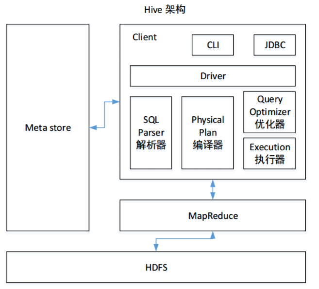
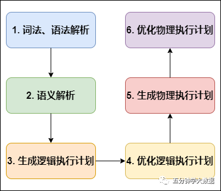
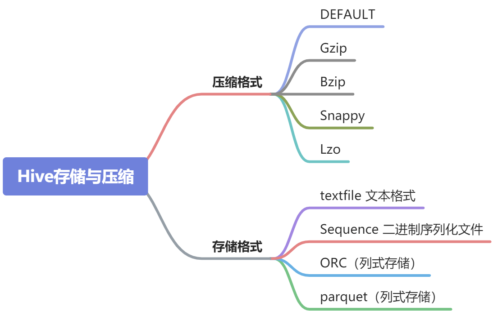

#### Hive的架构？hive sql的执行过程？

Hive既不负责数据的存储也不负责数据的计算，hive的主要工作是负责SQL解析和维护元数据信息，数据储存在HDFS上，计算可以选择MapReduce、Tez或者Spark，元数据可以存储在MySQL或者deby等关系型数据库中。



hive sql的执行过程：

1. client将hive sql提交给Driver。
2. Driver调用SQL解析器、编译器、优化器生成物理执行计划，这中间会进行元数据的访问。
3. 如果计算引擎使用的是Spark的话，执行器会把物理执行计划提交资源调度器Yarn，由Yarn来调度Spark任务执行，Spark任务执行的时候会从HDFS上读取数据。
4. 最后把查询结果返回给Driver，Driver再返回给client。

Hive SQL编译成MapReduce或Spark程序的过程：



1. **词法、语法解析**: Antlr 定义 SQL 的语法规则，完成 SQL 词法，语法解析，将 SQL 转化为抽象语法树 AST Tree；
2. **语义解析**: 遍历 AST Tree，抽象出查询的基本组成单元 QueryBlock；
3. **生成逻辑执行计划**: 遍历 QueryBlock，翻译为执行操作树 OperatorTree；
4. **优化逻辑执行计划**: 逻辑层优化器进行 OperatorTree 变换，合并 Operator，达到减少 MapReduce Job，减少数据传输及 shuffle 数据量；
5. **生成物理执行计划**: 遍历 OperatorTree，翻译为 MapReduce 任务；
6. **优化物理执行计划**: 物理层优化器进行 MapReduce 任务的变换，生成最终的执行计划。

#### hive 内部表和外部表的区别？

删除内部表会直接删除元数据（metadata）及存储数据；删除外部表仅仅会删除元数据，HDFS上的文件并不会被删除；

#### row_number()、rank()、dense_rank() 区别？

- rank()：1、2、2、4
- dense_rank()：1、2、2、3
- row_number()：1、2、3、4

#### hive常用开窗函数？

- 聚合函数：sum()、max()等

- LAG(col,n,default_val)：取往前n行的值

​       LEAD(col,n, default_val)：取往后n行的值

​       FIRST_VALUE(col,[boolean])：取第一个数据

​       LAST_VALUE(col,[boolean])：取最后一个数据

- row_number()、rank()、dense_rank() 

#### 4种排序的区别？

- order by：会对数据进行全局排序，此时设置reduce个数无效，只会有一个reduce，会造成数据倾斜问题，可以设置严格模式禁止不带limit的order by执行，即set hive.mapred.mode=strict。
- sort by：只对分区内的数据进行排序，也就是只会对同一个reduce中的数据进行排序，不进行全局排序，如果设置的reduce的个数等于1，那么此时的sort by 和 order by的效果一样，sort by 经常和distribute by连用。
- distribute by：用于指定按哪个列的值进行分区，也就是具有相同值的数据会进到同一个reduce中。
- cluster by：cluster by是distribute by 和 sort by 字段相同且按升序排序时的简写。

#### Hive支持的压缩格式和存储格式？

TextFile和SequenceFile是行式存储；orc和parquet是列式存储。

行式存储：

- 缺点：因为数据是按块存取，所以当查询只涉及某几个列时，还是会把整行数据都读取出来，不能跳过不必要的列读取；另外由于每一行中，列的数据类型不一致，导致不容易获得一个极高的压缩比，也就是空间利用率不高。
- 优点：适合查询明细。

列式存储：

- 缺点：不适合查询明细，数据的INSERT、UPDATE操作效率低。
- 优点：适合聚合分析。

ORC的存储格式是：数据按行分块，每块按照列存储。只有Bzip和LZO的压缩格式支持分割，其他不支持。



> [一文搞懂Hive的存储格式与压缩格式](https://www.ikeguang.com/article/1805)

#### map join 和 reduce join？

reduce join：reduce join就是比较常规的思路，具体做法是，把join字段当作key，然后相同key等数据会发到同一个reduce中，从而完成join，其实就是Hash join的做法。

map join：map join是对reduce join的一种优化，不过仅限于大表join小表的场景，具体做法是，把整张小表加载到所有MapTask中（如果是Spark，则可使用广播变量将小表广播到Executor内存中），然后MapTask再分开读大表完成join，最后再在reduce完成聚合。map join可以避免数据倾斜，降低reduce端的压力。类似于基于块的嵌套循环连接算法，驱动表的可以完全装进内存的情况。

#### hive的数据倾斜问题？

数据倾斜问题是指数据分配不均导致某些节点处理缓慢，而其他节点却很空闲，从而降低了整个任务的处理效率。

----

数据倾斜主要发生Reduce端，因为相同Key的数据会进入到同一个Reduce端，如果其中某几个Key的数据量相比于其他key的数据量特别大，那么就会引发数据倾斜，比如 join 和 group by的时候就比较容易发生数据倾斜。

**join时的数据倾斜**：

inner join的数据倾斜是由于某几个Key的数据量比较大造成的，解决的方法有：

- 如果是大表join小表，可以开启 Map join（默认就是开启）。
- ~~使用分桶表来优化两张大表的join。与reduce join的区别就是，使用分桶表可以在Map端完成join；与Map join的区别就是，使用分桶表不用将某一张表完全加载到Map的内存中。~~

left join和full join 除了有inner join的问题外，还有当连接字段有很多null时，也会引发数据倾斜，因为值为null的数据会进到一个reduce中，inner join没有这样的问题是因为内连接的时候，null会被自动过滤，不参与连接。解决null值引发的数据倾斜的方法：

- 如果连接字段为null的数据并不需要保留，可以先过滤掉null值再做连接 
- 如果连接字段为null的数据需要保留，可以给null字段赋一个随机值，不过需要保证随机值关联不上

**group by的数据倾斜：**

group by的数据倾斜是由于某几个Key的数据量比较大造成的，解决的方法有：

- 开启 Map 端聚合：`set hive.map.aggr=true`。（Spark自动就有）
- 开启负载均衡：`set hive.groupby.skewindata=true`，开启该配置会将作业拆解成两个作业，先把数据量大的key拼接一些随机数使其分散到不同的reduce中聚合，之后再把拼接的随机数去掉进行一次聚合。

----

除了Reduce端会出现数据倾斜之外，Map端也可能会，Map端的数据倾斜主要是，数据存储问题造成的，比如使用GZIP等不可分割的压缩方式存储大文件，就会导致处理这个压缩文件的MapTask任务比其他任务更慢。解决的方法就是使用Bzip和LZO等支持分割的压缩格式。

----

还有就是有些sql语句本身就会造成数据倾斜，比如`count(distinct)`只能用一个 reduce 来完成，所以当数据量很大时会造成数据倾斜，解决方法是：使用先 GROUP BY 分散到不同的reduce中去重，然后再使用COUNT。

#### Hive的优化措施？

1. 本地模式：没有开启本地模式时，所有任务都会提交给yarn来调度执行，开启本地模式之后，hive会先判断查询的数据量大不大，如果不大就直接在本地运行，不提交给yarn。✔

3. 对小文件进行合并，对小文件进行合并可以减少MapTask的数量

`set hive.input.format = org.apache.hadoop.hive.ql.io.CombineHiveInputFormat;`

4. 合理设置Reduce的个数，reduce 个数并不是越多越好，因为过多的启动和初始化 reduce 也会消耗时间和资源。

5. 设置严格模式✔

   - 对于分区表，要求 where 语句中必须含有分区字段的过滤条件，也就是不允许用户扫描所有分区：`set hive.strict.checks.no.partition.filter=true;`

   - order by 必须和 limit 连用：`set hive.strict.checks.orderby.no.limit=true;`   

   - 禁止join时不加on连接条件，也就是不允许出现笛卡尔积：`set hive.strict.checks.cartesian.product=true;`


6. 开启jvm重用

7. 设置数据存储格式和压缩方式：针对 hive 中表的存储格式通常有 orc 和 parquet，压缩格式一般使用 snappy✔

8. 设置Fetch，Fetch是指Hive 中对一些简单的查询可以不必使用 MapReduce 计算。✔

#### Hive 小文件过多怎么解决？

1. 使用 hive 自带的 concatenate 命令，自动合并小文件。✔

```
#对于非分区表
alter table A concatenate;
#对于分区表
alter table B partition(day=20201224) concatenate;
```

> 注意：
> 
> 1、concatenate 命令只支持 RCFILE 和 ORC 文件类型。
> 
> 2、使用 concatenate 命令合并小文件时不能指定合并后的文件数量，但可以多次执行该命令。
> 
> 3、当多次使用 concatenate 后文件数量不在变化，这个跟参数 `mapreduce.input.fileinputformat.split.minsize=256mb` 的设置有关，可设定每个文件的最小 size。

2. map端输入时可以使用`CombineHiveInputFormat`对小文件进行合并。

3. 减少 Reduce 的数量，reduce 的个数决定了输出的文件的个数，所以可以调整 reduce 的个数控制文件数量。

4. 使用 hadoop 的 archive 将小文件归档。✔

Hadoop Archive 简称 HAR，是一个高效地将小文件放入 HDFS 块中的文件存档工具，它能够将多个小文件打包成一个 HAR 文件，这样在减少 namenode 内存使用的同时，仍然允许对文件进行透明的访问。

#### 时间处理函数？

| 函数                                                        | 作用                 |
| ----------------------------------------------------------- | -------------------- |
| `unix_timestamp("2020-10-28",'yyyy-MM-dd');`                | 获取指定时间的时间戳 |
| `from_unixtime(1603843200);`                                | 将时间戳转为日期格式 |
| `date_format('2020-10-28 12:12:12','yyyy/MM/dd HH:mm:ss');` | 格式化日期           |

