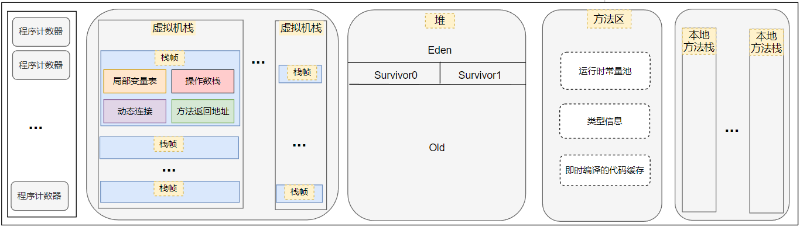
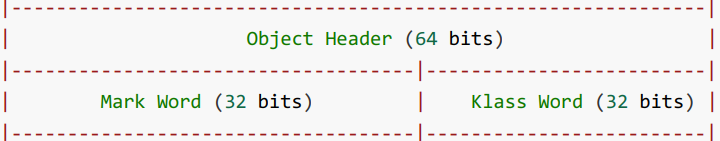
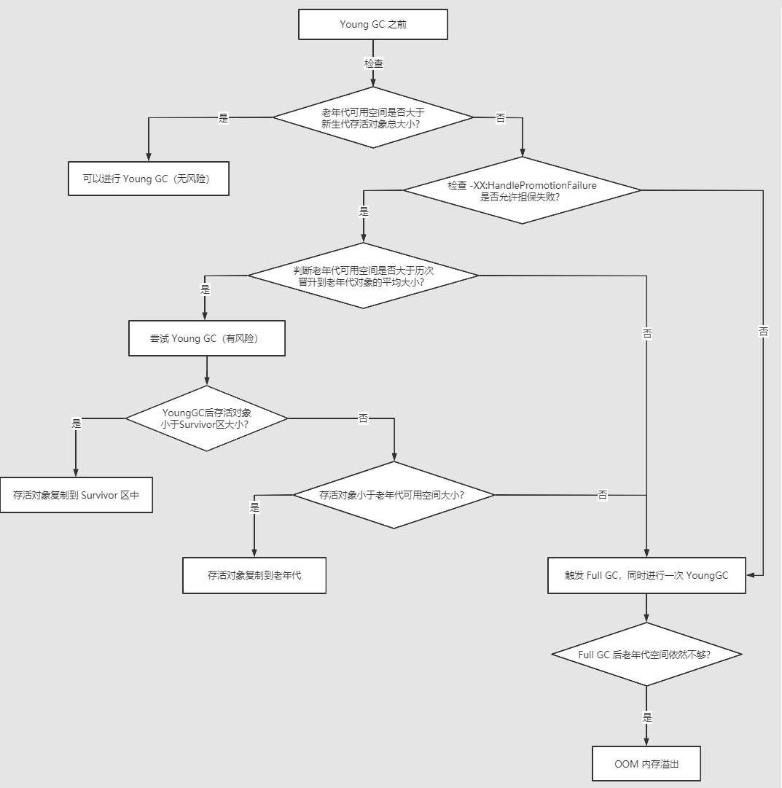
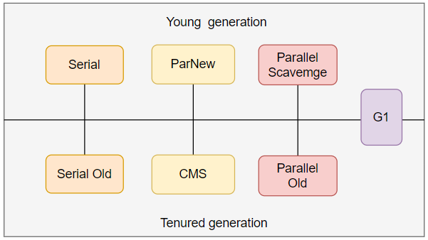
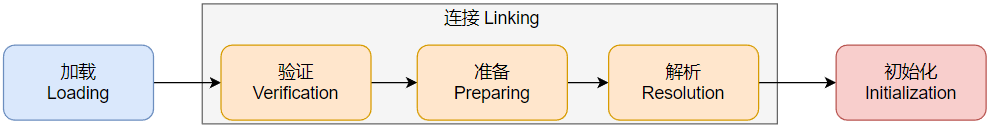
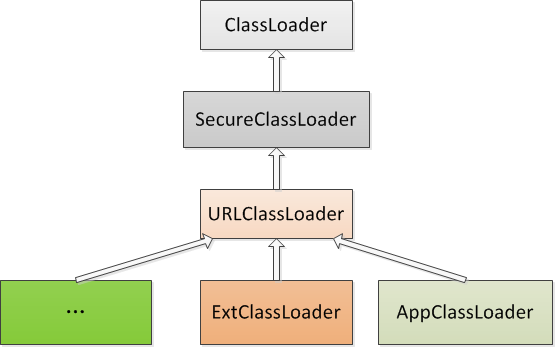
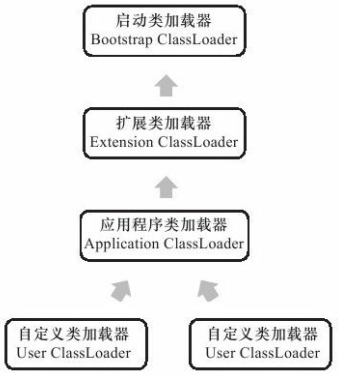

#### JVM的内存结构？⭐

JVM的内存结构包括虚拟机栈、本地方法栈、堆、方法区和程序计数器。其中虚拟机栈、本地方法栈和程序计数器是线程私有的，随线程一起创建和销毁，而堆和方法区是所有线程所共享的。

- 线程创建时，jvm会为其创建对应的**程序计数器**，程序计数器的作用是指示下一条需要执行的字节码指令，每个线程都有一个独立的程序计数器，目的是为了在线程切换之后能恢复到正确的执行位置。

- 线程创建时，jvm会为其创建对应的**虚拟机栈**，线程执行方法时会创建栈帧，方法执行的过程就是对应栈帧在虚拟机栈里入栈和出栈的过程。

  一个栈帧包括局部变量表、操作数栈、方法返回地址、动态连接和一些额外的附加信息。

  - **局部变量表**用于存放方法参数和方法内部定义的局部变量。在Java程序被编译成字节码文件时，方法code属性的max_locals数据项就确定了该方法所需分配的局部变量表的最大容量。实例方法被调用时，局部变量表的第0位索引的变量槽存放的是this。为了节省栈帧所用的内存空间，局部变量表的变量槽可以根据变量的作用域进行复用。

  - **操作数栈**的最大深度在编译时已经被写在方法Code属性的的max_satcks数据项中。

- **本地方法栈**是为虚拟机使用本地方法服务的。HotSpot直接把虚拟机栈和本地方法合二为一了。

- **堆**是用来存放对象实例的，几乎所有对象都在堆上分配。堆内存被划分新生代和老年代，比例默认是1:2，新生代中又分为Eden区、Survivor0和Survivor1区，比例是8:1:1。

- **方法区**主要是用于存放类型信息、常量、即时编译器编译后的代码缓存。
  
  - 类型信息：类的一些信息，包括类名、字段描述、方法描述等，占大头的是方法，方法编译成的字节码占的空间是最多的，所以叫方法区。
  - 运行时常量池：运行时常量池和字符串常量池不是同一个东西，JDK6时的运行时常量池中包含了字符串常量池，JDK7及之后字符串常量池搬到了堆，运行时常量池还在方法区。

#### 内存溢出和内存泄漏？

内存溢出：Out Of Memory，程序在申请不到足够的内存了就会报OOM。
内存泄露：Memory Leak，指有些内存空间虽然已经没用了，但是又无法被回收。

导致内存泄露的场景：

- 静态属性导致内存泄露

  静态属性的生命周期通常伴随着应用整个生命周期(除非ClassLoader符合垃圾回收的条件)，所以即使当一个静态属性再也不会被使用，它也不会被回收。单例模式就是典型的静态属性场景。

- 未关闭的资源

  比如各种连接：数据库连接、网络连接、io连接，除非其显式的调用了其close方法将其连接关闭，否则是不会自动被GC 回收的。
  
- ThreadLocal

  如果一个使用了ThreadLocal并且没有调用其remove()方法的线程迟迟不结束，那么ThreadLocalMap里面的value就不会被回收，于是就会造成内存泄露。

#### 有GC的区域？有OOM的区域？有StackOverflow的区域？⭐

有GC的区域：堆、方法区
有OOM的区域：堆、方法区、虚拟机栈、本地方法栈。也就是说出来程序计数器之外的4个区域都有OOM。
有StackOverflow的区域：虚拟机栈、本地方法栈

#### 方法区在JDK6、7、8中的变化？⭐

JDK6和JDK7的方法区在HotSpot虚拟机中的落地实现是永久代，之所以称之为永久代，是因为HotSpot虚拟机将分代回收的设计扩展至方法区上，使得垃圾回收器能像管理堆内存一样管理方法区。但从JDK6到JDK7，方法区做了一些改动，在JDK6中，字符串常量池和静态变量都是放在方法区中；到了JDK7时已经将字符串常量池和静态变量移到了堆内存中，但是方法区还是永久代。到了JDK8就完全废除了永久代，改为元空间，所谓元空间就指是本地内存。

#### 为什么要将永久代 (PermGen) 替换为元空间 (MetaSpace) ?

方法区存放的类型信息和常量等其它信息都是动态变化的，而永久代的大小受到设置的限制（使用-XX:MaxPermSize的指定，即使不指定也有默认的大小），这样很容易出现内存溢出问题。但元空间的大小只受到本机物理内存的限制，所以内存溢出的可能性更小。

#### 实例对象是怎样存储的？

对象的实例存储在堆空间；对象的类元信息存储在方法区（元空间），被对象头中的类型指针所指向；对象的引用存储在虚拟机栈 

#### 堆内存中的对象由哪些部分组成？

对象头（MarkWord 和 类型指针，如下图）、实例数据、对齐填充

#### markword包含哪些信息？

#### 对象分配的过程？⭐

1.字节码指令new会首先检查符号引用所代表的类是否完成了类加载过程

2.然后会为对象分配内存空间
分配⽅式有 “指针碰撞” 和 “空闲列表“ 两种，选择哪种分配方式由 Java 堆是否规整决定，⽽ Java堆是否规整⼜由所采⽤的垃圾收集器是否带有压缩整理功能决定。

3.初始化为零值

4.设置对象头信息

5.执行`<init>()`方法

#### 对象的访问定位有哪两种方式？

①句柄（包含指向实例对象的指针 和 指向类型数据的指针）

②直接指针（直接指向实例对象，类型指针在实例对象中）

#### 逃逸分析、栈上分配、标量替换？

**逃逸分析**：就是看一个对象能否被其他方法或线程访问到。

如果能证明一个对象不会逃逸到方法或线程外（即别的方法或线程无法通过任何途径访问到该对象），或逃逸程度较低（只逃逸出方法而不逃逸出线程），则可能为这个对象实例采取不同程度的优化：

**栈上分配**：如果确定一个对象不会逃逸出线程，那让该对象在栈上分配内存是个不错主意，对象所占用内存空间就可随栈帧出栈而销毁，减少GC压力。栈上分配可支持方法逃逸，但不能支持线程逃逸。

**标量替换**：假如逃逸分析能够证明一个对象不会在方法外部被访问，并且该对象可被分解，那么程序真正执行时将可能不去创建该对象，而改为直接创建它的若干个被这方法使用的成员变量代替。将对象拆分后，除可让对象的成员变量在栈上 （栈上存储的数据，很大机会被虚拟机分配至物理机器的高速寄存器中存储）分配和读写外，还可为后续进步优化创建条件。标量替换可视作栈上分配一种特例，实现更简单（不用考虑对象完整结构的分配），但对逃逸程度的要求更高，它不允许对象逃逸出方法范围内。

----

#### 判断对象是否存活的两种方法？⭐

①引用计数算法
一个对象被引用1次则计数加1，当引用失效时计数-1，那些计数为0的对象就代表没有任何引用，可以执行回收；无法解决循环引用的问题。
②可达性分析算法
从GC Roots中的根对象作为起始节点，根据引用关系向搜索，所走过的路径称为“引用链”，如果一个对象没有与任何引用链相连，则将被判定为垃圾。

#### 哪些能作为GC roots？

1. 栈上的局部变量表

2. 方法区中的运行时常量池

3. 堆上字符串常量池

4. 堆上class对象中的静态变量

5. ...

#### Java 中都有哪些引用类型？⭐

强引用、软引用、弱引用、虚引用
①强引用：我们new方式创建的对象就是强引用类型的，只要强引用的对象是可触及的，则垃圾收集器永远不会执行回收
②软引用：内存充足时候不会回收，只有在内存溢出前才进行回收，可以用来实现缓存，将临时的数据存储下来，即使没有内存了，垃圾收集器也能将其回收。java提供了SoftReference来实现软引用，在回收软引用时，可以将引用放到这个ReferenceQueue引用队列中，可以获取到对象的信息，进行额外的处理。
③弱引用：只要发生了GC，那么弱引用直接被回收。也能实现缓存功能，因为一旦GC就会回收，不会让系统有过多的内存压力。java提供了WeakReference来实现弱引用，与软引用一样，在回收时可以将弱引用放进一个引用队列，可以获取到对象的信息，跟踪回收情况。ThreadLocal类的静态内部类ThreadLocalMap的key就是WeakReference。
④虚引用：用于对象回收跟踪，是引用类型中最弱的一个。虚引用不能像强软弱一样单独使用，要配合引用队列进行使用，也无法通过虚引用来获取被引用的对象，当使用get()方法时，总会返回null。虚引用的作用就是能在这个对象被垃圾回收器回收时收到一个系统通知，并且能跟踪对象的回收时间。java提供了PhantomReference来实现虚引用，不过在创建引用时，需要指定引用队列ReferenceQueue。

#### 为什么要有GC？GC原理是什么？什么情况下触发垃圾回收？

为什么要有GC：因为程序不断运行，不断有新的对象产生，为了避免无用对象占用内存空间导致内存不足，因此要进行回收 。

GC原理：利用可达性分析算法判定对象的死活，然后利用垃圾回收算法进行清除，比如标记-清除算法、标记-复制算法和标记-整理算法。

什么情况下触发垃圾回收：当新生代满时触发Young GC（准确的说是Eden满的时候），当老年代满时触发Full GC/Major GC。

#### 有哪几种垃圾回收算法，它们各自的优缺点是什么？⭐

有三种垃圾回收算法：标记-清除算法、标记-复制算法和标记-整理算法。

标记-清除算法：优点就是简单，不用复制；缺点也很明显，一是执行效率不够稳定，标记和清除过程的执行效率随对象数量的增加而降低，二是产生大量不连续的碎片。
标记-复制算法：优点就是不会产生大量碎片；缺点是一是很大的内存复制开销，二是如果标记复制算法不结合分代收集理论的话，是需要将可用内存缩小为原来的一半，有点浪费空间。
标记-整理算法：标记整理是在标记清除算法的基础之上增加一个整理内存的过程，优点是不产生碎片，缺点是复制移动对象复杂。

#### 什么是分代回收？

分代回收建立在分代假说之上，也就是绝大多数对象都是朝生夕灭的，熬过多次垃圾收集过程的对象难以消亡。根据这个假说，将内存分为不同的区域，比如新生代和老年代，对不同的区域采取不同的回收方式以提高回收效率。

#### 简述分代垃圾回收器是怎么工作的？JVM怎么回收内存？⭐

（基于分代回收的思想对内存进行划分，可达性分析算法判定对象的死活，最后再利用垃圾回收算法进行清除）

一般分为两个分代，新生代和老年代，默认占比为1:2。新生代有3个分区，一个Eden区，两个Survivor区，两个Survivor区又分别称为From区和To区，三个分区默认的比例是8:1:1。新生代采用的是复制算法，而老年代采用的是标记整理或标记清除算法。新创建的对象会先放到Eden区中，当Eden区满时，会触发YoungGC，对Eden区和From区进行垃圾回收，存活的对象放进To区中，并且年龄计数+1，若年龄计数器为15，就晋升到老年代。

#### 对象何时进入到老年代？⭐

1. 长期存活的对象将会进入老年代。新生代中的对象的年龄到达设置的阈值将会进入老年代，默认是15，也可通过-XX:MaxTenuringThreshold设置；

2. 或者**动态对象年龄判定**，当Survivor区中相同年龄的所有对象的总和大于Survivor区的一半时，大于等于该年龄的对象将直接进入老年代，无需达到要求的阈值。

3. 大对象直接进入老年代。这样做的目的是避免在Eden区及两个Survivor区之间来回复制，产生大量的复制开销。

#### Minor GC/Young GC、Major GC/Old GC、Mixed GC、Full GC ？⭐

书本上的定义：
Minor GC/Young GC：新生代的垃圾收集。
Major GC/Old GC：老年代的垃圾收集，目前只有CMS会单独收集老年代。
Mixed GC：整个新生代以及部分老年代的垃圾收集，目前只有G1收集器会有这种行为。
Full GC：堆和方法区的垃圾收集。

但是，好像一般只有Young GC和Full GC两种，触发Young GC和Full GC的条件见下一个问题的图示。

#### 什么时候会触发GC（包含有空间分配担保原则）？⭐

当Eden区满的时候会触发Young GC，在Young GC之前会检查老年代的可用空间是否大于新生代存活对象的总大小，如果大于代表此次Young GC没有风险直接执行Young GC，但如果小于则表示有风险，那么就要检查是否开启了空间分配担保。如果**没有开启空间分配担保**，那么直接进行Full GC；如果**开启了空间分配担保**，那么就需要检查老年代可用空间是否大于历次晋升到老年代对象的平均大小，如果不大于那就Full GC，如果大于就会先尝试进行一次Young GC，Young GC完之后如果存活的对象可以放进Survivor区，那么直接放进Survivor区，如果放不下，就看一下老年代的可用空间是否放的下，放得下就放，放不下就需要再进行一次Full GC，每次Full GC完之后如果老年代还放不下存活的对象，那就报OOM了。

#### 说一下你知道的垃圾回收器，重点讲一下CMS和G1和各自的特点。⭐

**Serial/Serial Old：**都是串行回收，简单高效，只适合单核CPU；Serial是新生代收集器，基于标记-复制算法，Serial Old是老年代收集器，基于标记-整理算法。

**Parallel Scavenge/Parallel Old：**都是多条GC线程并行执行，并非与用户线程并发，所以垃圾收集时仍是STW；Parallel Scavenge是新生代收集器，基于标记-复制算法，特点是可控制的吞吐量和自适应调节；Parallel Old老年代收集器，基于标记-整理算法。

**ParNew：**新生代收集器，基于标记-复制算法，Serial的多线程版本，多条GC线程并行执行。

**CMS：**老年代收集器，基于标记-清除算法，目标是最短回收停顿时间，能够实现用户线程与GC线程同时运行，整个清理过程分为四步：
    ① 初始标记（会STW）：仅仅标记处GC Roots能直接关联到的对象，这个时候是STW的，因为只有一小部分的GC Roots会被标记，因此停顿是非常短暂的。
    ② 并发标记：从GC Roots开始遍历整个对象引用链，这个过程是并发的，与用户线程同时进行，不会STW。
    ③ 重新标记（会STW）：对在并发标记期间因用户程序继续运作而导致标记产生变动的那一部分对象进行重新标记。此过程是STW的，但因为这些对象占少数，所以不会停顿过长时间。
    ④ 并发清理：清理标记阶段未被标记的对象，释放内存空间，此过程是并发的，可以和用户线程一起运作。
因为最耗费时间的并发清除和并发标记阶段是并发的，不需要暂停工作，所以整体的回收还是低延迟的。而初始标记和重新标记仍然需要暂停用户线程，所以CMS仍然会有STW。CMS无法收集浮动垃圾，有可能出现并发收集失败，从而导致FULL GC。因为使用的是标记-清除算法，所以有可能导致出现无法为新对象分配内存，这时也会出现并发失败，从而临时启用Serial Old进行一次老年代的收集。

**G1：**G1（Garbage First）回收器采用面向局部收集的设计思路和基于Region的内存布局形式，是一款主要面向服务端应用的垃圾回收器。G1设计初衷就是替换 CMS，成为一种全功能收集器。G1 在JDK9 之后成为服务端模式下的默认垃圾回收器，取代了 Parallel Scavenge 加 Parallel Old 的默认组合，而 CMS 被声明为不推荐使用的垃圾回收器。G1从整体来看是基于 标记-整理 算法实现的回收器，但从局部（两个Region之间）上看又是基于 标记-复制 算法实现的。

G1把连续的Java堆划分为许多大小相等的独立区域Region，每一个Region都可以根据需要扮演新生代的Eden、Survivor或者老年代。虽然G1还保留着新生代和老年代的概念，但是新生代和老年代不再是固定的了，它们都是一系列Region的动态集合。G1 回收器的运作过程大致可分为四个步骤： 

​    ①初始标记（会STW）：仅仅只是标记一下 GC Roots 能直接关联到的对象，并且修改TAMS指针的值，让下一阶段用户线程并发运行时，能正确地在可用的Region中分配新对象。这个阶段需要停顿线程，但耗时很短，而且是借用进行Minor GC的时候同步完成的，所以G1收集器在这个阶段实际并没有额外的停顿。 

​    ② 并发标记：从 GC Roots 开始对堆中对象进行可达性分析，递归扫描整个堆里的对象图，找出要回收的对象，这阶段耗时较长，但可与用户程序并发执行。当对象图扫描完成以后，还要重新处理在并发时有引用变动的对象。 

​    ③ 最终标记（会STW）：对用户线程做短暂的暂停，处理并发阶段结束后仍有引用变动的对象。 

​    ④ 筛选回收（会STW）：更新Region的统计数据，对各个Region的回收价值和成本进行排序，根据用户所期望的停顿时间来制定回收计划，可以自由选择任意多个Region构成回收集，然后把决定回收的那一部分Region的存活对象复制到空的Region中，再清理掉整个旧Region的全部空间。这里的操作涉及存活对象的移动，必须暂停用户线程，由多条回收器线程并行完成的。

**总结**：

1. 除CMS和G1外，其他垃圾收集器都不分阶段，都是直接STW做一次回收。
2. GCRoots枚举和移动对象都必须STW，所以在CMS和G1中初始标记都会STW，但是CMS并发清理不用STW，因为它是基于标记-清除算法进行的，而G1的筛选回收需要STW，因为基于标记-复制需要移动对象。
3. 三款年轻代垃圾收集器Serial、ParNew、Parallel Scavenge都是基于 标记-复制 算法。
4. 除CMS外，使用其他老年代垃圾回收器的时候都会连带着启动年轻代的回收，只有CMS存在只针对老年代的垃圾回收。

#### CMS回收停顿了几次？为什么要停顿？

停顿了两次，因为CMS虽然是主打低延迟的，但初始标记阶段和重新标记阶段不得不暂停用户线程，初始标记为了标记出GC Roots能直接关联到的对象，重新标记阶段的停顿是为了对在并发标记期间因用户程序继续运作而导致标记产生变动的那一部分对象进行重新标记。

#### 简单说一下G1？

G1将整个堆分为大小相等的多个Region（区域），并跟踪每个区域的垃圾大小，在后台维护一个优先级列表，每次根据允许的收集时间，优先回收价值最大的区域，达到在有限时间内获取尽可能高的回收效率，并且不会产生空间碎片。它的运作流程主要包括以下：初始标记，并发标记，最终标记，筛选回收。除了并发标记阶段不会产生STW之外，其余三个阶段都会STW。

#### 常用的 jvm 调优的参数都有哪些？

-Xms：初始堆空间内存（默认为物理内存的1/64）
-Xmx：最大堆空间内存（默认为物理内存的1/4）
-XX:NewRatio：设置老年代与新生代在堆结构的占比
-XX:SurvivorRatio：设置新生代中Eden和S0/S1空间的比例
-XX:+PrintGCDetails：输出详细的GC处理日志
-XX:PermSize：设置初始分配的永久代大小
-XX:MaxPermSize：设置永久代最大可分配空间
-XX:MetaspaceSize：设置元空间初始分配空间
-XX:MaxMetaspaceSize：设置元空间最大可分配空间

#### 说一下 jvm 调优的工具？

jdk自带的有jconcole，jvisualvm
eclipse提供的MAT

#### 说一下 JVM 调优的命令？

jps：JVM Process Status Too，显示指定系统内所有的HotSpot虚拟机进程。

jstat：JVM statistics Monitoring，是用于监视虚拟机运行时状态信息的命令，它可以显示出虚拟机进程中的类装载、内存、垃圾收集、JIT编译等运行数据。

jstack：jstack用于生成java虚拟机当前时刻的线程快照。jstack来查看各个线程的调用堆栈，就可以知道没有响应的线程到底在后台做什么事情，或者等待什么资源。 如果java程序崩溃生成core文件，jstack工具可以用来获得core文件的java stack和native stack的信息，从而可以轻松地知道java程序是如何崩溃和在程序何处发生问题。

----

#### 谈谈 JVM 中的常量池？

JVM中的常量池有：**Class文件常量池、运行时常量池，全局字符串常量池，以及基本类型包装类对象常量池**

Class文件常量池：字节码文件中的常量池，静态存储在磁盘上。

运行时常量池：运行时常量池在方法区，Class文件常量池在类加载后会存放在运行时常量池中。由符号引用翻译出来的直接引用也存储在运行时常量池中。

全局字符串常量池：JDK7之后从运行时常量池移到了堆。

基本类型包装类对象常量池：java中基本类型的包装类的大部分都实现了常量池技术，即Byte、Short、Integer、Long、Character、Boolean，另外两种浮点数类型的包装类没有实现。这5种包装类型只是在值小于等于127时才可使用常量池中的对象，大于127之后会新创建对象。

#### 类加载和卸载时机？

卸载时机：由JVM自带的类加载器所加载的类，在JVM的生命周期中，始终不会被卸载。（JVM本身会始终引用这些类加载器，而这些类加载器始终引用它们所加载的类的Class对象，所以说这些Class对象始终是可触及的。 ）而由用户自定义的类加载器所加载的类是可以被卸载的。

#### 类加载过程？⭐

类加载过程总的来说分为加载、连接、初始化三个步骤，其中连接又分为验证、准备、解析三步。

**加载：**

在第一步加载阶段虚拟机主要需要完成三件事，一是通过类加载器获取此类的二进制字节流流，二是将此字节流所表示的静态存储结构转换成方法区的运行时数据结构，三是在堆中生成一个代表此类的Class对象。

**连接：**

接下来是连接中的**验证**阶段，主要会完成四个阶段的验证：文件格式验证、元数据验证、字节码验证和符号引用验证，目的是保证这些信息被当作代码运行之后不会危害到虚拟机自身的安全。

再接下来是连接中的**准备**阶段，主要是为类变量分配内存和赋初始值。为类变量赋初始值分两种情况，一是没有final修饰，也即只有static的变量，它会被赋默认的零值，然后在最后的初始化阶段才会被赋程序中指定的值；另外一种情况是有final修饰的类变量，也即常量，在编译阶段就会为这个字段生成ConstantValue属性，此属性中存放着程序中指定的值，然后在准备阶段就会被赋上该值。

连接的最后一个阶段是**解析**，它所做的工作是将常量池中的符号引用转换成直接引用，例如类、接口、方法和字段的符号引用。直接引用理解成能直接定位到目标的内存地址，而符号引用是一个与虚拟机内存布局无关，用于在字节码中描述。解析阶段并不一定在初始化阶段之前开始，也有可能在初始化之后开始。

**初始化：**

类加载的最后一个阶段初始化所做的工作是执行类构造器`<clinit>()`方法，`<clinit>()`方法是编译器将程序中所有类变量赋值和静态代码块中的代码合并之后编译的结果。六种主动引用的场景会触发类的初始化，除此之外的都称为被动引用，不会触发类的初始化。（应该不会问的这么细，让我把六种主动引用场景说出来，或者说出书上那几个被动引用的例子）

#### `<clinit>`方法和`<init>`方法的区别？⭐

`<clinit>()`方法是编译器将程序中所有类变量赋值和静态代码块中的代码合并之后编译的结果，在类加载过程的初始化阶段被调用。而`<init>()`方法是编译器将程序中所有实例变量直接赋值和构造器中的代码合并之后编译的结果，在实例化对象的时候调用。

#### 类加载器？⭐

类加载器完成的是类加载过程中加载阶段的第一件事，即通过一个类的全类名来获取描述该类的二进制字节流。每一个类加载器都拥有一个独立的类名称空间，一个类的唯一性由这个类的全类名和加载它的类加载器共同决定。站在JVM的角度来看，可将类加载器分为两种，一种是**启动类加载器**，这个是用C++编写的，是虚拟机的一部分；另一种就是其它所有的类加载器，包括**扩展类加载器**、**应用程序类加载**器（或称之为**系统类加载器**）和**自定义类加载器**，这些都是用Java语言编写的，都继承自抽象类java.lang.ClassLoader。在JDK8之前都使用的三层类加载器架构，加载过程就是双亲委派模型，在JDK9引入模块化系统之后发生很大的变化。

- Bootstrap ClassLoader是由C/C++编写的，它本身是虚拟机的一部分，所以它并不是一个JAVA类，也就是无法在java代码中获取它的引用，JVM启动时通过Bootstrap类加载器加载%JRE_HOME%\lib下的rt.jar、resources.jar、charsets.jar等核心jar包中的class文件，比如int.class,String.class都是由它加载，可以通过启动jvm时指定-Xbootclasspath路径来改变Bootstrap ClassLoader的加载目录，比如`java -Xbootclasspath/a:path`指定的文件追加到默认的bootstrap路径中。
-  ExtClassLoader，扩展的类加载器加载%JRE_HOME%\lib\ext目录下的jar包和class文件，还可以加载`-D java.ext.dirs`选项指定的目录。
- AppclassLoader（应用程序类加载器）也称为SystemAppClass，因为在ClassLoader类中的`getSystemClassLoader()`方法拿到的就是AppclassLoader，AppclassLoader用于 加载当前应用的classpath的所有类。

 ExtClassLoader（扩展类加载器）和 AppClassLoader（应用程序类加载器）都继承自URLClassLoader，如下：

ExtClassLoader 和 AppClassLoader 都是在 sun.misc.Launcher 中定义并创建实例的，AppClassLoader的父加载器也就是在这里被设置成ExtClassLoader 的。

自定义类加载器可以直接继承ClassLoader，也可以选择继承URLClassLoader。ClassLoader最重要的方法是`loadClass()`，双亲委派机制的逻辑就是在这里实现的；其次重要的方法是`findClass()`，实际加载类到内存的逻辑应该在这里实现，自定义类加载器需要覆盖这个方法；最后是`defineClass()`方法，这个方法是最核心的，它是一个native方法，能将class二进制内容转换成Class对象，如果不符合要求的会抛出各种异常，编写自定义类加载器的`findClass()`需要用到它。

类加载器的应用：

1. 热部署
2. 字节码加密
3. 隔离加载，解决依赖冲突。全类名相同的类不能用同一个类加载器加载，但可以用不同的类加载器加载。

#### 双亲委派模型？⭐

双亲委派模型的工作过程是，如果一个类加载器收到了类加载请求，他首先不会尝试去加载这个类，而是将加载请求委派给父类加载器区完成，父类再委派给父类，每一层都如此，直到加载请求到达最顶层的启动类加载器，然后才开始尝试加载，当父类加载器无法完成这个加载请求时，子加载器才会尝试去自己加载。值得注意的一点是，这种父子关系并不是通过继承关系来实现的，而是组合关系，通过组合关系来复用代码。

#### 方法调用？解析和分派？静态分派和动态分派？⭐

方法调用的唯一任务就是确定被调方法的版本，也就是确定到底要调用那个方法，因为对具有相同名字的方法而言，有重载和重写众多版本。而谈对方法调用的理解，那肯定就是要理清解析和分派的区别，以及分派中静态分派和动态分派的区别。在《深入理解Java虚拟机》中是从解析和分派两个方面进行讲解的，我想从编译和运行两个阶段来看方法调用的过程，这样能把书上知识点串起来了。

在**编译阶段**通过方法接收者的静态类型和方法参数的静态类型来确定跟在方法调用指令后面的符号引用(CONSTANT_Methodref_info)，这就是所谓静态多分派。

然后在运行阶段，根据方法调用指令的分派逻辑来决定方法的最终版本，对于invokestatic指令和invokespecial指令来说，他们的分派逻辑是直接把**类加载过程中的解析阶段**解析到的方法的直接引用作为方法调用的最终版本，而虚方法调用指令invokevirtual却不是直接使用这个直接引用，它的分派逻辑是在**执行阶段**首先根据引用找到方法接收者的实际类型（找实际类型的过程是，首先根据引用找到堆上的对象，再通过对象的类型指针就可以找到实际类型），然后在实际类型里找，看有没有和符号引用里的描述符和简单名称都相符的方法，有就返回这个方法的直接引用作为方法调用的最终版本，没有就去父类里面找，找到Object里面还没有就抛异常。这就是所谓动态单分派，也就是分派的过程不看方法接收者的静态类型，只做方法的匹配。

#### 虚方法和非虚方法是什么？

非虚方法就是在编译时编译器能直接确定方法调用版本的方法，比如静态方法、父类方法、final修饰的方法、实例构造器、私有方法，调用这些方法编译器给出的指令是invokestatic或invokespecial。虚方法就是在编译时编译器不能确定最终调用版本的方法，也就是除上面5种方法之外的方法，这些方法有可能是从父类继承过来的，也有可能会被子类重写，所以只能等待运行时根据引用指向的实例化对象到底是父类对象还是子类对象来决定最终调用方法的版本，对于虚方法编译器给出的指令是invokevirtual。

#### 多态？⭐

多态就是父类引用可以指向子类对象，如果父类方法被子类重写，那么通过父类引用调用这个方法实际上会调用子类重写的方法。多态性的根源在于虚方法调用指令invokevirtual的执行逻辑，所以字段没有多态性。

（一点杂谈：多态是程序具有灵活多变的动态扩展性的根本。比如你在方法里调用了接口的方法，这时你是不确定方法调用的最终版本，然后你在main方法或者其他地方给这个方法传递了接口的实现类，那么这时方法调用的最终版本就确定下来了，或者你又传递了接口的另一个实现类，那么方法调用的最终版本就又变了，这就多态的魅力，很多设计模式都是这个原理；再比如，你在编写程序的整个过程中都没有确定实现类，只是写了一个通过配置文件中配置的类名反射实例化对象然后传入到方法中，这个反射实例化的对象就是这个接口的实现类对象，于是其他人在使用这个程序的时候，只需要导包，然后写配置，就可以使用你编写的程序了，这就是多态的魅力，jdbc就是这种思想，Java标准库里的jdbc全是接口，所以用户在编写程序的时候能编译通过，只需要导入不同数据库提供不同的jdbc实现类，就可与不同的数据库交互。）

#### 虚拟机动态分派的实现？或者说虚方法表是什么？⭐

因为动态分派需要反复去搜索类型的元数据，所以最常用的优化手段就是在方法区为每个类建立一个虚方法表，虚方法表中存放着每个方法的实际入口地址，包括从父类中继承过来的方法，在类加载阶段这张表就完成了初始化，所以就不用像之前需要先在子类中搜索，子类中没有再去父类中搜索，现在只需要查表即可获得最终的直接引用。虚方法表其实算是一种很慢的分派方式，只在解释执行时用，在即时编译时，会有更多的性能优化措施。
