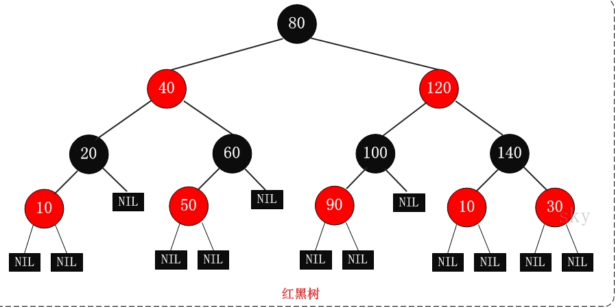

#### 解释一下什么是面向对象？

从面向对象和面向过程的差异来解释什么是面向对象比较好。面向过程的编程思想是把数据和过程分别作为独立的部分来考虑，数据代表问题空间中的客体，过程则用于处理这些数据；而面向对象则站在现实世界的角度去抽象问题，把数据和过程都看作是对象的一部分。

#### 5种网络IO模型？

阻塞IO、非阻塞IO、IO多路复用、信号驱动IO、异步IO。

#### BIO、NIO、AIO的区别？

BIO即阻塞IO，是JDK最早就提供的IO方式，BIO的编程思想是面向文件流。

NIO是New IO的意思，NIO编程模型基于三个基本组件：通道、缓冲区、选择器。数据是从通道读入缓冲区，从缓冲区写入通道中的。选择器是用于网络IO实现IO多路复用的。

AIO即异步IO，BIO和IO多路复用都有阻塞，异步IO完全没有阻塞，也就是AIO再向操作系统发出读写请求之后就返回接着做自己的事情了，等到操作系统准备好数据并把数据从内核空间复制到用户空间之后，AIO才会去处理，也就是说AIO全程都不会阻塞。

#### 语句（statement）和表达式（expression）的区别？

分命令式编程语言和函数式编程语言看

命令式编程语言里面，有表达式和语句和函数，函数不在这个level上，它是语句的集合，现在只谈论表达式和语句，他俩个都是编程语言的基础，区别的是+-*/=ifwhile等关键字，命令式编程语言里面表达式不能单独作为一行，他就像是没有说完的话，必须变成语句才行。

函数式编程里面都是表达式，可以单独存在？？？

#### ArrayList的扩容机制？

扩容的时机：如果使用无参构造器，则初始化容量是0，在第一次添加时会扩容到10，以后每次扩容都是扩到原来的1.5，比如10会扩容到15；如果使用指定大小的有参构造器，则初始化时就是这个容量，以后每次扩容也是扩到原来的1.5。

扩容的过程：调的是`Arrays.copyOf()`，这个方法又调了`System.arraycopy()`，是个native方法，基本原理是先申请一个新容量的数组，然后再复制旧数组中的元素。

#### HashMap插入元素的流程？put()方法的流程？

首先根据key的hash值（调用key的`hashCode()`方法）找到在数组中应该插入的位置，然后先判断这个位置是否为空，若为空就直接插在数组的这个位置，否则就依次检查链表上的每一个节点（或在红黑树上查找），判断key值是否相等（调用key的`equals()`方法），若相等，就替换value值，若都不相等，就插入，插入后分两种情况检查：① 如果数组长度小于64，若节点总数大于阈值（`数组长度 x 负载因子`），或某个链表的长度大于树化的阈值8，出现这两种情况中的任意一种情况就会将数组扩容为原来的两倍；② 如果数组长度大于64，只会在节点总数大于阈值时扩容，如果没有达到扩容阈值，但是链表长度大于8，则会把链表变成红黑树。

注意：检查头节点和检查链表后面的节点并不是在一起（即一个循环里面）的操作。

#### HashMap的扩容机制？

扩容的时机：**当数组长度小于64时**，若节点总数大于阈值（数组长度 * 负载因子），或某个链表的长度大于树化的阈值8，出现这两种情况中的任意一种情况就会将数组扩容为原来的两倍；**当数组长度大于64时**，只会在节点总数大于阈值时扩容，若某个链表的长度等于树化的阈值8，则会将链表变成红黑树。

扩容的过程：先申请一个新容量的数组，然后再把每个元素重新hash到新Map中。这中间有个规律，处于同一个桶中的数据，一部分会散列到新数组的相同位置`i`上，另一部分会散列到`n+i`上，这是因为位置是通过`hash & (n-1)`计算得到的，n是数组容量。比如扩容前为16，扩容后容量为32，元素的hash值和15、31做与运算的低4位是相同的，只有第5位不同，因为15的第5位为0，而31的第5位为1。

注意两点：

1. 是节点总数与数组长度*负载因子比较，而不是数组上已被占有的位置
2. 数组长度小于64时，链表长度等于8不会触发树化，而是触发扩容

#### 二叉排序树、平衡二叉树、红黑树、平衡m叉查找树、B-树、B+树？

**二叉排序树**就是根节点的左子树小于根节点的值，根节点的右子树大于根节点的值，然后左右子树都是二叉排序树的树，一个递归的定义。从二叉排序树的性质可以看出其中序遍历的结果的是有序的。

**平衡二叉树**就是在二叉排序的基础上加上了的自平衡算法，保证插入和删除时，左右子树的高度差不会超过1。

------

**红黑树的性质：**

性质1：每个节点只有两种颜色：红色 和 黑色    

性质2：根节点是黑色的

性质3：每个叶子节点（NIL）是黑色的空节点

**性质4：不会出现两个连续的红色节点**，或者说 红色结点的两个子结点一定都是黑色，或者说红色节点的父节点一定是黑色的

**性质5：任何一个节点到叶子节点的所有路径上的黑色节点数相同**

红黑树是一颗平衡二叉树，但是它的平衡并不是像平衡二叉树那样左右子树高度差不超过1个，而是左右子树高度差不会超过1倍，但是红黑树左右子树黑色节点的高度是相等的，所以红黑树的左右子树是“近似平衡” 和 “黑色完美平衡”。

正因为红黑树的平衡性没有平衡二叉树的平衡性好，所以红黑树的查找效率要略低于平衡二叉树，但是红黑树的插入删除效率要比平衡二叉树高。

红黑树依靠两种操作保证上面5条性质：**变色** 和 **旋转**

比如插入数据时，插入节点的颜色是红色，大致有如下情形：

1. 插入节点的父节点是黑色的，直接插入即可

2. 插入节点的父节点是红色的：
   2.1 叔叔节点是红色，那么全程靠变色就可以保证上面5条性质
   2.2 叔叔节点是黑色，那么还分以下两种情况，都是靠变色加旋转来保证红黑树的5条性质：
     2.2.1 插入节点是父节点的左孩子
     2.2.2 插入节点是父节点的右孩子

------

B-树就是一颗平衡m叉查找树，但是B-树要比平衡m叉查找树要严格，就是B-树的所有叶子节点必须在同一层上，而平衡m叉查找树只需要左右子树高度不相差1。

B+树是B-树的变形，不同于B-树的是，B+树的非叶子节点不存数据（或指向数据的指针），所有数据或指向数据的指针都是存在叶子节点上，非叶子节点只是对叶子节点的多级索引。

MySQL的索引结构就是B+树，每个节点是大小为16KB的页，对于聚簇索引，非叶子节点中存的一条条记录包括主键 + 下一层节点的页号，这个下一层节点页面里面存的都是比该主键大的记录，叶子节点存的一条条记录是完整的数据；对于非聚簇索引，非叶子节点存的一条条记录包括查找键 + 下一层节点的页号，叶子节点存的一条条记录是 查找键 + 主键，所以在非聚簇索引上找到记录后要回表，也就是到聚簇索引上找完整的数据。