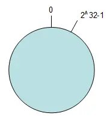
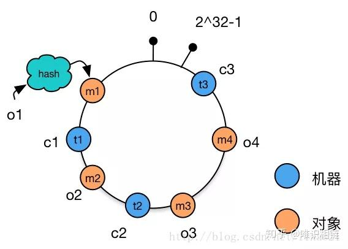
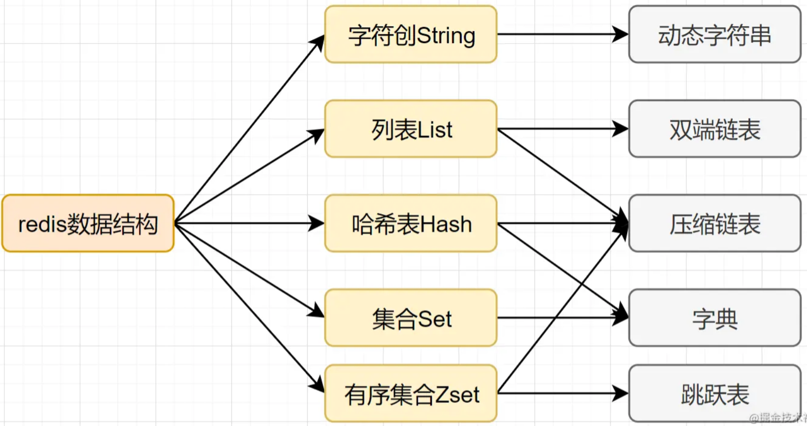
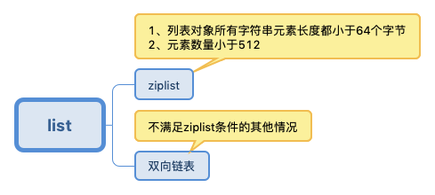
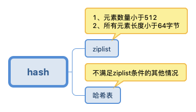
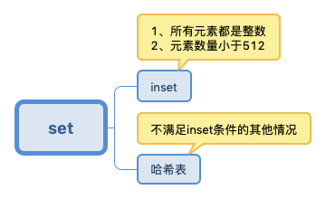
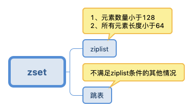

#### 一致性Hash算法？

传统的Hash算法在增加删除服务器的时候都需要重新Hash所有数据才可以保证下一次取数据的不出错，这样性能太低了。一致性hash就是来解决这个问题的。

首先说一下传统的Hash算法在增加删除服务器的问题。比如说最开始有3台服务器，挂了一台，那么取数时你是对3取余还是对2取余，对3取余的话，新添加的数据就有可能加不进去，对2取余的话，那么数据原本在没有挂的0号机上，就有能取余的结果变成了1。如果说对原来数据用3取余，对添加的数据用2取余那就没问题了，但是你取数的时候怎么知道这是原来的数据呢。

新增加一台机器也是同样的道理，都必须重新散列所有数据。

一致性Hash算法的做法是，使用一个环状的数据结构，即一致性Hash环，把数据和服务器都hash到这个环上，服务器就用ip或主机名hash即可，数据所存放的机器就是顺时针最近的那台服务器。这样如果挂了一台服务器，那么对查剩余的数据没影响的，只是在查保存在挂了的那台机器上的数据时，会在环上下一台服务器中找，但是找不到，返回错误即可。对于增加一台服务器，只需要把它顺时针的下一台服务器部分数据转移到这台机器上即可，不用调整全部数据。不过这里还存在一个问题，就是新增加的服务器只分担一台服务器的压力，对其它服务器没有丝毫影响，所以新的解决方法就是**把每台服务器作为许多个虚拟节点分散的hash到这个环上**，每台机器都如此，这样新机器加入的时候也是作为许多虚拟节点散开这个环上，于是就可以随机的分担其它许多服务器的存储压力了。

Redis分布式存储数据就是这个原理，与HDFS分布式存储完全不同，HDFS需要一个NameNode来保存文件的分布的信息，但是Redis不用，不过这也主要是因为它们面向的数据不同，Redis面向的是一条数据，HDFS面向一个文件。

-----

按照常用的hash算法来将对应的key哈希到一个具有2^32次方个桶的空间中，即`0 ~ (2^32)-1`的数字空间中。现在我们可以将这些数字头尾相连，想象成一个闭合的环形。如下图：

数据 和 机器的唯一标识 都进行hash，：

数据顺时针存到最近的机器。

#### Redis的数据结构？

String：字符串、整数或者浮点数，可对对整数和浮点数执行自增或者自减操作。

List：应用如 评论列表、消息队列（数据的生产者可以通过**Lpush**命令从左边插入数据，多个数据消费者，可以使用**BRpop**命令阻塞的“抢”列表尾部的数据）。

Set：无序集合，自动去重的那。

Sorted Set：去重并排序，写进去的时候给一个分数，自动根据分数排序，应用如 排行榜。

Hash：包含键值对的无序散列表。

#### Redis的底层数据结构？

> https://i6448038.github.io/2019/12/01/redis-data-struct/

1.动态字符串SDS：

- 空间预分配
- 惰性空间释放

2.双向链表

3.压缩列表ziplist：此数据结构是为了节约内存而设计的，是一段连续的内存，

- 元素的遍历：先找到列表尾部元素，然后再根据ziplist节点元素中的`previous_entry_length`属性，来逐个遍历。

4.哈希表：采用了渐进式哈希的方式完成收缩和扩容的步骤，首先是在哈希表的数据结构里面有两个表头（ht[0]和ht[1]），也就是两张哈希表，刚开始的时候只在第一张哈希表里增加和删除元素，然后rehash的时候，会在给第二张哈希表开辟空间，接着分n步慢慢地将第一张表的元素rehash到另外一张表上，其过程依靠rehashidx变量完成，rehashidx 的数值就是现在rehash的元素位置，rehashidx 等于 -1 的时候说明没有在进行refresh，rehash完成之后会将ht[0]和ht[1]互换，也就是保持ht[0]还是当前有元素的那张hash表，ht[1]还是没有元素的那张hash表。

5.跳表

##### 字符串

其中：embstr和raw都是由SDS动态字符串构成的。唯一区别是：raw是分配内存的时候，redisobject和 sds 各分配一块内存，而embstr是redisobject和raw在一块儿内存中。

##### 列表

##### hash

##### set

##### zset

#### redis为什么这么快？

1.完全基于内存

2.采用单线程，避免了频繁的上下文切换和锁资源争用的开销

3.采用了非阻塞I/O多路复用机制

4.高效的数据结构

#### Redis是单线程的，如何充分利用多核CPU服务器的性能？

Reids的性能瓶颈通常是网卡的吞吐量和内存的大小，比如可能出现千兆网卡打满也打不满CPU的单核性能。当单核性能不能满足，需要能压榨多核服务器的性能时，可以在单台服务器上部署多个Redis实例，每个Redis进程都与CPU的一个核心绑定，然后组成Redis-cluster模式。

#### 数据淘汰策略？

可以设置内存最大使用量，当内存使用量超出时，会施行数据淘汰策略。Redis 具体有 6 种淘汰策略：

| 策略              | 描述                         |
| --------------- | -------------------------- |
| volatile-lru    | 从已设置过期时间的数据集中挑选最近最少使用的数据淘汰 |
| volatile-ttl    | 从已设置过期时间的数据集中挑选将要过期的数据淘汰   |
| volatile-random | 从已设置过期时间的数据集中任意选择数据淘汰      |
| allkeys-lru     | 从所有数据集中挑选最近最少使用的数据淘汰       |
| allkeys-random  | 从所有数据集中任意选择数据进行淘汰          |
| noeviction      | 禁止驱逐数据                     |

Redis 4.0 引入了 volatile-lfu 和 allkeys-lfu 淘汰策略，LFU 策略通过统计访问频率，将访问频率最少的键值对淘汰。

#### 持久化？

##### AOF 持久化

将写命令添加到 AOF 文件（Append Only File）的末尾。

使用 AOF 持久化需要设置同步选项，从而确保写命令同步到磁盘文件上的时机。这是因为对文件进行写入并不会马上将内容同步到磁盘上，而是先存储到缓冲区，然后由操作系统决定什么时候同步到磁盘。有以下同步选项：

| 选项       | 同步频率         |
| -------- | ------------ |
| always   | 每个写命令都同步     |
| everysec | 每秒同步一次       |
| no       | 让操作系统来决定何时同步 |

- always 选项会严重减低服务器的性能；
- everysec 选项比较合适，可以保证系统崩溃时只会丢失一秒左右的数据，并且 Redis 每秒执行一次同步对服务器性能几乎没有任何影响；
- no 选项并不能给服务器性能带来多大的提升，而且也会增加系统崩溃时数据丢失的数量。

随着服务器写请求的增多，AOF 文件会越来越大。Redis 提供了一种将 AOF 重写的特性，能够去除 AOF 文件中的冗余写命令。
