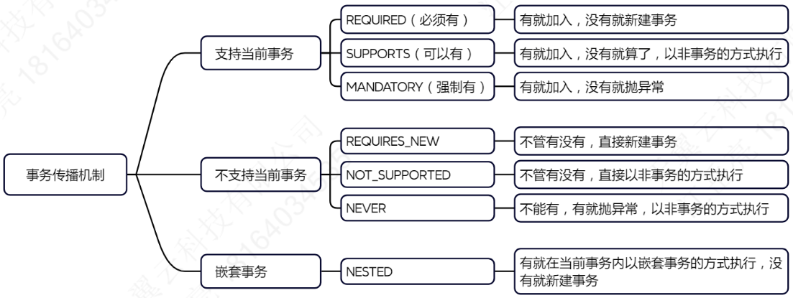
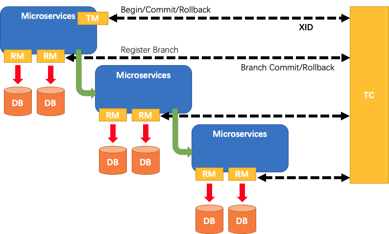

#### Spring依赖注入的方式？

构造器注入和setter注入。

#### Spring 中的 bean 生命周期?

Spring Bean生命周期的主要阶段：

1. 实例化：Spring容器首先根据bean定义创建一个对象实例。这可以通过构造函数或工厂方法来完成。
2. 属性填充：一旦实例被创建，Spring就会将配置文件中定义的所有属性值注入到这个实例中。如果需要，还会调用setter方法进行依赖注入。
3. Aware接口回调：如果Bean实现了BeanNameAware, BeanFactoryAware, 或 ApplicationContextAware等接口，那么相应的setBeanName(), setBeanFactory(), 或 setApplicationContext()方法会被调用。这些回调允许Bean获取自己的名称、所属的BeanFactory或ApplicationContext。
4. 后置处理器：如果注册了任何BeanPostProcessor，它们的postProcessBeforeInitialization()方法将会在此时被调用。这允许对Bean进行一些定制化的处理，比如修改属性值或执行一些自定义逻辑。
5. 初始化方法：如果Bean实现了InitializingBean接口，则其afterPropertiesSet()方法会被调用。此外，还可以通过@PostConstruct注解或者在XML配置中的init-method属性指定的方法来定义自定义的初始化逻辑。
6. 后置处理器：在所有上述初始化工作完成后，如果有注册BeanPostProcessor，则它们的postProcessAfterInitialization()方法会被调用。这是最后一次修改Bean的机会。
7. 使用阶段：此时，Bean已经完全准备好并可以被应用程序使用了。
8. 销毁方法：当容器关闭时，如果Bean实现了DisposableBean接口，其destroy()方法会被调用。同样，也可以通过@PreDestroy注解或XML配置中的destroy-method属性来指定自定义的销毁逻辑。

总结：Spring Bean的生命周期从实例化开始，经过属性填充、初始化前、初始化、初始化后的步骤，直到Bean可以被使用为止。当Spring应用上下文关闭时，会触发Bean的销毁流程。理解这些阶段可以帮助你更有效地管理和优化你的Spring应用。例如，你可以利用初始化和销毁方法来释放资源、清理缓存或记录日志等。

#### Spring 中的 bean 的作用域（scope）？

- singleton (单例)：容器中只会存在一个共享的实例。
- prototype (原型)：每次对这个Bean的请求都会创建一个新的实例。
- request (请求)：每一次 HTTP 请求都会产生一个新的实例，并且该 bean 仅在当前 HTTP 请求内有效。
- session (会话)：在一个HTTP Session中，容器会返回该Bean的同一个实例。
- application (全局会话)：在ServletContext级别上，容器会返回该Bean的同一个实例，整个Web应用共享一个实例。

request/session/application：这些作用域主要用于Web开发中，根据不同的需求选择合适的作用域来管理Bean的生命周期。

#### Spring 怎么解决循环依赖问题？

循环依赖有三种情况：

1. 构造器注入存在循环依赖，Spring将抛出BeanCurrentlylnCreationException异常。
2. 原型（prototype）作用域的Bean，Spring也不能解决循环依赖。
3. 单例（singleton）作用域Bean的属性注入（setter注入），Spring使用三级缓存来解决循环依赖。

三级缓存：

1. 第一级缓存：保存完全初始化好的Bean实例。
2. 第二级缓存：保存已经创建但还未完成属性填充的Bean实例。
3. 第三级缓存：保存工厂对象，用于创建Bean实例。

解决步骤：

- 创建阶段：当Spring容器开始创建一个Bean时，首先会检查一级缓存（已完全初始化的Bean），如果没有找到，则将创建的新实例放入二级缓存。
- 属性填充阶段：接着Spring会尝试对这个新创建的Bean进行属性填充，如果此时需要注入另一个Bean，而该Bean也正在被创建（即存在循环依赖），则可以从二级缓存中获取部分初始化的Bean实例。
- 初始化后阶段：一旦所有属性都填充完毕且初始化完成后，该Bean会被从二级缓存移至一级缓存，并从三级缓存中移除对应的工厂对象。

#### AOP有哪些实现方式？

- 静态代理：编译时编织，在编译阶段生成 AOP 代理类，典型代表是AspectJ。
- 动态代理： 运行时在内存中生成 AOP 动态代理类，典型代表是JDK 动态代理 和 CGLIB动态代理。
  - JDK 动态代理：要求被代理的类必须实现一个接口，运行时动态生成的代理类也会实现相同的接口。
  - CGLIB动态代理：运行时动态生成被代理类的子类，重写被代理类的方法。

#### JDK 动态代理和CGLIB动态代理的局限？

JDK动态代理无法代理的方法：

- JDK动态代理只能代理接口中的方法，接口中的方法都是public的，所以JDK动态代理只能代理public方法。
- 接口中也可以有static方法，同样因为static方法没有多态，所以JDK动态代理不能代理static方法。

CGLIB动态代理无法代理的方法：
* 因为final修饰的类和方法不能被继承，所以CGLIB不能代理final修饰的类和方法。
* private方法可以被继承，但是CGLIB依然不能代理private方法，原因是private方法没有多态。
* static方法没有继承一说，也就没有多态，所以CGLIB不能代理static方法。

#### Spring AOP的实现方式？

Spring AOP使用CGLIB 和 JDK动态代理实现了代理模式，默认使用JDK动态代理（SpringBoot2.x默认使用cglib动态代理）。`<aop:aspectj-autoproxy proxy-target-class="false"/>` 时，如果目标类有实现接口，则使用JDK动态代理，反之则使用cglib动态代理。`<aop:aspectj-autoproxy proxy-target-class="true"/>` 时，直接使用cglib动态代理。

#### Spring AOP有几种通知方法？

五种通知：
1. @Before：前置通知
2. @AfterReturning：返回通知
3. @AfterThrowing：异常通知
4. @After：后置通知
5. @Around：环绕通知

#### Spring 声明式事务的传播方式？

#### SpringMVC拦截器？

SpringMVC拦截器在Controller方法执行前后执行，需要实现HandlerInterceptor接口，提供三个方法：
* preHandle：控制器方法执行之前执行preHandle()，其boolean类型的返回值表示是否拦截或放行，返回true为放行，即调用控制器方法；返回false表示拦截，即不调用控制器方法。
* postHandle：控制器方法执行之后执行postHandle()。
* afterComplation：处理完视图和模型数据，渲染视图完毕之后执行afterComplation()。

#### SpringMVC异常处理器？

@ControllerAdvice将一个类定义为全局的异常处理类，@ExceptionHandler用于设置所标识方法处理的异常，@ExceptionHandler还可以标注在@Controller类里的方法上，该方法只会解决本类发生的异常，即只要该类的@RequestMapping方法发生了@ExceptionHandler方法能解决的异常，都会跳到这个方法。

#### SpringBoot自动配置原理？

- @SpringBootApplication 是 @SpringBootConfiguration、@EnableAutoConfiguration、@ComponentScan 这三个注解的合成注解。@ComponentScan的默认扫描范围是配置类所在的包及其所有子包，并不会扫描到spring-boot-autoconfigure包，起关键作用的是@EnableAutoConfiguration注解。
- @EnableAutoConfiguration注解会找META-INF/spring.factories文件（SpringBoot2.0是这个文件，3.0换文件名了），spring.factories文件中指明了自动配置类的全类名。
- spring-boot-starter导入了 spring-boot-autoconfigure，spring-boot-autoconfigure囊括了所有内置场景器的所有配置类。
- 批量加载这些自动配置类。配置类根据条件注解和xxxProperties属性类完成自动配置了。

#### 自定义Starter步骤？

1. 创建一个配置类，并使用@Configuration和条件注解（如@ConditionalOnClass、@ConditionalOnMissingBean等）来指定何时应用这些配置。
2. 在src/main/resources/META-INF/spring.factories文件中添加相应的配置，让Spring Boot能够发现你的自动配置类。
3. 创建两个模块：一个是自动配置模块，另一个是starter模块。starter模块只包含pom.xml文件，用于引入自动配置模块和其他必要的依赖。
4. 引入自定义的Starter。

#### SpringCloud的组件？

- Consul：注册中心（服务发现） 和 配置中心。
- spring-cloud-loadbalancer：负载均衡。
- RestTemplate：服务调用。
- OpenFeign：服务调用。
- Gateway：网关。
- Resilience4j：CircuitBreaker断路器 和 RateLimiter限流器。
- Micrometer Tracing + Zipkin：分布式链路追踪。
- seata：分布式事务。

#### CircuitBreaker断路器？

CircuitBreaker提供了三种主要的状态：closed、open、half_open，和两种特殊的状态：DISABLED 和 FORCED_OPEN。closed是允许访问状态，open是禁止访问状态，half_open是部分可访问状态。DISABLED是始终允许访问，FORCED_OPEN是始终禁止访问。

CircuitBreaker处于COLSED（闭合）状态允许正常访问，当失败率或者慢调用率超过设定的阈值时，CircuitBreaker会转换成OPEN（打开）状态，这时不允许进行访问，等待一定的时间之后CircuitBreaker转变成HALF_OPEN（半开）状态，这时允许指定数量的请求正常访问，如果这些请求的失败率仍然超过阈值，那么再次进入OPEN状态，否则进入CLOSED状态。

#### RateLimiter限流器？

常见限流算法：
1. 滚动时间窗口：滚动时间窗口给每一个时间窗口设置一个最大请求量，在时间窗口内的某个时刻达到最大请求量之后，窗口剩下的时间会直接拒绝或阻塞到来的请求，每个窗口之间没有重叠。滚动时间窗口简单粗暴，但在两个窗口的临界点处可能会出现流量尖峰的问题，比如0.9秒时有100个请求，1.1秒时也有100个请求，虽然第一秒和第二秒确实都在各自的时间范围内限制了100个请求，但是从0.5秒1.5秒这一秒之间却有200个请求。
2. 滑动时间窗口：为了避免滚动时间窗口流量尖峰问题，滑动时间窗口更加精细地划分时间窗口，比如再将1秒划分成10个格子，然后随时间的流逝，窗口跟着时间滑动，每次都是计算最近10个格子的请求量，如果前9个格子的请求量已经达到100个请求，那么下一个100毫秒会直接拒绝或阻塞到来的请求，滑动窗口的缺点是，存储和计算的开销更大。
3. 漏桶算法：漏桶的出水口大小一定，从而保证请求处理速度永远不会超过设定的值，最简单的实现方式是使用信号量Semaphore来限制并发量。
4. 令牌桶算法：有一个固定容量的桶，然后以稳定的速率生成令牌放在桶中，因为桶的容量固定，令牌满了就不生产了。当有请求时，需要获取令牌才能通过，桶中有充足的令牌时，突发的流量可以直接获取令牌通过，当令牌取光后，后面的请求就得等生成令牌后才能通过，这种情况下请求通过的速率就变得稳定了。令牌桶的优点是可用处理突发流量，所以被广泛的应用于各种限流工具中，比如Guava的RateLimiter。

Resilience4j的AtomicRateLimiter是滚动时间窗口算法。

#### 分布式事务？2PC？

两阶段提交（2PC, two-phase commit）算法是一种共识算法，解决了原子提交问题。2PC有两种角色：协调者（coordinator）（也称为事务管理器（transaction manager）） 和 参与者（participants）。协调者通常在请求事务的相同应用进程中以库的形式实现（例如，嵌入在Java EE容器中），但也可以是单独的进程或服务。

两阶段指的是 准备阶段 和 提交阶段：

1. 准备阶段：协调者发送一个准备（prepare）请求到每个参与者，询问它们是否能够提交。
2. 提交阶段：
   - 如果所有参与者都回答“是”，表示它们已经准备好提交，那么协调者在阶段 2 发出提交（commit）请求，然后提交真正发生。
   - 如果任意一个参与者回复了“否”，则协调者在阶段2 中向所有节点发送中止（abort）请求。

理解2PC的关键在于两个关键的“不归路”点，这两个承诺保证了2PC的原子性：

* 当参与者投票“是”时，它承诺它稍后肯定能够提交（尽管协调者可能仍然选择放弃）。
* 一旦协调者做出决定，这一决定是不可撤销的。

关于第2点：协调者做出决定之后必须把这个决定写到磁盘，这被称为**提交点（commit point）**，一旦协调者的决定落盘，就没有回头路了，一定要将提交或回滚的决定发送给所有参与者，如果这个请求失败或超时（比如参与者在此期间崩溃，网络出现问题等），协调者必须永远保持重试，直到成功为止（可以是故障自动恢复，实在不行就人为介入解决问题，反正最后一定要能提交）。协调者把最终的决定写到磁盘这一动作和数据库常规的单点事务提交是一样的，也就是说2PC的提交点归结为协调者上的常规单节点原子提交。

#### 2PC存在的问题？

2pc协议唯一存在的问题是协调者的单点故障问题：在提交阶段，任何准备好了但未收到协调者最终决定的参与者都会在疑虑中卡死，等待协调者恢复，协调者恢复后，通过读取其事务日志来确定所有存疑事务的状态，任何在协调者日志中没有提交记录的事务都会中止，这就是为什么协调者必须在向参与者发送提交或中止请求之前，将其提交或中止决定写入磁盘上的事务日志。

解决协调者单点故障问题的方法是使用Paxos、Raft等协议实现协调者的高可用。

#### 2PC的实现方式？

**强一致性方案：**

- XA：X/Open XA（扩展架构（eXtended Architecture）的缩写）是跨异构技术实现两阶段提交的标准。许多传统关系数据库（包括PostgreSQL，MySQL，DB2，SQL Server和Oracle）和消息代理（包括ActiveMQ，HornetQ，MSMQ和IBM MQ） 都支持XA。简单理解，XA是参与者实现的协议，异构系统只要实现了XA协议，就能被组合在一个分布式事务中。

**最终一致性方案：**

XA是强一致的分布式事务的实现方案，在没有收到第二阶段的提交或者回滚请求之前本地事务不会结束，各个参与者对本地资源一直占有，不会释放，性能较低，于是出现牺牲部分一致性换取更高性能的最终一致性方案，最终一致性方案的实现方式很朴素，那就是在准备阶段直接提交本地事务，后续第二阶段如果需要回滚，那就再使用另外一个本地事务进行补偿，所以最终一致性方案也称为补偿性分布式事务，最终一致性允许出现中间状态，也就是不一致的状态，系统最终要达到一致状态。

提交事务的结果有可能通过事后执行另一个补偿事务来取消，但从数据库的角度来看，这是一个单独的事务，因此任何关于跨事务正确性的保证都是应用自己的问题。XA协议依赖数据库层的实现，但是补偿性分布式事务则完全依赖应用层的实现，最终一致性事务的典型代表是TCC，此外还有可靠消息最终一致性、最大努力通知：

- TCC模式：Try-Confirm-Cancel。
- 可靠消息最终一致性：可靠消息最终一致性是多个服务之间通过消息队列传递远程调用的消息，这种方案能保证最终一致性的核心原理是消息队列为服务调用提供了一种可靠的通信方式（保证远程调用一定能传递到），而这种可靠通信的实现原理其实是消息队列利用 **2pc** 或者 **ack+幂等** 完成了生产者和消息队列之间 以及 消费者和消息队列 之间 的exactly-once。

- 最大努力通知：事务A执行完之后通知事务B执行，事务B最好能执行成功，即使失败了也不要紧，事务A也不必回滚（个人认为最大努力通知这种方案应该不能算作是分布式事务的实现方案）。

#### TCC模式的三个问题？

TCC有三个问题：
1. 空回滚：Try还没执行却执行了Cancel。
2. 悬挂：Cancel都执行了却又执行了迟到的Try。
3. 幂等：Try、Confirm、Cancel三个阶段都有可能重复执行。

解决这三个问题的共同思想是，三个方法都作为本地事务方法，在事务即将结束的时候向数据库日志表中插入一条数据表示本方法已经执行过了，在事务开始的时候首先检查方法有没有执行过。

1. 针对空回滚问题：Cancel方法开始时检查Try方法有没有执行过，如果数据库中存在相同XID的Try方法日志，就表示已经执行过了，此时Cancel方法直接返回，从而避免空回滚。
2. 针对悬挂问题：Try方法开始时检查Cancel方法有没有执行过，如果已经执行过了，则直接返回，避免Try锁定的资源永得不到释放，也即悬挂。
3. 针对幂等问题：Try、Confirm、Cancel三个方法在开始时检查自己有没有执行过，如果执行过就直接返回，从而实现幂等。

#### Seata？

Seata对分布式事务的区分：
* 全局事务（Global Transaction）：也就是整个分布式事务。
* 分支事务（Branch Transaction）：每一个参与者的事务，也被称为本地事务。

Seata中的角色：

* 事务协调者（Transaction Coordinator，TC）：维护全局和分支事务的状态，驱动全局事务提交或回滚。
* 事务管理者（Transaction Manager，TM）：定义全局事务的范围：开始全局事务、提交或回滚全局事务。
* 资源管理者（Resource Manager，RM）：管理分支事务处理的资源，与TC交谈以注册分支事务和报告分支事务的状态，并驱动分支事务提交或回滚。

Seata管理分布式事务的流程：

1. TM告诉TC开启一个分布式事务，TC生成一个代表全局事务的XID
2. 微服务之间的开始调用并传递XID
3. RM收到XID之后向TC注册本地事务
4. TM告诉TC可以提交或者回滚全局事务了（意思是前面的数据库操作已经做完了，现在告诉TC可以开始两阶段提交了。@GlobalTransactional注解标注的方法正常结束的话就可以告诉TC可以提交了，至于最终是否可以提交还要看接下来两阶段的结果，如果方法发生异常，那肯定是直接告诉TC可以回滚了）
5. TC驱动所有分支事务提交或者回滚（TC先询问所有参与者是否准备好了，然后再决定提交或者回滚）

总结来说，Seata把2pc的协调者分成了两个角色，TM和TC，独立TC的进程方便使用Paxos等共识算法实现高可用，分布式事务的提交点肯定是持久化在TC中。

#### AT模式？

AT模式是Seata提供的一种最终一致性方案，它与TCC模式原理基本上是一样的，只不过TCC的补偿事务需要用户编写，AT模式则是自动生成回滚SQL，不过自动生成也有一定的限制，并不是所有DML语句都可以生成相应的回滚SQL。AT模式是Seata主推的方式。

