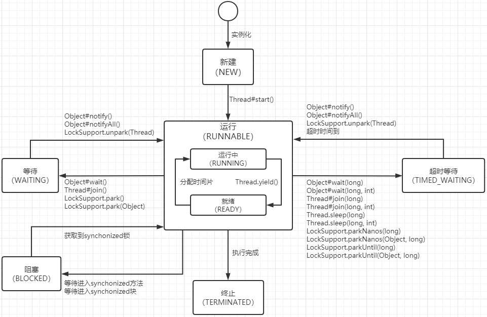
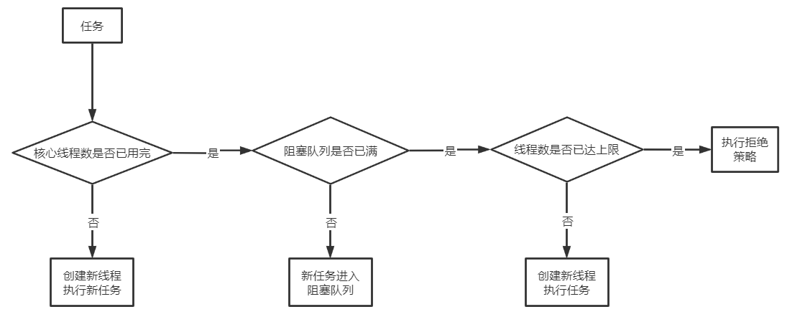
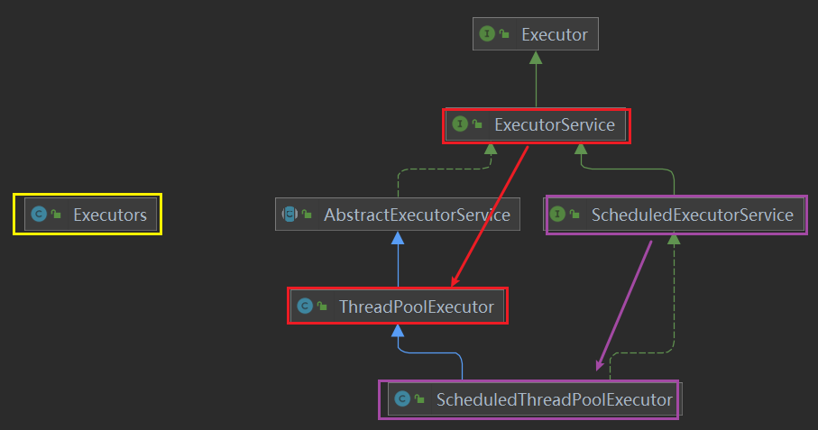
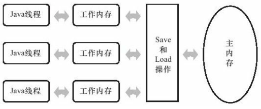
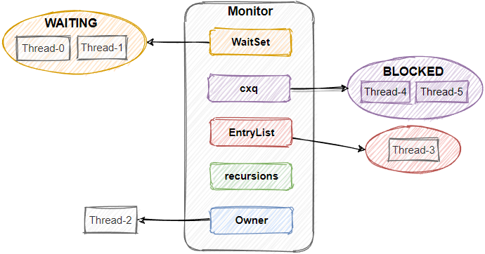
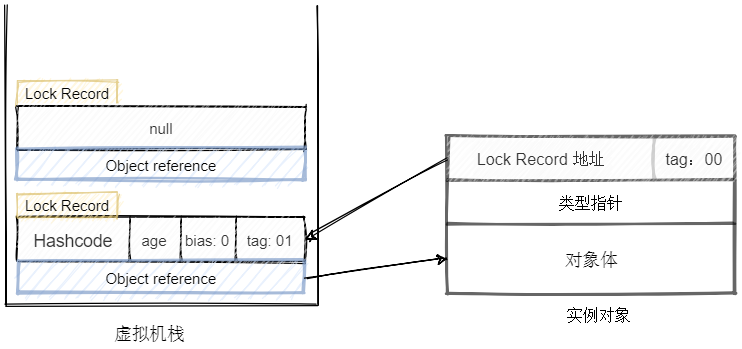
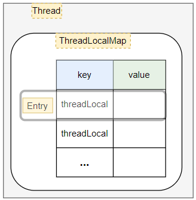
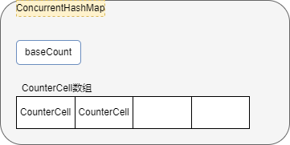
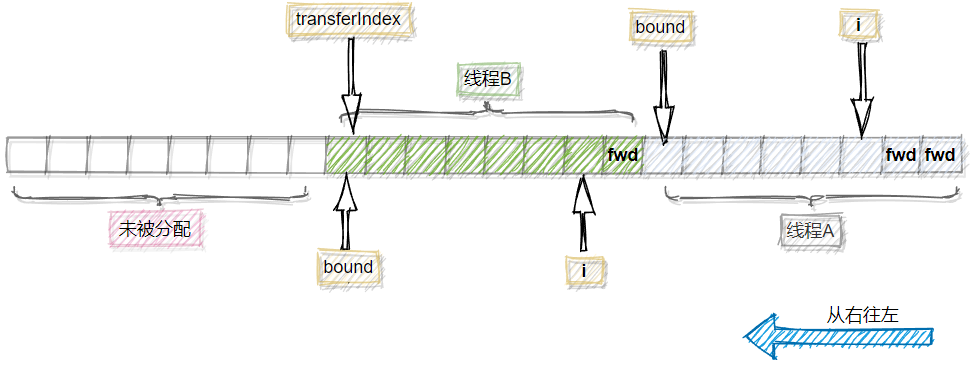

## 应用

### 线程的状态？



以上是从jvm的synchronized锁的角度出发的，synchronized是JVM实现的，而JUC的Lock是用户层面的实现，所以LockSupprot.park()是等待，这个操作毕竟不是锁，只是实现锁的一个关键操作。synchronized的角度区分了阻塞和等待两种状态，这两种状态的区别在于，阻塞状态在等待获取一个排它锁，这个事件发生在另外一个线程放弃这个的锁的时候；而等待状态在等待一段时间，或者唤醒动作的发生。当然你也可以把JUC的Lock锁的操作加在上面，比如ReentrantLock的lock()与unlock()加在阻塞那里，await()和signalAll()放在等待那里。

为什么与操作系统里进程的三种状态（就绪、运行、阻塞）不同？当然问题的原因不在于Java里是线程，而操作系统里是进程，因为操作系统里线程也是这3种状态。问题的根本原因在于上面是Java提高的一种统一的并发编程模型，解决跨平台问题的Java一直都是在如此地做，上图中所讲的waiting等待状态和blocked阻塞状态其实都是依靠操作系统提高的park系统调用完成，在操作系统看来都是线程阻塞（Java线程的实现方法是1:1，所以操作系统能感知Java所创建的线程），其区别是在Java这一层实现的，主要是waiting等待状态的线程只在调用notify之后被加入到等待唤醒的队列中，而blocked阻塞状态的线程在每次解锁操作之时都会被加入到等待唤醒的队列中。

### 创建线程的3方式？

1.继承Thread类

2.实现Runnable接口

3.实现Callable接口：实现Callable接口 -> 创建FutureTask对象`new FutureTask(new MyThreadCallable());` -> `new Thread(futureTask, "A").start()`;

本质上只有一种创建线程的方式，即 `new Thread().start()`;

### 线程抛异常会不会导致整个JVM进程结束？

不会，java虚拟机退出的条件是：虚拟机内不存在非守护线程。

在Linux操作系统中，当线程发生错误，操作系统会给线程发送kill信号（比如非法访问内存发送的是kill -11，即SIGSEGV），之后线程执行自定义的信号处理函数，如果线程不在信号处理函数里垂死挣扎恢复进程，那么在信号处理函数执行完后，进程直接结束（kill -9 除外，不管进程是否定义了信号处理函数，都会马上被干掉）。线程崩溃不会导致 JVM 崩溃是因为 JVM 自定义了信号处理函数。

> [美团一面：为什么线程崩溃崩溃不会导致 JVM 崩溃 (qq.com)](https://mp.weixin.qq.com/s/JnlTdUk8Jvao8L6FAtKqhQ)
>
> [OOM异常会导致JVM退出吗？ - 知乎 (zhihu.com)](https://zhuanlan.zhihu.com/p/269892810)

### 线程池？

#### 说一下线程池的核心参数？

```java
public ThreadPoolExecutor(int corePoolSize,
                          int maximumPoolSize,
                          long keepAliveTime,
                          TimeUnit unit,
                          BlockingQueue<Runnable> workQueue,
                          ThreadFactory threadFactory,
                          RejectedExecutionHandler handler);
```

- corePoolSize：线程池中常驻的线程数，超出常驻的线程数后任务会进入阻塞队列
- maximumPoolSize：线程池中最大线程数，超出最大线程数后执行拒绝策略
- keepAliveTime：超过常驻线程数的线程在空闲下来keepAliveTime后会被销毁
- unit：keepAliveTime的时间单位
- workQueue：阻塞队列，阻塞队列满了之后会创建非核心线程来执行任务
- threadFactory：线程工厂，创建一个新线程时使用的工厂，可以用来设定线程名、是否为daemon线程等
- handler：拒绝策略

#### 线程池的工作流程？

当调用 execute() 方法添加一个任务时，线程池会做如下判断：

1. 如果正在运行的线程数量小于 corePoolSize，那么马上创建线程运行这个任务；
2. 如果正在运行的线程数量大于或等于 corePoolSize，那么将这个任务加入阻塞队列；
3. 如果这时候队列满了，而且正在运行的线程数量小于 maximumPoolSize，那么还是要创建非核心线程立刻运行这个任务；
4. 如果队列满了并且正在运行的线程数量等于 maximumPoolSize，那么线程池会根据拒绝策略来对应处理。

当一个线程完成任务时，它会从队列中取下一个任务来执行。

当一个线程无事可做，超过一定的时间（keepAliveTime）时，线程池会判断，如果当前运行的线程数大于 corePoolSize，那么这个线程就被销毁，也就是线程池的所有任务完成后，最终会收缩到 corePoolSize 的大小。



#### 拒绝策略？

主要有4种拒绝策略：

1. AbortPolicy（默认策略）：抛出异常
2. CallerRunsPolicy：把任务交给调用者线程执行
3. DiscardOldestPolicy：丢弃等待队列中最旧的任务（队头，也就是下一个即将执行的任务），并执⾏当前任务
4. DiscardPolicy：直接丢弃任务，也不抛出异常

还可以自定义拒绝策略。

#### 常见阻塞队列？

BolckingQueue只是一个接口，主要用它的三个实现类：

1. ArrayBlockingQueue ：由数组结构组成的有界阻塞队列
2. LinkedBlockingQueue ：由链表结构组成的有界阻塞队列
3. SynchronousQueue：不存储元素的阻塞队列

#### ThreadPoolExecutor submit和execute方法的区别？

1. execute只能提交Runnable类型的任务，而submit既能提交Runnable类型任务也能提交Callable类型任务

2. execute会直接抛出任务执行时的异常，submit会吃掉异常，可通过Future的get方法将任务执行时的异常重新抛出。



- execute()方法在Executor接口中。
- submit()方法在ExecutorService接口中。
- AbstractExecutorService抽象类实现了submit()方法，submit()方法的实现是，submit会先将传入的Runnable或者Callable构造成一个RunnableFuture，然后调用了execute()。
- ThreadPoolExecutor实现了execute方法，并从AbstractExecutorService抽象类中继承了submit()方法。

#### 有哪几种常见的线程池？

- **FixedThreadPool**
  
  1. 定长的线程池，核心线程数量 = 最大的线程数量，没有非核心线程。
  2. 使用的是**无界**等待队列`LinkedBlockingQueue`。
  
- **SingleThreadPool**
  
  1. 只有单个线程的线程池，核心线程数量 = 最大的线程数量 = 1，没有非核心线程。
  2. 使用的是**无界**等待队列`LinkedBlockingQueue`。
  
- **CachedThreadPool**
  
  1. 核心线程数量 = 0，最大的线程数量 = Integer.MAX_VALUE，也就是无限大。
  2. 使用的是不存储元素的阻塞队列`SynchronousQueue`（SynchronousQueue就是只要线程往里面put，如果没有其它线程及时取出来，那么该put线程就会阻塞），也就是只要来了任务如果没有空闲线程就会创建新的线程执行任务，空闲线程的keepAliveTime等于一分钟。
  
- **ScheduledThreadPoolExecutor**

  **周期性**执行任务的线程池，有核心线程，但也有非核心线程，非核心线程的大小也为无限大，适用于执行周期性的任务。构造函数调用的还是`ThreadPoolExecutor`构造函数，区别不同点在于任务队列是用的`DelayedWorkQueue`。

### Java中都有哪些锁？

synchronized 和 JUC包下的Lock的实现类（ReentrantLock、ReentrantReadWriteLock中的ReadLock和WriteLock）

Lock中的主要方法：

- lock：用来获取锁，如果锁被其他线程获取，进入等待状态。
- lockInterruptibly：如果线程使用此方法获取锁时，如果发生等待，则这个线程能够响应中断，即可中断线程的等待状态。
- tryLock：tryLock方法是有返回值的，它表示用来尝试获取锁，如果获取成功，则返回true，如果获取失败（即锁已被其他线程获取），则返回false。
- tryLock（long，TimeUnit）：与tryLock类似，只不过是有等待时间，在等待时间内获取到锁返回true，超时返回false。
- unlock：释放锁。

### ReentrantLock与synchronized的区别？

相同点是都是可重入锁。

不同点是：

1. synchronized是Java的关键字，完全由JVM实现；Lock 是JUC包下的一个接口，ReentrantLock是Lock的子类，基于AQS实现。

2. synchronized能提供的功能，ReentrantLock都能提供，ReentrantLock相比于synchronized还能提供一些更高级的功能，包括：
   
   - 等待可中断：正在等待的线程可以放弃等待。
   
   - 公平锁：synchronized是非公平锁，ReentrantLock默认也是非公平锁。ReentrantLock可以设置成公平锁，一旦设置成公平锁之后，性能会急剧下降。
   
   - 支持多个条件变量

3. 异常是否释放锁：synchronized 在发生异常时候会自动释放占有的锁，因此不会出现死锁；而 lock 发生异常时候，不会主动释放占有的锁，必须手动 unlock 来释放锁，可能引起死锁的发生。

效率方面，JDK6对synchronized进行锁优化之后，二者在效率已经没有高低之分了。

### Semaphore、CountDownLatch、CyclicBarrier？

- **Semaphore(信号量)**：可以指定资源数目，抢到了就减1，用完后释放会加1，相当于操作系统里学的pv操作里的信号量
- **CountDownLatch(倒计时器)**：调用countDownLatch.countDown();的线程会将计数器减一，调用countDownLatch.await();的线程会阻塞等待，直到计数器减为0。也就是调用countDownLatch.await();的线程会阻塞等待所有调用countDownLatch.countDown();的线程执行完成后再执行。
- **CyclicBarrier(循环栅栏)**： 每个线程await的时候会停下来等待，当到达10个线程等待的时候，就会触发CyclicBarrier中的任务，CyclicBarrier中的任务中的任务完成时就会唤醒所有等待的线程，CyclicBarrier 的字面意思是可循环使用，所以称为循环计数。

### Java中哪些集合类是线程安全的？

JDK1.0就有的三个线程安全的集合类：Vector、HashTable、Stack

Collections的包装方法

```java
List<E> synArrayList = Collections.synchronizedList(new ArrayList<E>());
Set<E> synHashSet = Collections.synchronizedSet(new HashSet<E>());
Map<K,V> synHashMap = Collections.synchronizedMap(new HashMap<K,V>());
```

JUC包：

- CopyOnWriteArrayList 、CopyOnWriteArraySet，写时复制，读写不互斥，写写互斥，也就是写的时候会加锁，读的时候不会加锁。
- ConcurrentHashMap、ConcurrentSkipListMap、ConcurrentSkipListSet
- 非阻塞线程安全队列：ConcurrentLinkedQueue、ConcurrentLinkedDeque
- 阻塞BolckingQueue的实现类：ArrayBlockingQueue、LinkedBlockingQueue、SynchronousQueue、PriorityBlockingQueue、DelayQueue

### 并发编程总结

并发编程大致包括两块：

- 创建线程：Thread类和Runnable接口 -> 线程池 -> Callable接口和FutureTask -> CompletableFuture
- 线程同步：锁（synchronized、ReentrantLock、ReadWriteLock） -> volatile -> 同步器（CountDownLatch、CyclicBarrier、Semaphore） -> 线程安全集合（Collections.synchronizedList(new ArrayList<>())、CopyOnWriteArrayList、ConcurrentHashMap、BolckingQueue）-> 原子类（AtomicInteger、AtomicReference、LongAdder） -> 无锁（CAS）

----

## 原理

### 什么是缓存一致性？

什么是高速缓存？由于处理器的计算速度与内存的访问速度存在着几个数量级的差异，所以不得不在处理器和内存之间加一层或者多层读写速度尽可能接近处理器运算速度的高速缓存（cache）。运算时将所需要的数据先复制到缓存，这样可以让处理器更快访问到数据，运算结束后再把缓存中的结果同步到内存，这样虽然解决了处理器与内存在速度上的矛盾，但又引入了一个新的问题，即缓存一致性。

什么是缓存一致性问题？在有多个处理器的系统中，每个处理器都有自己的高速缓存，当多个处理器的运算任务都涉及同一块主内存区域时，将导致各自的缓存数据不一致，将数据同步回主内存时以谁的数据为准是个问题，这就是缓存一致性问题。为解决缓存一致性问题，需要各个处理器在访问缓存时遵循一些协议以达到缓存一致性，如MESI协议。

### Java内存模型？



（书面化：Java内存模型（JMM）是对内存中数据进行读写访问过程的一个抽象，为的是屏蔽各种硬件和操作系统的内存访问差异，实现一种一致的内存访问效果。JMM定义了程序中变量的访问规则，即规定所有变量都存储在主存中，每个线程都有自己的工作内存，工作内存保存了线程使用到的主内存变量的副本，线程对变量的操作必须在工作内存中进行，不能直接读写主内存中的数据，不同线程之间也无法直接访问对方的工作内存，线程之间变量值的传递必须通过主内存完成。）

口语化：Java内存模型是Java虚拟机规范为屏蔽各种硬件和操作系统的内存访问差异所定义的一种**统一的内存访问模型**。JMM分为主内存和工作内存两部分，主内存只有一个，被所有线程共享，所有变量都存储在主存中；而工作内存是每个线程独有的，每个线程都有一个工作内存，工作内存保存了线程使用到的主内存变量的副本，**线程对变量的操作必须在工作内存中进行，不能直接读写主内存中的数据，不同线程之间也无法直接访问对方的工作内存，线程之间变量值的传递必须通过主内存完成**。

### 原子性、可见性、有序性？

想要实现并发，首先要解决底层指令并发操作带来的三个基本问题：原子性、可见性和有序性，这三个特性是并发程序运行的基础（在思考这些基本原则的时候要跳出你的惯性思维，理所应当的东西在底层也是需要依靠合理的设计来实现的）。

#### 原子性？

首先要解决的是基本数据类型的原子读写，不能出现一个线程long变量写一半，然后另一个线程却读到了这个long变量的情况发生，这个由Java内存模型直接保证（通常来说32位计算机对32位的变量的操作都是具有原子性的，但是对于64位的变量如long不能保证原子性，所以需要解决这个问题）。然后更进一步的需要解决的更大范围的原子性保证，这个可以由synchronized来保证。

#### 可见性？

一个线程对变量的写要能被另外一个线程读到（注意这里不是立即读到），这个看似平常并且理所应当的要求同样需要依靠jvm来实现，Java内存模型规定在变量修改之后要将新值同步到主内存，在变量读取前需要从主内存刷新变量值，通过这种依赖主内存作为传递媒介的方式来实现可见性。如果想要保证变量的修改可以立即被其他线程读到，可以加上volatile关键字。除volatile外，synchronized和final也可以保证这种立即可见性。

#### 有序性？

首先程序最基本的理所应当的有序性是依靠先行发生原则来保证的，然后对于并发程序的有序性可以依靠volatile和synchronized来保证，其中volatile只能禁止volatile变量前后指令重排序的语义。

#### **Happens-Before原则是什么？**

Happens-Before（先行发生原则）是Java内存模型中定义的两个操作之间的偏序关系，如果两个操作之间满足Happens-Before原则，那么Java虚拟机将不能对其进行重排序。Happens-Before原则有8条。先行发生原则保证了程序的那种理所应当的有序性，这种理所应当的有序性其实也是需要依赖底层的设计去实现的。

### volatile和synchronized的区别？

volatile可以看作是一种轻量级的锁，volatile保证了变量访问的可见性和有序性，但没有保证原子性；synchronized都保证了。

### 谈谈你对volatile关键字的理解？

- 保证了变量的可见性，volatile可以保证变量对所有线程的可见性，也就是每次访问volatile变量都能保证它的值是主内存中的最新值。不加volatile时，线程对工作内存中变量的修改不能及时被其它同样也使用了该变量的线程感知到，加上之后，一个线程对变量值的修改就能够立即被其它线程所感知到。

- 可以禁止指令重排。也就是禁止重排读写volatile关键字修饰的变量前后的指令。

实现原理：在程序生成汇编代码后，访问volatile变量的指令的后面会添加一个空操作的汇编指令，这个空操作相当于一个内存屏障，它的作用就是将本处理器的缓存写到内存中，并且会引起其它核的缓存失效，从而保证了可见性，并且这个空操作还可以保证指令重排序无法越过内存屏障。

### CAS操作？

CAS操作指的是比较并交换（Compare And Swap），由硬件指令提供支持，是一个原子操作。在Java中的CAS操作就是Unsafe类提供的几个方法，这几个方法即时编译的结果就是与处理器相关的CAS指令，不过我们一般不能直接使用Unsafe类，需要通过其它的类如原子类来间接的访问它。

CAS操作的执行过程是，持有一个变量的**内存位置**，**旧的预期值**和**准备设置的新值**，更新时先检查变量的值是否与旧的预期值相同，如果相同则更新为新值，返回true；如果不同则更新失败，返回false。

### ABA问题？

这是CAS的操作逻辑带来的一个问题，更新时变量的值等于旧的预期值并不代表这中间变量的值没有发生过变化，但按CAS操作的逻辑是可以更新成功的，这就是ABA问题，比如有时候需要双写双删来确保数据的准确性，这个重复写入和删除就可能会因为ABA造成问题，例如想从100上减去50，为确保成功减去50，100-50要操作两次，但只能成功一次，不巧的是在两次减50的操作中间，有其他线程加了50，那么就会造成两次减50的操作都能成功，于是ABA就造成了问题。

解决：使用带戳的原子引用类AtomicStampedReference，戳就是一个表示版本的变量，每次更新值成功之后都需要将戳的值加1。这样每次使用该原子引用类更新值的时候，不但要比较此时的值是不是原来的值，还要比较此时的戳是不是原来的戳，当出现ABA问题时，由于戳是递增的，所以并不会更新成功，从而解决ABA问题。

### 悲观锁和乐观锁？

悲观锁是一种阻塞同步机制，而乐观锁是一种非阻塞同步机制，也称为无锁。

悲观锁在操作共享数据之前总是先加锁，无论是否出现竞争，只有加锁成功才能进行操作，加锁失败就会被阻塞，而**阻塞和唤醒线程会带来性能上的开销**。

但乐观锁不一样，他在操作共享数据之前并不会加锁，而是先读取数据，然后操作数据，最后再把结果写回去，不过在写回去的时候要检查一下数据是否与读的时候一样，一样就更新成功，不一样就会更新失败，失败之后的补偿措施是不断重试直至成功，这种乐观的并发策略不需要将线程阻塞挂起，因此也被称为非阻塞同步（数据库中的乐观锁更新失败的结果是就是更新失败，没有线程阻塞挂起的操作）。

乐观锁底层实现需要硬件指令的支持，通常是完成CAS操作的原子指令，在Java中的使用乐观锁是通过由Unsafe类的几个方法。

### AQS？

AQS是JUC包下的一个抽象类AbstractQueuedSynchronizer，基于Unsafe类提供的CAS操作以及park()与unpark()方法实现，是一个用于实现锁和各种线程同步工具的基于模板方法的框架，JUC下的锁以同步器（Semaphore、CountDownLatch、CyclicBarrier）都是基于AQS实现的。

AQS 使⽤⼀个 int 成员变量**state**来表示同步状态，使⽤ CAS 对该同步状态进⾏原⼦操作实现对其的修改，通过LockSupport的park()与unpark()实现线程的阻塞和唤醒，通过内部的 FIFO 队列来完成线程的排队。

### ReentrantLock的实现？

AQS对象内部有一个核心的变量叫做**state**（类似于synchronized monitor的recursions），是int类型的，代表了**加锁的状态**，初始状态下，这个state的值是0。

这个AQS内部还有一个关键变量叫做**exclusiveOwnerThread**（AQS从AbstractOwnableSynchronizer继承而来，（类似于synchronized monitor的owner），用来记录**当前加锁的是哪个线程**，初始化状态下，这个变量是null。

ReentrantLock非公平锁的**加锁过程**：首先调用CAS操作将state值从0变为1，如果CAS操作成功，则表示加锁成功，接着把exclusiveOwnerThread设置为自己，如果CAS操作失败了就再检查一下exclusiveOwnerThread是不是自己，如果是自己，就把state加1，这就是可重入的逻辑，如果不是自己，就把自己挂起到等待队列中。

ReentrantLock非公平锁的**释放锁过程**：先把state变量减1，如果减完之后变量的值变为0，该线程会把exclusiveOwnerThread设置为null，然后唤醒等待队列队首的线程，至此该线程也就彻底释放了锁。

### 为什么非公平锁比公平锁的性能更高？

公平锁会在获取锁的时候先检查等待队列是否空，如果为空则直接获取，如果不为空则进入等待队列，这样就保证了公平，即先来线程先获取锁；而非公平锁并不会保证先到先得，在获取非公平锁的时候，首先会直接尝试获取，如果成功就获得了锁，如果失败才会进入等待队列，这样可以减少线程被挂起和唤醒的次数，因为线程的挂起和唤醒都是系统调用，涉及到内核态和用户态之间的转换以及上下文的切换，减少线程被挂起和唤醒的次数可以大大降低开销。

### JDK6对synchronized锁进行了那么优化？

JDK6实现了各种锁优化技术，包括适应性自旋、锁消除、偏向锁、轻量级锁等。

适应性自旋：所谓自旋就是让后请求锁的线程不进入阻塞状态，而是继续占用cpu时间片，忙等待一会，看看持有锁的线程是否会很快的释放锁。这种自旋需要在多核cpu进行才有意义，在单核cpu上自旋没有意义。适应性指的是虚拟机会根据自旋获得锁成功的情况自动调整自旋的次数。

锁消除：指即时编译器会对一些不可能存在竞争共享数据的加锁操作进行消除。

锁粗化：指编译器会把一些连续的加锁操作放在一起，避免频繁地进行加锁和解锁的操作。

### synchronized加解锁过程？

#### 重量级锁加解锁过程？

重量级锁依靠操作系统底层的同步机制实现，加锁和解锁（可能会）涉及操作系统的系统调用，所以称为重量级锁。



重量级锁实现所依赖的数据结构是Monitor，其简化的数据结构如下：

- `WaitSet`指向因为调用`Object::wait`而处于等待状态的线程集合。
- `cxq`指向因为竞争锁失败而阻塞的线程集合。
- `EntryList`指向即将被唤醒的线程队列，每次当锁被释放时会唤醒EntryList队首的线程。
- `Owner`指向的获得锁的线程。
- `recursions`是锁重入计数。

重量级锁加解锁过程：

1. 在对象上加重量级锁的时候，首先会检查对象`MarkWord`最后两位是不是`01`，即是否处于`Heavyweight Locked`重量级锁定状态，如果不是，那么先给对象初始化一个Monitor管程对象，然后将对象头的MarkWord用cas操作置为重量级锁状（MarkWord的前62位是指向Monitor对象的指针，后两位是`01`），之后再将Monitor的Owner指向该线程，并设置recursions为1，此时该线程就加锁成功了。
2. 如果发现对象已经处于重量级锁定状态，那么首先会通过MarkWord的前62位找到Monitor，然后检查Owner是否指向自己，如果是，那么锁重入，直接将recursions加1即可，如果不是，那么就将线程加入到cxq竞争队列中然后挂起。
3. 如果线程在解锁之前调用`Object::wait`，那么该线程也会释放锁，然后加入到WaitSet队列中然后挂起。**当其他线程调用`Object::notifyAll`，会将WaitSet中的线程加入到EntryList。**
4. 当 synchronized块结束 或者 使用`Object::wait` **释放锁时**，会先将cxq中的线程加入到EntryList，然后**唤醒EntryList队首的线程**。

总结：锁释放时，只会唤醒EntryList队首的线程。所以对于处于waiting状态的线程，如果没有其他线程调用notify方法，那么他就不会被加入到EntryList队列中，也就永远不会被唤醒；对于因为竞争锁失败而阻塞的线程，因为每次释放锁都会将cxq队列中的线程加入到EntryList队列，所以只要锁被释放，它们就有被唤醒的机会（可以简单地将cxq队列和EntryList队列看作是一起的，然后每次调用notify方法都会将WaitSet中的线程加入到EntryList队列）。

#### 轻量级锁加解锁过程？



轻量级锁实现依靠的数据结构是`Lock Record`，`Lock Record`包含两部分：`Displaced Mark Word` 和 `Object reference`，`Displaced Mark Word` 记录的是锁对象的MarkWord，`Object reference`记录的锁对象的引用。

加锁流程：

1. 线程每次加轻量级锁都会在栈中创建一个`Lock Record`，然后将尝试使用cas操作将锁对象的Mark Word设置为轻量级锁定状态（前62位是`Lock Record`的地址，后两位是00），如果锁对象后两位是`01`（即处于未锁定状态或者偏向锁状态），那么cas操作可以成功，也就是加锁成功。
2. 否则如果cas操作失败，那么有两种情况：
   - 如果其它线程已经持有了该 Object 的轻量级锁，那么cas操作会失败，因为cas期望Mark Word的后两位是01，而此时是00处于轻量级锁定状态，在轻量级锁定状态下出现锁竞争情况，会导致进入锁膨胀过程。
   - 如果是本线程重复对锁对象加锁也会导致cas操作失败，不过这是锁重入现象，会再添加一条`Lock Record`作为重入的计数，该`Lock Record`的第一部分`Displaced Mark Word` 置为null。

解锁流程：

1. 如果`Lock Record`的`Displaced Mark Word`为null，代表这是一次重入，删除锁记录继续执行。
2. 如果`Lock Record`的`Displaced Mark Word`不为null，则利用CAS指令将对象头的`mark word`恢复成为`Displaced Mark Word`。如果成功，则continue，否则膨胀为重量级锁。

#### 使用synchronized加锁过程中，对象的hashcode值都会保存在哪里？

在Java中如果一个对象计算过hash值，那么就应该一致保持不变，不然会让很多基于hash值的应用出错。而对象的hash值是保存在对象头的MarkWord里面的（而不使用实例字段的原因是，并不是所有对象都需要计算hash值，如果把对象的hash值保存在对象头里面，当对象不需要计算hash值时，可以复用其空间），当使用synchronized加锁时，MarkWord中保存hash值的位会被复用，比如被偏向锁存线程id，被轻量级锁存指向lock record的指针，被重量级锁存指向monitor的指针，那如果对象要计算hash值，其hash值会被保存在哪里呢？对于不同的状态，对象的hash值保存的地方都不一样：

1. 对于处于未锁定的对象，其hash值直接保存在对象头的MarkWord中。
2. 如果对象计算过hash值，那么对象就不会再进入偏向锁状态了，对于已经进入偏向锁状态的对象，也会撤销偏向进行锁升级。
3. 对于处于轻量级锁定状态的对象，其hash值会被保存在lock record中。
4. 对于处于重量级锁定状态的对象，其hash值会被保存在monitor中。

### TreadLocal？

#### TreadLocal的使用场景？

**TreadLocal的使用场景**：如果每个线程都需要用自己的数据来执行某个方法，那么就需要在这个方法所属的类中创建一个TreadLocal，然后在该方法中使用`TreadLocal::get()`方法了。TreadLocal典型的应用是连接管理，一个线程持有一个连接，连接对象可以被同一个线程中的不同方法使用，而不同线程之间不共享连接。

#### TreadLocal原理？

**TreadLocal原理**：ThreadLocal类里面有一个静态内部类ThreadLocalMap类，**每个Thread对象都有一个ThreadLocalMap对象**，调用ThreadLocal对象的set方法就是在往线程自己的ThreadLocalMap对象里面设置值，所以不会出现并发修改问题，ThreadLocalMap的**key就是调用set方法的ThreadLocal对象**，所以如果需要保存多个值，需要new多个ThreadLocal对象（所以值并不是保存ThreadLocal对象里面，而是保存在线程自己的ThreadLocalMap对象里面）。



#### ThreadLocal的内存泄露问题？

**ThreadLocal的内存泄露问题**：如果一个使用了ThreadLocal的线程迟迟不结束（比如使用线程池里面的线程），那么它就会一直持有ThreadLocalMap对象的引用，所以ThreadLocalMap对象也就不能被回收，ThreadLocalMap对象里面保存着key和value，它们也是引用，不过key是ThreadLocal对象的弱引用，所以不会给ThreadLocal对象的回收造成负担，但是value是用户设置的强引用，所以只要ThreadLocalMap对象不释放，value所指向的对象也就不能被释放，并且还会出现key所指向的ThreadLocalMap对象已经被回收，此时key为null，但是key对应的value却不能回收的情况，这就是妥妥的内存泄露。（ThreadLocalMap的Entry的key是弱引用，所以Entry的key不会作为ThreadLocal对象的引用计数，当发生gc时，如果key所指向的ThreadLocal对象没有强引用了（典型的就是最初创建ThreadLocal对象时的引用），ThreadLocal对象可以被顺利回收，此时ThreadLocalMap的Entry的key为null。）

解决内存ThreadLocal的内存泄露的方法就是当线程不再使用ThreadLocal时，需要调用其`remove()`方法删除ThreadLocalMap对象里的Entry。

### ConcurrentHashMap原理？

ConcurrentHashMap的数据结构和HashMap一样：数组+链表+红黑树。

#### sizeCtl含义？

- sizeCtl为0，表示数组未初始化， 且数组的初始容量为16。
- sizeCtl为正数，如果数组未初始化，那么其记录的是数组的初始容量，如果数组已经初始化，那么其记录的是数组的扩容阈值。
- sizeCtl为-1，表示数组正在进行初始化。
- sizeCtl小于0，且不为-1，表示数组正在扩容， -(1+n)，表示此时有n个线程正在共同完成数组的扩容操作。

#### put方法的并发流程？


put方法实现并发安全的主要思想是 cas+自旋 的无锁并发策略，大致流程是：

1. 首先检查是否是第一次put元素，如果是，需要先初始化数组，也就是在new ConcurrentHashMap的时候并没有初始化数组，真正做数组初始化是在第一次添加元素时完成，即懒初始化（Lazily initialized）。初始化完成后自旋进行添加元素。
2. 将keyhash之后找到key所在桶，然后检查为null，如果是，尝试使用cas设置value，cas成功就直接break，表示添加成功，如果失败了，自旋重新尝试其他情况的添加操作。
3. 上一步失败后表示桶的第一个位置一定有了元素，所以需要检查桶的第一个元素是否是forwarding节点，如果是，表示当前桶已经被迁移到新数组了，并且扩容操作还没有结束，此线程需要去协助扩容。
4. 如果桶的第一个元素不是forwarding节点，那么可能的情况有3种：【没有进行扩容】、或者【正在扩容，但是桶还没有被迁移】、或者【正在扩容，但是桶还没有被迁移完，只被迁移了一部分】。由于执行添加操作需要修改链表或者树，所以需要对桶的第一个节点加互斥锁，对于前两种情况，该线程都可以加锁并添加成功（除非有其他线程已经锁定这个桶并添加元素，如果是这样，该线程会阻塞等待，唤醒之后抢到锁然后double check一下桶的第一个元素是否是之前来的时候的第一个元素，如果是直接添加，如果不是自旋重试即可），但是对于第3种情况，该线程会被阻塞，因为扩容线程正在迁移桶的时候也会对桶的第一个元素加互斥锁，等到扩容线程释放锁之后，该线程抢到锁也不能添加成功，因为会double check一下桶的第一个元素是否还是原来的那个元素，显然第一个元素被扩容线程换成了forwarding节点，于是该线程添加失败，自旋重新尝试后到第3步去协助扩容。
5. 添加完成后需要检查桶的节点数量，如果达到树化的阈值，需要进行树化，需要注意的是，与HashMap一样，当数组长度小于64并且链表长度达到树化的阈值8的时候，并不会进行树化操作，而是进行扩容操作。
6. 最后会调用`addcount`方法维护节点个数，并且当节点个数达到扩容阈值时`addCount`方法还会调用扩容方法。

#### ConcurrentHashMap维护节点个数的方法？

ConcurrentHashMap定义两个成员变量：`baseCount`和`CounterCell[]`数组。



节点数加1的流程是：

1. 先对baseCount做加1的cas操作，如果成功就返回（大部分情况都可以成功），
2. 如果失败了，表示发生了竞争，那就对`CounterCell[]`数组中某个元素做加1的cas操作，如果成功就返回，
3. 如果失败了，表示发生了竞争，那就将`CounterCell[]`数组扩容为原来两倍，之后自旋对`CounterCell[]`数组中某个元素做加1的cas操作。

因此`size()`方法的计算过程就应该是baseCount加上`CounterCell[]`数组的和。

ConcurrentHashMap维护节点个数的方法与原子类累加器LongAdder一样，能实现高效的累加操作。

#### 并发扩容的流程？

1. 每一个参与扩容的线程首先会用cas操作设置`sizeCtl+1`。

2. 然后进入到扩容方法里面，如果是第一个扩容线程会先新建`nextTable`，之后参与扩容的线程就不用建了，直接进行协助扩容。

3. 每个扩容线程会根据旧数组的长度计算一个步长`stride`，然后在旧数组上从`transferIndex`处领取一个长为`stride`的任务，这个任务分配的方向是从右往左，比如旧数组长为64，`stride`为16，那么第一个任务是`[48,63]`，第二个任务是`[32,47]`。线程领取到任务之后会将`bound`设置为任务的下界，`i`为当前扩容线程正在迁移的桶的下标，然后将`transferIndex`设置为`bound`，因为`transferIndex`是成员变量，而`bound`和`i`是方法的局部变量，所以`transferIndex`总记录的是数组最大未分配数组的下标+1，即最大未分配数组的长度。

4. 之后线程从右往左迁移每一个桶到新的数组，直到`i`到达`bound`，每迁移完一个桶，线程会把数组对应的位置设置为`ForwardingNode`节点。

5. 线程处理完当前的任务之后，如果发现`transferIndex>0`，即还有任务没有被领取，那么线程会接着继续从`transferIndex`处领取下一个任务。

6. 最后一个退出的扩容线程会对旧数组上的每个位置进行一次检查，以免遗漏未迁移的桶，最后退出时会将扩容后的数组`nextTable`赋给table，然后`nextTable`置为null。



值得注意的是：链表和树的迁移时，是对每个节点进行复制，也就是新Map中的节点都是new出来的，而不是只将桶的第一个元素复制到了新数组，这么做的原因就是确保读写可以并发，即写时复制的思想，保证迁移过程中读不受影响（迁移时同一个桶上的元素会被分散迁移到新数组的两个不同的桶中，所以如果不对节点进行复制必然会对读操作混乱），迁移完之后会将forwarding节点设置到旧桶上，之后的读会被转发到新数组上进行。

#### 扩容步长`stride`是如何计算的？

若cpu是单核，即NCPU=1，那么stride就等于整个数组的长度，也就是只用一个线程完成整个map的迁移，否则通过cpu核数与数组长度一起计算出`stride`，然后若步长小于最小迁移步长，那么就使用最小迁移步长16。

#### 什么情况下线程才会进行扩容或加入扩容？

1. put线程发现桶已被迁移，即桶的第一个节点是ForwardingNode，那么他会加入扩容。
2. put线程put成功之后对节点数加1，然后发现达到扩容阈值并且没有线程在进行扩容，那么他会作为第一个线程启动扩容流程。

2. put线程put成功之后，达到树化的阈值，但是数组长度却小于64，那么他会作为第一个线程启动扩容流程。

3. put线程put一个新节点成功之后对节点数加1，然后发现有线程在进行扩容，那么它会加入扩容（注意put的是已有value，那么它不需要对节点数加1，也就不会加入扩容）。

**总结**：一个增加新节点的线程触发了扩容操作，然后开始迁移桶，后面来的写线程如果桶还没被迁移，那么可以直接设置成功，如果该线程也是新增节点，那么会进行协助扩容，如果该线程不是新增节点，而是修改已有节点的value，则不会进行进行协助扩容；如果后面来的写线程的桶已经被迁移了，那么不管是新增节点的线程还是修改已有节点的value的线程，都会因为发现桶的第一个节点是`ForwardingNode`，而被加入协助扩容的大军中，直到扩容完毕，线程才能完成新增节点或者修改节点value。

#### 为什么get方法不需要进行任何并发控制就能保证读的并发安全？

1. Node的val用volatile修饰，所以如果写线程先修改了，读线程能及时读到。
2. 扩容线程迁移桶的时候会复制节点，并不会改变原有桶的结构，所以即使读线程读的桶正在被迁移，读线程也能安全读到数据。
3. 如果正在发生扩容，并且读线程读的桶已经被迁移了，那么读线程会根据旧数组上的forwarding节点的nextTable属性找到新的数组，然后在新数组上查找，这也就是forwarding节点名字的由来，即将读请求转发到新的扩容数组。

