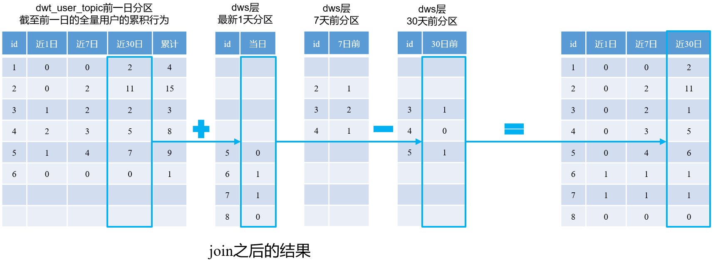
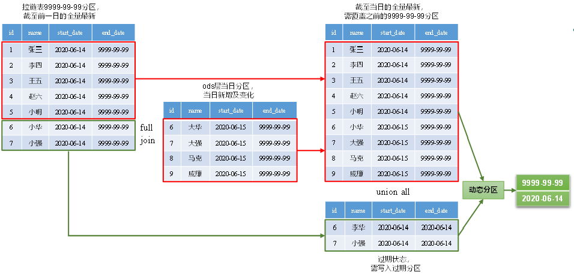
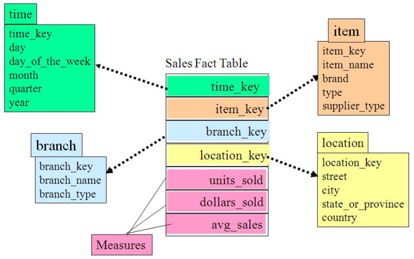
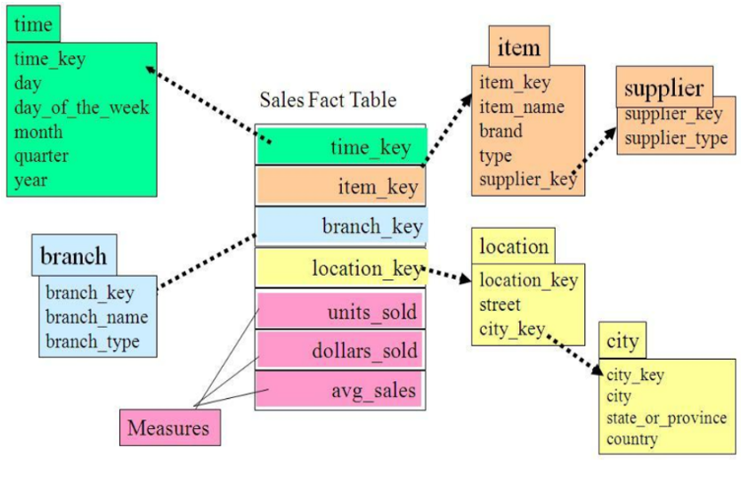

#### 什么是数据仓库？

后台系统每天都会产生大量的数据，比如数据库MySQL中的业务数据，和通过埋点日志产生的用户行为数据，这些数据中蕴含着大量有价值的信息，但是现在的问题就是这些数据并没有被合理组织和储存起来，这会给数据价值的挖掘带来极大的困难，比如业务数据库MySQL不会存储历史数据，MySQL中的数据反映的只是当前业务系统的状态，而在时间维度上对历史数据的分析是具有极大价值的，再比如如果直接使用日志数据，那么针对不同的需求，不同的开发人员都需要自己对原始数据进行处理，这就导致了重复开发，严重降低开发效率。数仓就是来解决这个问题的，数仓并不是数据起点也不是数据的终点，它处在一个中间位置，数仓所做的事情就是将业务数据和日志数据合理的组织和存储起来，比如清洗、备份、聚合、统计，而且很重要的一点是，数仓会储存历史数据，也就是数仓会对后台系统每日新增的数据进行同步，通过数仓的分层装载之后，极大地方便了后续对数据的利用。

#### 数据库与数据仓库的区别？

1.数据库面向事务处理；而数仓面向数据分析。

2.数据库中保存的是系统当前的数据；数仓中保存有历史数据。

3.数据库使用关系建模，遵循三范式；数仓使用维度建模。

#### 介绍一下这个项目？

这个项目是对电商平台建立的离线数仓，一共分为了ODS层、DIM 层、DWD 层、DWS 层、DWT 层 和 ADS层。

埋点日志通过Flume+Kafka+Flume的数据采集通道同步到HDFS上，MySQL中的业务数据通过sqoop同步到HDFS上，然后使用Hive的load命令将数据导入到ODS层的表中。对于日志数据，将每天的增量数据同步到HDFS中；对于业务数据，ODS层有三种同步策略：全量同步、增量同步、新增及变化同步。当然因为是练手的项目，所以这两种数据都是使用脚本模拟生成的。

DIM层和DWD层根据维度建模对ODS层的数据进行加工，DIM层存的是维度表，有两种同步策略，即全量表和拉链表，DWD层存的是事实表，有三种类型的同步策略，即对应三种类型的表：事务型事实表、周期型快照事实表、累积型快照事实表。

DWS层和DWT层按主题对DWD层事实表中的数据进行聚合，区别有几点：

1. DWS层存的是对数据的每日汇总，而DWT层存的是近7日、近30日、以及累积汇总的聚合值。
2. DWS层是对DWD层活跃指标的统计，也就是当天有活跃的数据才会被聚合，比如DWS层商品主题表当天的分区中存的就是当天有产生下单退单的商品的聚合值，在sql的实现上就是，取dwd层事实表当天分区的数据进行聚合，然后left join关联维度表，关联的目的是维度退化，维度退化的优点就是可以在有需要的时候加快查询，不用再去关联维度表，缺点就是增加了存储开销。
3. DWT层的数据来源是DWS层，是对DWS层数据的进一步聚合，存的是近7日、近30日、以及累积汇总的聚合值。DWT层相对DWS层而言存的是全量数据的聚合值，比如DWT层的商品主题表中存的是所有商品的累积聚合值，在sql的实现上就是，每天全量的维表left join dws层当天分区和dwt层前一日分区的聚合值，也就是自依赖实现。

ADS层是数据应用层，根据需求建表并统计聚合值。

然后将ADS层的数据同步到MySQL中，使用SuperSet读取MySQL中的数据并可视化。

最后使用Azkaban实现全流程调度，使用 Kylin 实现即席查询。

#### ODS层的同步策略？

对于日志数据，是将当天产生的数据同步到ODS层当天的分区中，可以看作是增量同步策略。

对于业务数据有4种同步方式：全量同步、增量同步、新增及变化同步 和 特殊同步。

- 全量同步就是每天都同步业务数据库中表的全部数据，过滤条件是`where 1=1`，这种同步策略适用于表的数据量不大，每天既会有新数据的插入，也会有旧数据的修改。
- 增量同步就是每天都只同步表中新增加的数据，过滤条件是`where create_time=当前日期`，这种同步策略适用于表数据量很大，且每天只会有新数据插入。
- 新增及变化同步就是每天只同步新增加的数据和变化的数据，过滤条件是 `where modify_time=当天日期`，这种同步策略适用于表的数据量很大，并且每天既会有新数据的插入，也会旧数据的修改。
- 特殊同步就是只对业务数据库中的表做一次同步，比如地区表。

#### 项目中有哪几种日志？

有两种日志，分别是 启动日志 和 页面日志，都是json格式的字符串。

启动日志在app启动的时候产生，包含启动时间段、公共信息、启动信息和错误信息。公共信息就是有关手机型号等信息，启动信息包含启动时间，广告id等。启动日志在app启动之后上报。

页面日志在浏览页面的时候产生，在离开页面的时候上报。每一条页面日志都包括公共信息、页面信息 和 跳入页面的时间，另外根据页面的不同和用户在一个页面所做的动作，还会产生不同的日志信息，这些信息都是json串里的一个字段的值，最后在用户离开页面的时候，用户在这个页面所产生所有日志信息都是作为一个json串发送到日志服务器上的。

比如用户在浏览一个页面时，会产生不同的事件，比如添加收藏、取消收藏等，这些动作日志都是作为json串里的actions字段的值，actions字段是一个数组；再比如用户如果是在浏览商品，那么商品页还会产生曝光日志，每一个被曝光的商品会作为displays数组的一项。

#### 日志数据是如何被处理的？

ODS层直接存储日志的原始形式，也就是ODS层日志表里面只有一个列，这个列的类型是String。

**DWD层如何处理日志数据？**

对启动日志建立启动日志表，启动日志解析思路：先将所有包含start字段的日志过滤出来 `get_json_object(line,'$.start') is not null`，然后使用get_json_object函数解析每个字段。

对页面日志建立不同的事实表：页面日志表、动作日志表、曝光日志表、错误日志表。每种日志表解析日志的思路都是，将包含该字段的日志过滤出来，然后使用get_json_object函数解析每个字段，当然如果有的字段是数组，还要先将该字段explode。

DWS和DWT层按维度聚合DWD层事实表的度量值，如果有需要会从DWD层日志表中取数。

#### 数仓为什么要分层？

1. **复杂问题简单化：** 分层可以使复杂问题简单化，结构更加清晰，每一层都有各自的职责。

2. **减少重复开发：** 通过对中间层数据的复用，可以极大减少重复开发，比如DIM层和DWD层将业务数据库的关系模型转换成查询更为高效的维度模型，DWS层和DWT层对数据汇总，都是为了方便后续复用。

3. **隔离数据：** 每一层都是将上一层数据做了一次计算和转换后的再次存储，这样就实现了数据的隔离，隔离的好处就是可以更加细粒度控制数据。

4. **方便数据血缘追踪：** 数据的血缘关系指的是每张表数据的来源以及去向，数仓分层使得数据的血缘关系更加清晰，如果有一张表的数据源出现了问题，我们可以快速定位到。

#### 数仓有哪些层？每一层的作用？

数仓最基本的分层思想是分为3层：ODS层（原始数据层）、DW层（数据仓库层）、ADS层（数据应用层）。阿里把第二层DW层换了称呼，叫CDM层（common data model，公共数据层）。

本项目将第二层又细分成了：DIM 层、DWD 层、DWS 层、DWT 层，也即离线数据仓库包含 ODS 层、DIM 层、DWD 层、DWS 层、DWT 层、ADS 层。

---

##### ODS层

**ODS层**（Operation Data Store，原始数据层），数据源的数据经ETL之后进入ODS层，ODS层保持数据原貌，不会对来自业务系统的数据做修改，其主要作用就是起到备份数据的目的，当然，数仓接下来的DIM层和DWD层的数据来源也是ODS层。

---

##### DIM层 和 DWD层

**DIM层**（Dimension，维表层）和 **DWD层**（Data Warehouse Detail，数据明细层）这两层需要用到维度建模的理论知识指导建表，一般采用星型模型，呈现的状态是星座模型，其中，DIM层存放的是维度表，DWD层存放的是事实表。

---

接下来的3层，DWS层、DWT层和ADS层都是以需求为驱动，和维度建模已经没有关系了。

##### DWS层 和 DWT层

**DWS层**（data warehouse detail）和 **DWT层**（wata warehouse topic）按照主题去建表，主题相当于观察问题的角度，对应着维度表，通常是一个维度表就是一个角度，比如DIM层有用户维度表、商品维度表、地区维度表，那么相应的DWS层和DWT层也就有用户主题表、商品主题表、地区主题表，表中存的数据是对事实表按维度外键聚合的结果。

**DWS层 和 DWT层 的数据是如何计算得到的？**

DWS层表中存的数据是将DWD层多张事实表的度量值按同一个维度聚合的聚合值。比如DWD层订单、支付、退款、评价等事实表中都有用户维度，那么DWS层用户主题表中存的就是将这几张表按用户维度聚合的聚合值，也就是group by用户id，然后把聚合的结果写到用户主题表中。

DWS层与DWT层的区别是，DWS层对DWD层数据按天汇总，而DWT层是对DWD层的数据进行累积汇总，比如近一个星期得累积值，近30天的累积值，从开始至今的累积值。

DWT层只会保留两个分区的数据，一是因为DWT层的数据量比较大，二是因为DWT层的数据保存的累积汇总值，没有必有保留很多分区。DWT层表的数据来源是DWT层前一日分区中的数据和DWS层当日分区中的数据，然后做一个加减操作，比如要计算DWT层近30天数据的累积聚合值，那么计算的方式就是 DWT前一日分区的数据 + DWS层最新一天的数据 - DWS层30天的数据。



**你说通常是DIM层的一个维度表就对应于DWS层和DWT层一张主题表，也就是说有例外情况？**

是的，因为事实表中有维度退化的维度字段，在DWS层和DWT层也会对这样的维度建立对应的主题表，比如，DWS层有访客主题，但是DIM没有访客维度表，因为访客维度在DWD层页面日志表中，这张表的数据来自于ODS层的用户行为日志，因为访客信息的维度很少，所以没必要为其单独建立一张维度表，而是将维度字段字节退化到事实表中，这样查询效率更高，因为减少了join的次数。

---

##### ADS层

最后一层是**ADS层**（application data store），该层是直接为统计报表提供数据，所以通常是需要展示什么指标就直接在这一层计算什么指标，比如路径分析、用户统计、用户行为漏斗分析、用户留存率等。

用户统计：ADS层的用户统计与DWS层和DWT层的用户主题表存的数据不同，DWT存的是某个用户近来1、7、30日以及从开始至今的各项数据的累积值，比如下单次数、退款次数等；但是ADS层存的是近1、7、30日下单用户总数、退款用户总数等信息；也就是DWT层是针对每一个用户都有一条数据，但是ADS层是所有用户的统计值。

路径分析：就是用户在网站中的访问路径的变化，比如从商品详情页直接跳到付款页面有多少次，或者是从商品详情页返回首页有多少次，通常是用桑基图展示，桑基图需要提供3个值，<source, target, value＞，桑基图中target可以为空，但是不能存在环。

用户行为漏斗分析：漏斗分析反映了一个业务过程从起点到终点各阶段用户转化情况，比如一个完整的购物流程是：浏览首页，接着浏览商品详情页，然后加购物车、然后下单，最后付款，漏斗分析就是统计这个完整购物流程各个阶段的人数。

用户留存率：留存分析一般包含新增留存和活跃留存分析。新增留存分析是分析某天的新增用户中，有多少人有后续的活跃行为。活跃留存分析是分析某天的活跃用户中，有多少人有后续的活跃行为。

新增留存率具体是指留存用户数与新增用户数的比值，例如2020-06-14新增100个用户，1日之后（2020-06-15）这100人中有80个人活跃了，那2020-06-14的1日留存数则为80，2020-06-14的1日留存率则为80%。

----

#### 关系建模与维度建模的区别？

从数仓数据装载的逻辑上看，好像维度模型是将关系模型原来拆分的表又合并回来了，比如，DIM层商品维度表的数据来自于ODS层的 商品表、一级品类表（数码、服装）、二级品类表（电脑、手机）、三级品类表（台式电脑、笔记本本电脑），在关系建模中是将这些表分开的，商品表通过一级分类id与一级分类表关联，然后一级分类表与二级分类表关联，二级分类表与三级分类表关联，要查商品的二级分类信息就需要两次join。但在维度建模中则是将这些表全部关联之后写到商品维度表中，商品维度表中的一行数据表示一件商品，商品的所有信息都存在这一张表中。

但是这太片面了，这种简单的理解并不正确，因为关系建模与维度建模面向的问题不同，所以它们建模的思想与流程不同。

**总结来说：**

关系建模与维度建模面向的问题不同，所以它们建模的思想与流程不同。

关系建模面向的是事务处理，遵循三范式，目的是为了降低数据冗余，从而消除插入、删除、修改异常。

维度建模不考虑数据有没有冗余这种问题，因为维度建模不是面向事务处理，而是面向的是数据分析，需要的是快速查询，其建模过程从业务过程出发，将业务用事实表和维度表呈现出来，维度建模得到的表之间的关联结构简单，故查询简单，查询效率较高。

#### 维度建模的流程？

**选择业务过程→声明粒度→确认维度→确认事实**

**（1）选择业务过程**

比如下单业务，支付业务，退款业务，物流业务，一条业务线对应一张事实表，此步是在确定事实表。

**（2）声明粒度**

数据粒度指数据仓库中保存数据的细化程度或综合程度的级别，比如DWD层的数据比DWS层的数据粒度更加细，或者说DWS层数据比DWD层数据的综合程度更加高。

声明粒度指的是确定事实表中的一行数据表示什么，应该尽可能选择**最小粒度**，也就是应该保存最明细的数据，以此来应各种各样的需求。

当然根据实际情况可以有出入，比如与下单业务相关的事实表有两张，分别是订单事实表和订单明细事实表，显然订单明细事实表是一张粒度更细的表，订单事实表中记录的一个订单的总金额等数据可以从订单明细事实表总的数据算出来，从这点上看订单事实表是比较多余的一张事实表，但是实际情况是，对下单业务的统计其实更加注重于对一笔订单进行统计，而不是对一笔订单中的一个商品项进行统计，所以添加订单事实表是很有必要，这样可以避免每次都需要对订单明细事实表进行汇总，当然，将下单业务定义为成这两张表还有其它好处，比如订单事实表是一张累积型快照事实表，累积型快照事实表的特点就是数据有状态，而订单明细事实表是一张事务型事实表，会记录所有增量数据。

**（3）确定维度**

此步骤确定的是与事实表相关的维度有哪些，实际上是在确定事实表中需要有哪些维度外键。事实表中的维度描述的是该业务过程 “是谁、在何时、在何地” 的描述信息。

**（4）确定事实**

此步骤确认的是事实表中的度量值（次数、个数、件数、金额等），例如订单金额、下单次数等。

总结来说，**维度建模以事实表为中心**，以**业务过程**为建模驱动，基于每个具体业务过程的特点，构建**最细粒度**的明细层事实表。

维度建模整个流程可以借助业务**总线矩阵**完成。重点关注下单业务有关的两张事实表，即 订单事实表 和 订单详情事实表。

|           | **时间** | **用户** | **地区** | **商品** | **优惠券** | **活动** | **度量值**           |
| --------- | ------ | ------ | ------ | ------ | ------- | ------ | ----------------- |
| **订单**    | √      | √      | √      |        |         |        | 运费/优惠金额/原始金额/最终金额 |
| **订单详情**  | √      | √      | √      | √      | √       | √      | 件数/优惠金额/原始金额/最终金额 |
| **支付**    | √      | √      | √      |        |         |        | 支付金额              |
| **加购**    | √      | √      |        | √      |         |        | 件数/金额             |
| **收藏**    | √      | √      |        | √      |         |        | 次数                |
| **评价**    | √      | √      |        | √      |         |        | 次数                |
| **退单**    | √      | √      | √      | √      |         |        | 件数/金额             |
| **退款**    | √      | √      | √      | √      |         |        | 件数/金额             |
| **优惠券领用** | √      | √      |        |        | √       |        | 次数                |

#### 维度表与事实表？

**维度表**一般是对**事实的描述信息**。每一张维表对应现实世界中的一个对象或者概念，例如：用户、商品、地区、日期等。

**事实表**中的每行数据代表一个业务事件，比如：下单、支付、退款、评价等，事实表中的字段一般分为两类，即：维度外键 和 度量值。维度外键是用来与维度表关联的字段，度量值这个业务事件所产生的数据，比如下单的金额，商品的件数等。

DIM层和DWD层的数据来自于ODS层，相当于是把ODS层中保存的关系模型转换成了维度模型。

下单业务对应两张事实表，分别是订单事实表和订单明细事实表，订单事实表是一张累积型快照事实表，订单明细事实表是一张事务型事实表。**订单事实表和订单明细事实表的区别是**，订单事实表存的是一个订单总的情况，比如原始总金额、减免金额、最终金额，订单明细事实表存的是一个订单中的一个商品项的情况，比如商品的数量、原始金额、活动优惠分摊金额、最终金额等。

支付业务对应支付事实表，这是一张累积型快照事实表，其与状态有关的时间字段是create_time、callback_time，callback_time不为null，表示支付完成，为null则表示支付未完成。

退款业务对应的退款事实表也是一张累积型快照事实表，其与状态有关的时间字段是create_time、callback_time，callback_time不为null，表示退款完成，为null则表示退款未完成。

评价业务对应的评价事实表是一张事务型事实表，因为用户不能修改已发表的评论，所以ODS层评价表中的数据只会新增不会变化，于是DWD层的评价事实表是一张事务型事实表。

**评价事实表的数据完全来自于ODS层同步的评价表，为什么还要在DWD层建立评价事实表？**

因为DWD层的建模思想是维度建模，事实表建立的依据以业务事件为准，通常来说DIM层与DWD层一张表的数据来自于ODS层多张表的数据，但是也不乏有这种完全一致的情况，也就是关系建模和维度建模所建立的表相同。不要总把关系建模和维度建模联系在一起，这是两种不一样的建模思想，所面对的问题并不相同。

#### 事实表的类型？

1.**事务型事实表（增量）：** 事务型事实表的特点是数据只会新增，原有的数据不会改变，也就是事务型事实表会保存所有业务事件产生的数据，所以事务型事实表的同步策略是增量同步，只需要将每日增量数据写到最新的分区即可。

比如订单明细事实表是一张事务型事实表。订单明细事实表总的存的是一个订单中的一个商品项的情况，订单产生之后，无论订单的状态是什么样的，完成或者退款，订单明细都是不会发生变化的，所以订单明细事实表是一张事务型事实表，分区字段等于订单的创建时间。

2.**周期型快照事实表（全量）：** 周期型快照事实表不关心表中数据变化的中间状态，只会在固定的时间间隔如每天或者每月对数据进行一次全量同步，就像是在这个时间点为数据拍了一张快照，所以称为周期型快照事实表。

比如加购事实表就是一张周期型快照事实表，用户在一天之内会进行很多次将商品加入到购物车和从购物车中删除，但是加购事实表并不关心这中间的操作，只在每日的一个事件点对来自ODS层的数据做一次全量同步。

3.**累积型快照事实表（新增及变化）：** 累积型快照事实表的特点是有一个或几个不同含义的时间字段，时间字段是否有值表示着数据处于不同状态，我们需要根据每一条数据的状态变化将它写到不同的分区之中，也就把状态没有终止的数据保存在最新的9999-99-99分区之中，把状态已经终止的数据保存在其终止日期的分区之中。

简单的比如，支付事实表是一张累积型快照事实表，其与状态有关的时间字段是callback_time，callback_time不为null，表示支付完成，为null则表示支付未完成。

再比如，订单事实表中有这些时间字段：

```
`create_time` STRING COMMENT '创建时间(未支付状态)',
`payment_time` STRING COMMENT '支付时间(已支付状态)',
`cancel_time` STRING COMMENT '取消时间(已取消状态)',
`finish_time` STRING COMMENT '完成时间(已完成状态)',
`refund_time` STRING COMMENT '退款时间(退款中状态)',
`refund_finish_time` STRING COMMENT '退款完成时间(退款完成状态)',
`expire_time` STRING COMMENT '过期时间'
```

表示订单完成的状态有：

1. cancel_time不为null，终止时间为cancel_time
2. finish_time不为null，并且同步的时间大于finish_time 7天，并且refund_time为null，终止时间为finish_time+7天
3. refund_finish_time不为null，终止时间为refund_finish_time
4. expire_time不为null， 终止时间为expire_time

和其它累积型事实表一样，根据终止时间将数据写到对应的分区中，没有终止的数据写到9999-99-99分区中

累积型事实表的装载思路是，DWD层9999-99-99分区与ODS层当日分区的数据做full join，然后将左边表也就是9999-99-99分区中未关联上的数据和ODS层当日分区的数据用nvl或者coalesce函数或者是case语句和动态分区把数据写到对应的分区中。

左边表也就是9999-99-99分区中未关联上的数据是状态没有发生变化的数据，也就是这部分数据还是处于未完成的状态，左边表关联上的数据是状态发生变化的数据，但不必代表其状态已经终止，这部分数据的最新状态全在ODS层当日新增及变化的数据中，所以就不用管这部分数据了。


#### 拉链表？

拉链表可以保存历史数据，实现拉链表需要给表加上两个字段`start_date`和`end_date`，`start_date`是该条记录添加时的时间，`end_date`是该条记录过期的时间，对于尚未过期的数据`end_date="9999-99-99"`，然后分区字段`dt`等于`end_date`，也就是拉链表的`9999-99-99`分区会保存所有数据的最新记录，如果数据有历史记录，那么会保存在之前的分区的中。

每日同步数据时，需要将9999-99-99分区的数据与来自ODS层每日新增及变化的数据做full join，然后将左边表9999-99-99分区未关联上的数据和右边表ODS层每日新增及变化的数据一起insert overwrite到9999-99-99分区中，因为这一部分数据属于最新的数据，将左边表9999-99-99分区关联上的数据写到前一日的分区中，因为此时这一部分数据就变成了历史数据，这部分数据的end_date需要修改成同步时的前一日日期。用sql写出来就是前一部分数据与后一部分数据 union all 然后使用动态分区写到9999-99-99分区和前一日分区中。



**拉链表的使用：**

- 如果要在某一天的历史数据中取数，加上 dt="日期" 可以加快分区数据的过滤，而不是使用 end_date="日期";

- 如果要取最新的数据，加上 dt="9999-99-99" 可以加快分区数据的过滤，而不是使用 end_date="9999-99-99"；

- 如果要取某一天的切片数据，即在这一天有效的数据,比如：取 2021-12-09 这一天的历史切片，那么：
  
  ```sql
  select *
  from user_id
  where start_date<="2021-12-09" and end_date>="2021-12-09";
  ```

- 如果要取某一段时间内的历史数据，比如取 2021-12-09 至 2021-12-30，那么 ：
  
  ```sql
  select *
  from user_id
  where (start_date between "2021-12-09" and "2021-12-30")
        or (end_date between "2021-12-09" and "2021-12-30")
        or (start_date < "2021-12-09" and end_date > "2021-12-30")
  ```

#### 简单介绍一下SuperSet？

Superset就是用来展示数据的，把数据以图表的形式直观地展示出来，它是Apache开源的一款轻量级BI（Business Intelligence）分析工具，能够对接多种数据源。

#### 简单介绍一下Kylin?

Kylin是一个开源的分布式分析引擎，具有超大规模数据OLAP的能力，能够在很短的时间之内返回sql的查询结果，它的计算引擎可以MapReduce，还可以是Spark，它原理就是穷举出所有维度组合，这就相当于观察数据的角度，然后提前以这些维度组合的计算出度量值的聚合值。

一个角度得到的所有聚合值就是一个Cuboid，所有Cuboid组成一个Cube，Kylin在计算时是先计算最高维的Cuboid，然后再对高维Cuboid降维聚合就可低维Cuboid了。

使用Kylin的步骤就是先选择一大推表，然后选择这些表的join类型和join字段，接着确定哪些字段是维度，哪些字段是度量，最后选择度量值的聚合函数。Kylin会把你选择的表先连接在一起，然后用维度字段分组，对度量字段聚合，最后把结果保存在cube中（cube保存在HBase中）。所以使用Kylin最重要的是区分维度和度量，建模的方式其实并不那么重要，建模的方法只是方法论，最后落实的还是表，Kylin只关注最后连接在一起的表中哪些是维度哪些是度量。

#### 理解？

dwa层事实表，如果维度是1:1或者n:1的，都会在同一张事实表上（准确来说，他们是同一个主题，因为一个维度确定了，另一个维度也就确定了）；如果两个维度是n:n的，那么他俩就是没有关系，也就是两个不同的主题，应该在两张不同的事实表上。

指标是伴随着动作出现的，所以需要选择业务过程，然后细化一下业务过程（确定这个动作是不是太泛了，太泛了要具体，也就是确认粒度），之后是确认维度（也就是看这个业务过程有多少实体参与了），最后是确认指标（看看这个业务过程都产生了哪些指标）。

维度表是一些重要的实体，这些实体的关系是n:n，这个主题会把1:1和n:1的维度吸收进来。

比如 用户、商品 两者产生关系的动作是下单，下单是一个动作，所以订单是一个事实表。

业务过程是将维度联系起来产生指标的，所以维度建模以业务过程驱动。

dwd层事实表一定会有指标吗？也不一定，比如从点击等埋点事件记录的是用户在何时点击了什么，这种事实就没有指标，但是这种事实在下游dwa层会聚合出指标来。

### SCD（Slowly Changing Dimension，缓慢变化维）及其处理方式？

SCD（Slowly Changing Dimension，缓慢变化维），相对于事实来说，维度随时间变换更加缓慢，所以称为缓慢变化维度。

常用的处理方式：

1. 当维表不大的时候，直接每天的分区都存全量的数据。或者公司有钱能购买很多机器，这样做日后使用也更加方便，比如字节就是这样做的。
2. 每天都覆盖写，只保留一个分区的数据。
3. 添加新列保存旧值，如果只想保存一个旧值就只添加一个新列，同理，如果想保存多个旧值，那么可以添加多个列。
4. 添加新行，也就是拉链表，每当数据行发生变化，就新增一行保存新数据，然后旧数据行保存在当天的分区中，新数据保存在9999-99-99分区中。

**拉链表（缓慢变化维）？**

维度表都是全量表，但是有些维度表数据量实在是太大了，并且数据变化的也比较少（同步时间应该不是问题，因为拉链表在同步数据的时候，数据源需要全表扫描，在写到dim层的时候还需要计算full join，所花费的时间应该不比全量同步快，做拉链表主要原因还是节省存储空间吧），存起来太费空间，于是用拉链表。为什么不只存储2天左右的全量数据呢？因为有时候需要全量的历史数据，不止前2天的。**拉链表可以在既节省了空间的同时又保留了全部的历史数据。**

总结，拉链表适合数据量大，但是变化量级比较小的维度表（缓慢变化维）。拉链表的作用是可以在既节省了空间的同时又保留了全部的历史数据。

-----

ODS层不改变数据源的表结构，只做数据同步，但是可以选择不同的同步方式，不同的同步方式只是影响了数据的储存方式和下游的使用方式（也就是只是影响了sql的写法），并没有改变ods层需要保存所有数据的原则，也就是无论使用哪种同步方式，ODS层都同步了所有数据。

DIM层和DWD层基于维度建模的思想，对表结构做出了修改，但无论是维度表还是事实表，都存储了与之相关联的ODS的全部数据。比如DIM层的维度表只有全量和拉链表两种，这两种表都是可以取到该维度的所有历史数据的。DWD层有3种表，周期型快照事实表（全量表）、事务型事实表（增量表）、累积型快照事实表（新增及变化表)都保存了所有历史事务。不同类型的表都可以取到所有历史数据，只是影响了使用方式。DIM层和DWD层的表就是将数据源的所有历史数据进行维度建模之后形成的，所有历史数据 和 维度建模 都是后续统计使用的基础（DWS、DWT正是如此）。

DWS层的数据面向主题进行统计，统计主题当日活跃产生的各项指标，所以该层的表没有该主体全部的历史数据。因为是统计当日活跃，所以如果是从周期型快照事实表（全量表）和 事务型事实表（增量表）中取数，就是当日分区；如果是累积型快照事实表（新增及变化表)，那么就是当日分区和`'9999-99-99'`分区。

DWT层同样是面向主题进行统计，但是DWT因为有历史全部的累积值，所以肯定不像DWS那样只存当日有动静的数据，dwt应该存的是全量的数据（如果只存历史30天的累积值，那么表中可以只保存近30天有动静的数据；）

~~dws与dwt确实有重复，dwt基于dws计算，那么dws的角色更像是一个中间层，那么就定义一个中间层dwi。dwt更名为dwa对外提供，dwi不对外。dwa就是所谓的主题宽表。~~

最后论文的数仓分层是，ods,dim,dwd,dwi,dwa,dm,app，思考dm层都需要做成什么样？

dwa存的是现在dws的东西，dm存的是现在dwt的东西，dm还存全量用户画像，dm的表还直接给数据集使用，app层存的是报表使用的东西。

维表就是这个系统中最基本的实体，比如这个电商数仓最基本的维度是用户、商品、优惠券。业务数据库使用关系建模的时候会把维表拆得很细，这样做的目的是减少冗余，避免各种插入删除修改异常而导致的数据一致性问题。但是维度建模是以数据查询分析为目的，以这些最基本的维度为中心，然后将它以此为基础派生得到的维度再写回维表，比如商品表和spu表是一对多，最后会把spu的属性写到商品表里面，商品表与商品的销售属性是多对多，最后会把销售属性聚合成数组写回商品表里面；spu表和商品销售属性都是因为商品存在而衍生出来的维度，所以在最后的维度表里面只会将他们作为商品的附属属性写到商品表里面。

事实表就是最基本的属性之间产生关联（业务过程）而生成的，伴随着指标的出现，所以这些指标都可以从两个角度来观察；另外有时候可能是更粗粒度之间的维度产生的关联，因为在业务系统中就是这么设计的（可能因为某种原因不能拆分到更细粒度），这个时候可能需要数仓来以某种逻辑对指标进行拆分。

事实表应该没有delete数据，一般是维度表有delete数据，不过业务系统都不会真正的删除数据，而是打个删除标记，所以数仓就新增，或者新增及变化的同步策略，拉链表和累积型快照表都没问题，另外维度表一般都是全量表。

### 数仓分层的意义？

- 减少重复开发，在数据开发的过程中可以产生中间层，将公共逻辑下沉，减少重复计算；
- 清晰数据结构，简单化复杂问题，每个分层分工明确，方便开发人员理解；
- 方便定位问题，通过分层了解数据血缘关系，在出问题的时候通过回溯定位问题；

### 数据仓库建模方法？

- ER模型（范式模型）

- 维度建模

为了保证数据的一致性以及避免冗余，ER模型遵循第三范式，但在大规模数据跨表分析统计查询过程中，会造成多表关联，这会大大降低执行效率。而维度建模是从分析决策的需求出发构建模型，为分析需求服务，因此它重点关注用户如何更快速的完成需求分析，同时具有较好的大规模复杂查询的相应能力，所以维度建模是反范式理论，包含星型模型和雪花模型两种。

- Data Vault模型

DataVault由Hub（关键核心业务实体）、Link（关系）、Satellite（实体属性） 三部分组成 ，是Dan Linstedt发起创建的一种模型方法论，它是在ER关系模型上的衍生，同时设计的出发点也是为了实现数据的整合，并非为数据决策分析直接使用。

- Anchor模型

Anchor模型是对Data Vault模型做了进一步规范化处理，它是一个高度可扩展的模型，所有的扩展只是添加而不是修改，因此它将模型规范到6NF，基本变成了K-V结构模型。企业很少使用。

### 维度模型的种类？

**星型模型**：由一张事实表与多张维度表组成，通过维度外键关联。



**雪花模型**：与星型模式相同，由一张事实表与多张维度表组成，通过维度外键关联，所谓的“雪花化”就是将星型模型中的维度表进行规范化处理，不过雪花模型对维度进行规范会并不会完全遵循3NF，因为完全遵循三范式虽然降低了数据的冗余，但是会导致查询成本过高。



##### 星型模型 与 雪花模型 的优缺点？

因为雪花模型会对维度表进行规范化，也就是会将一张表拆分成多张表，所以优点是使用起来更加**灵活**，但是缺点就是查询性能低；星型模型刚好反过来了，因为星型模型不会进行规范化，所以优点就是**查询性能高**，但是使用起来不如雪花模型灵活。

##### 该如何选择？

在实际开发中，不会绝对选择一种，根据情况灵活组合，甚至并存。
