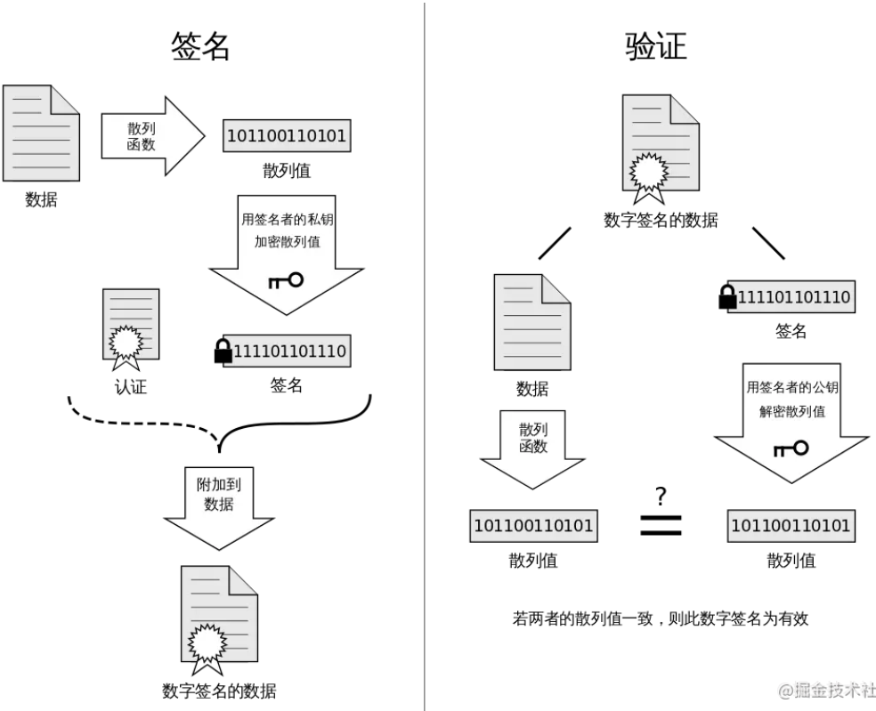
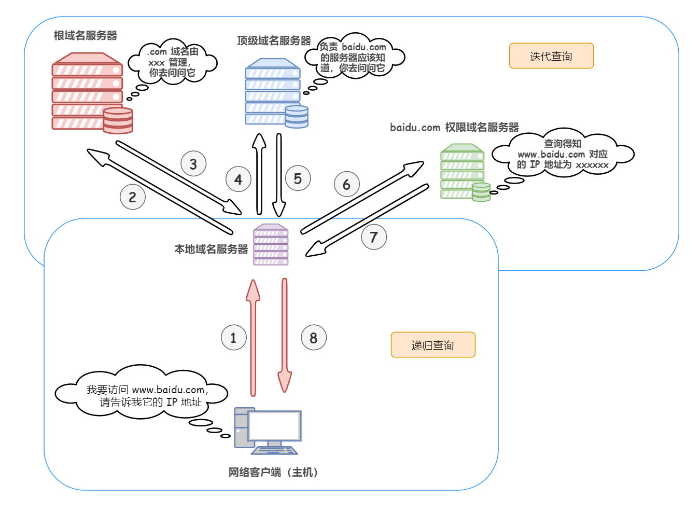

#### TCP和UDP？

UDP是无连接，面向报文的传输层协议，尽最大可能交付。

TCP：一是面向连接，有流量控制，拥塞控制，提供全双工通信；二是面向字节流，提供可靠交付，能保证字节流无差错、不丢失、不重复、并且按序到达。

#### TCP 的三次握手？

 A 为客户端，B 为服务器端：

- 首先 B 处于 LISTEN（监听）状态，等待客户的连接请求。
- A 向 B 发送连接请求报文，SYN=1，序号为 x。
- B 收到连接请求报文，如果同意建立连接，则向 A 发送连接确认报文，SYN=1，ACK=1，确认号为 x+1，序号为 y。
- A 收到 B 的连接确认报文后，还要向 B 发出确认，确认号为 y+1，序号为 x+1。
- B 收到 A 的确认后，连接建立。

**三次握手的原因**

第三次握手是为了防止失效的连接请求到达服务器，让服务器错误打开连接。客户端发送的连接请求如果在网络中滞留，那么就会隔很长一段时间才能收到服务器端发回的连接确认，在这期间客户端等待一个超时重传时间之后，会重新请求连接，但是之前滞留的连接请求最后还是会到达服务器，如果不进行三次握手，那么服务器就会打开两个连接，如果有第三次握手，客户端会忽略服务器之后发送的对滞留连接请求的连接确认，不进行第三次握手，因此就不会再次打开连接。

#### TCP 的四次挥手

以下描述不讨论序号和确认号，因为序号和确认号的规则比较简单。并且不讨论 ACK，因为 ACK 在连接建立之后都为 1。

- A 发送连接释放报文，FIN=1。
- B 收到之后发出确认，此时 TCP 属于半关闭状态，B 能向 A 发送数据，但是 A 不能向 B 发送数据。
- 当 B 不再需要连接时，发送连接释放报文，FIN=1。
- A 收到后发出确认，进入 TIME-WAIT 状态，等待 2 MSL（最大报文存活时间）后释放连接。
- B 收到 A 的确认后释放连接。

**四次挥手的原因**

主要就是为什么要有两个等待时间：服务器的 CLOSE-WAIT 和 客户端的 TIME-WAIT。

**CLOSE-WAIT**

客户端发送了 FIN 连接释放报文之后，服务器收到了这个报文，就进入了 CLOSE-WAIT 状态。这个状态是为了让服务器端发送还未传送完毕的数据，传送完毕之后，服务器会发送 FIN 连接释放报文。

**TIME_WAIT**

客户端接收到服务器端的 FIN 报文后进入此状态，此时并不是直接进入 CLOSED 状态，还需要等待一个时间计时器设置的时间 2MSL。这么做有两个理由：

- 确保最后一个确认报文能够到达。如果 B 没收到 A 发送来的确认报文，那么就会重新发送连接释放请求报文，A 等待一段时间就是为了处理这种情况的发生。
- 等待一段时间是为了让本连接持续时间内所产生的所有报文都从网络中消失，使得下一个新的连接不会出现旧的连接请求报文。

#### 如何解决粘包问题？

因为TCP是面向字节流的协议，它并不区分应用层交付的数据包的边界，所以tcp协议很有可能将你多次通过send函数发送的数据包放在一个tcp报文里面发送，也有可能将应用层的一个数据包划分成多次发送，然后传送到接收方，接收方tcp同样不区分数据的边界，也有可能缓冲多个tcp报文的内容然后再交付给应用层，综合这两方面，于是就出现了粘包问题。归结为一点就是，tcp不是面向报文的协议，它并不管应用层交付数据的边界，只是按照自己的算法进行发送，保证不丢失数据并且字节的顺序不变。

解决粘包的问题最直接的方式就是在应用层给数据加个头说明一个数据包的长度，如果一次接收的长度小于报头中的规定的长度，那么就将数据放在缓冲区等一下，如果大于就把多出来的数据放在缓冲区。

还有一种方法就是给数据加一个边界，比如\r\n，不过这种方式要处理数据中也有\r\n的情况。

对于udp协议没有这样的问题，因为udp是面向报文的协议，发送方应用层给你多大的包，udp就发多大的包，接收方udp也是一次收到整个数据包后向应用层交付。

不用考虑网络层，因为ip协议完全对上层透明，即使ip层发送方分包了，在接收方ip层也会把这一个包组装好之后再向传输层交付，所以就是传输层发送方发送多大的包，传输层接收方就能收到多大的包。

#### HTTPS的加密过程？

1.客户端向服务器发送请求

2.服务器向客户端返回数字证书（数字证书里面有服务器网站的信息 和 非对称加密的公钥）

3.客户端验证数字证书的合法性

4.客户端利用公钥加密 对称加密的密钥 发送给服务器

5.接下来服务器和客户端用对称加密的密钥加密数据进行通信

##### 为什么不直接一开始就用对称加密？

因为服务器直接将对称加密的密钥传送给客户端，中间可能被截获。

##### 为什么不服务器用客户端的公钥，客户端用服务器的公钥？

因为公钥加密算法比对称加密更加复杂，计算非常耗时，所以只能让客户端用公钥加密算法传递对称加密密钥，然后算然使用对称加密密钥加密数据。

##### 为什么要使用数字证书？

因为在服务器在向客户端传递公钥的过程中可能被狸猫换太子，意思是中间人虽然截获这个报文中没用，但是可以拦截这个报文然后换成自己的公钥，这要就可以骗过客户端，然后拿到客户端准备发送给服务器的对称加密密钥，于是以后客户端与服务器通信的内容就都泄露了。使用数字证书就可以避免这个问题了，数字证书中包含这个服务器的公钥信息和网站的其它信息，并且数字证书的数字签名使用CA机构的私钥加密，这样即使中间人可以改变数字证书的内容和数字签名，但也无法加密数字签名，因为客户端最后会使用CA的公钥解密数字签名。

数字签名：

#### 为什么要进行URL编码？

因为URL中的有特殊含义的字符如& = ? 不能直接作为值出现在URL，如果要出现在值中，就必须对它们进行转义，URL编码就是用来转义的，RFC规定，URL中只有ASCII码的非保留字（如a b c等）才能原样保留，对于ASCII码的其它保留字（如 **！ \* ’ ( ) ; : @ & = + $ , / ? # [ ]** ）采用%加ASCII码值的形式进行编码，比如&的ASCII码值是26，那么就用`％26`表示（一个字符变成了3个字符），其它非ASCII码的字符采用同样的方式进行编码，只不是后面的数值是对应编码的值，比如”中文”使用UTF-8编码得到的字节是`0xE4 0xB8 0xAD 0xE6 0x96 0x87`，经过URL编码之后得到`%E4%B8%AD%E6%96%87`。

#### DNS？

DNS（domain name system）域名系统，解析流程是：

1. 查浏览器的DNS缓存（如果是从浏览器出发）。

2. 调用操作系统的系统调用查DNS（Linux的系统调用是gethostbyname），操作系统首先是查本地hosts文件。

3. 然后递归查询本地域名服务器。

4. 本地域名服务器迭代查询域名系统，首先是查根域名服务器，再查顶级域名服务器，最后查权限域名服务器。（本地域名服务器不属于域名系统，它相当于是一个代理服务器）

5. 本地域名服务器向客户端返回解析到的ip地址，此致浏览器就拿到了对应网站的ip。

#### 浏览器输入URL到返回页面的全过程？

1. 进行域名解析（DNS）拿到网站的ip地址

2. 发送http请求，http请求是建立在tcp协议之上应用层协议，所以发送http请求之前会先进行建立tcp连接

3. 服务器响应，返回页面

4. 浏览器接收到页面后渲染，页面中还有一些图片等内容，浏览器会接着去请求图片，还有就是在前后端分离的项目，有很多Ajax异步请求，浏览器还需要向服务器请求数据

5. 断开tcp连接

#### 对称加密算法 和 非对称加密算法有哪些？

对称加密算法：DES、3DES、AES

非对称加密算法：RSA、ECC

散列算法：MD5、SHA-1

#### 为什么会丢包？使用TCP协议就一定不会丢包？

> [4.21 用了 TCP 协议，数据一定不会丢吗？ | 小林coding (xiaolincoding.com)](https://xiaolincoding.com/network/3_tcp/tcp_drop.html#用了tcp协议就一定不会丢包吗)
